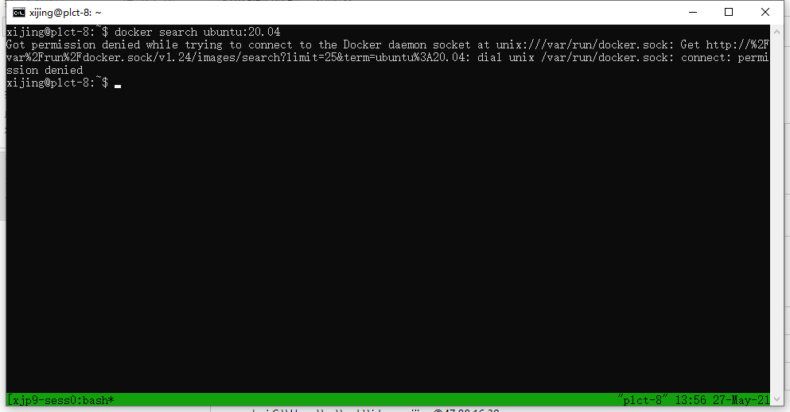

# Docker使用

之前对docker只有理论上的了解，核心印象就是：

- 隔离

- 启动快

- 方便在一个系统下管理很多个不同的应用环境，或者操作系统；一个docker对应一个使用环境；

一直没有实际操作过，而且对docker镜像是什么，怎么制作的很好奇。一直以为docker image等同于我们安装系统或者程序所需的安装包。


## Docker安装

- [Docker在linux（Ubuntu系统上的安装和使用）]()

  todo

- [Docker在win10上的安装和使用]()

​       todo

## Docker基本信息查询

- docker info
- docker version


## Docker镜像

### docker镜像

以ubuntu为例，docker的ubuntu镜像不是ubuntu官网下载的iso等系统安装文件，而是制作出来的；镜像的制作其实就是tar打包，比如在当前ubuntu系统下，将必须的一些文件制作成压缩包就行了。

docker镜像分为云端镜像和本地镜像。

- 云端镜像：[docker hub](https://hub.docker.com/search?q=&type=edition&offering=enterprisedocker)
  1. 在云端仓库中查询镜像：docker search ubuntu:20.04 
  2. 将需要的云端镜像通过`docker pull`下载到本地：docker pull ubuntu:20.04
  3. pull后通过`docker images`查看本地镜像

- 本地镜像：

  1. docker images查看本地镜像

  2. docker run 创建并运行一个镜像

     ```
     
     ```

     

  3. 





docker ps

docker kill-session  

docker run


## docker容器的查看

docker ps 　   可以查看运行中的容器

docker ps -a 　　可以查看所有容器，包括运行和停止的容器

docker ps -l 　　查看最近创建的一个容器

docker ps -n x  查看最近创建的x个容器　 如 docker ps -n 5 查看最近创建的5个容器


## 启动/停止docker容器

docker start 容器ID或容器名
1、先查看已经暂停的容器实例信息 docker ps -a 
2、通过docker start 59ec 启动容器
3、通过docker ps 查看当前启动的容器

```
xijing@p9-plct:~$ docker ps -a
CONTAINER ID   IMAGE                   COMMAND          CREATED       STATUS                    PORTS                                     NAMES
5b32a647536e   ubuntu:20.04            "/bin/bash"      3 days ago    Exited (0) 2 days ago                                               opencv
e2ba8bd04169   ubuntu:20.04            "/bin/bash"      9 days ago    Exited (137) 2 days ago                                             testxx
3392b5dadf41   ubuntu:20.04            "-name opencv"   10 days ago   Created                   0.0.0.0:50000->22/tcp, :::50000->22/tcp   upbeat_johnson
b476b97a3069   ubuntu:20.04            "/bin/bash"      10 days ago   Exited (0) 9 days ago                                               TUbt20.04
fd80979b6be4   openroad/flow-scripts   "/bin/bash"      11 days ago   Exited (137) 2 days ago                                             openroad
aa76762f0d68   ubuntu:18.04            "/bin/bash"      2 weeks ago   Exited (2) 2 days ago                                               jdk
cc4964d4aa54   ubuntu:20.04            "/bin/bash"      3 weeks ago   Exited (137) 2 days ago                                             llvm
34f6b6d08f03   ubuntu:20.04            "/bin/bash"      3 weeks ago   Exited (0) 2 days ago                                               zx
21e9d3480f97   ubuntu:18.04            "/bin/bash"      3 weeks ago   Exited (137) 2 days ago                                             openjdk
3a5cae203b0b   ubuntu:20.04            "/bin/bash"      3 weeks ago   Exited (137) 2 days ago                                             ubuntu-molly
885d960854d1   hello-world             "/hello"         5 weeks ago   Exited (0) 5 weeks ago                                              angry_margulis
9e9b3c462032   ubuntu                  "/bin/bash"      5 weeks ago   Exited (0) 2 days ago                                               gem5-learn
b729f03bbe28   7841a9fe650d            "/bin/bash"      5 weeks ago   Exited (0) 5 weeks ago                                              rocket-chip-test
cf4e9f44c25e   hello-world             "/hello"         6 weeks ago   Exited (0) 6 weeks ago                                              determined_moore
xijing@p9-plct:~$ docker restart testxx
testxx
xijing@p9-plct:~$ docker ps
CONTAINER ID   IMAGE          COMMAND       CREATED      STATUS         PORTS                                     NAMES
e2ba8bd04169   ubuntu:20.04   "/bin/bash"   9 days ago   Up 6 seconds   0.0.0.0:49153->80/tcp, :::49153->80/tcp   testxx
xijing@p9-plct:~$ docker attach testxx
```


## 连接docker容器

之后连接

```
# Attach to the default shell of a running container
docker attach YOUR-DOCKER-NAME

# Access a shell and run custom commands inside a container. Everytime you use this command will create a new bash shell.
docker exec -it YOUR-DOCKER-NAME /bin/bash
```