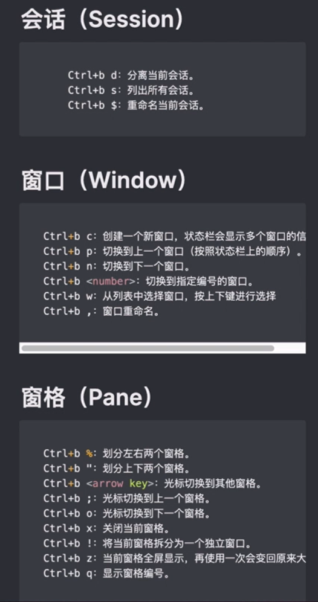

# TMUX命令

## 常用场景

1、在ssh进入服务器之后，第一个要做的事情就是使用tmux：

```
# 新建会话
tmux new -s <session-name>
# 分离回话
tmux detach
# ls 所有回话
tmux ls
# 进入session
tmux a -t <session-name>
```

这样做最大的好处就是：当你的PC与服务器之间因为各种原因导致会话（可见的就是命令窗口）连接卡死或者退出时，你再次ssh后，直接使用`tmux a -t <session-name>`就能继续原来的操作，之前的命令都一直在服务器上运行着。


2、当关闭命令窗口，想再次进入上次的会话：

```
# 使用之前创建的<session-name>进入session
tmux a -t <session-name>
```


## 常用命令

3、其它常用tmux命令

```
# ls 所有回话
tmux ls
# 切换会话
$ tmux switch -t <session-name> || 编号
# 使用会话名称
$ tmux kill-session -t <session-name> || 编号
```


4、在tmux窗口内使用的时候，常见的命令：




5、查看窗口历史记录

ctrl+B  [    :然后用键盘 up  dowon箭头按键查询；


6、自动记录输入输出日志：

https://www.kaifa99.com/GitHub/article_117878

https://qastack.cn/unix/5832/is-there-an-equivalent-of-gnu-screens-log-command-in-tmux


7、当我已经开了一个会话，想像terminal一样，开多个窗口，分别执行不同的命令的时候，怎么搞？

比如窗口1：执行一个耗时非常长的任务

我想再开一个命令窗口：可以执行一些简单的查询、创建等怎么搞？

没有找到方法；


