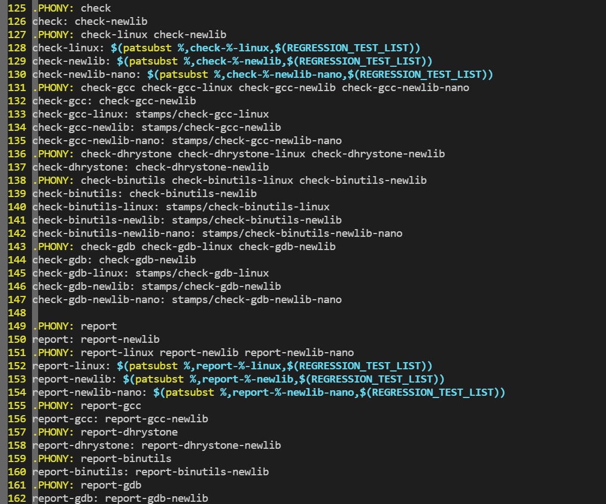
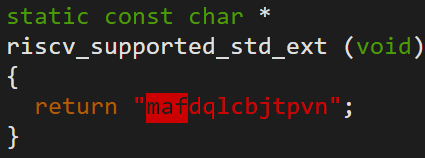

## riscv-gun-toolchain-BKV扩展分支的回归测试

## 扩展的仓库

**B 扩展:**

GCC: https://github.com/pz9115/riscv-gcc/tree/riscv-gcc-10.2.0-rvb

Binutils: https://github.com/pz9115/riscv-binutils-gdb/tree/riscv-binutils-experiment

**K 扩展：**

GCC: https://github.com/WuSiYu/riscv-gcc

Binutils：https://github.com/pz9115/riscv-binutils-gdb/tree/riscv-binutils-2.36-k-ext

**V 扩展：**

GCC: https://github.com/riscv/riscv-gcc/tree/riscv-gcc-10.1-rvv-dev

Binutils: https://github.com/riscv/riscv-binutils-gdb/tree/rvv-1.0.x


## 步骤

  0. make sure you had installed git and build-essential tools. If tips any error with miss, just use ``apt-get install`` to install it

```
apt-get install git build-essential tcl expect flex texinfo bison libpixman-1-dev libglib2.0-dev pkg-config zlib1g-dev ninja-build 
```

1. download riscv-gnu-toolchain form github

```
$ git clone https://github.com/riscv/riscv-gnu-toolchain
$ cd riscv-gnu-toolchain
$ git submodule update --init --recursive
$ cd ..
```

#### for b-ext

```shell
$ cp -r riscv-gnu-toolchain b-ext && cd b-ext

## switch gcc to rvb branch
$ cd riscv-gcc
$ git remote add pz9115 https://github.com/pz9115/riscv-gcc.git
$ git fetch pz9115
$ git checkout pz9115/riscv-gcc-10.2.0-rvb

## switch binutils to rvb branch
$ cd ../riscv-binutils/
$ git remote add pz9115 https://github.com/pz9115/riscv-binutils-gdb.git
$ git fetch pz9115
$ git checkout pz9115/riscv-binutils-experiment

## no need for customized qemu at now.

## set configure for building
$ cd .. && mkdir build && cd build
$ ../configure --prefix=$HOME/RISCV64/rvb/ --with-arch=rv64gc_zba_zbb_zbc_zbe_zbf_zbm_zbp_zbr_zbs_zbt --with-abi=lp64 --with-multilib-generator="rv64gc_zba_zbb_zbc_zbe_zbf_zbm_zbp_zbr_zbs_zbt-lp64--"

## build scr
$ make -j $(nproc)

## run testsuite
$ make report-gcc-newlib 2>&1|tee gcclog.md
$ make report-binutils-newlib 2>&1|tee binutilslog.md

#report-gcc-newlib、 report-binutils-newlib这两个是makefile里定义的target，目的就是跑回归测试；在makefile的149行到了162行
```




```
xj@e2ba8bd04169:~/RISCV$ cp -r riscv-gnu-toolchain b-ext && cd b-ext
xj@e2ba8bd04169:~/RISCV/b-ext$ cd riscv-gcc
xj@e2ba8bd04169:~/RISCV/b-ext/riscv-gcc$ git remote add pz9115 https://github.com/pz9115/riscv-gcc.git
xj@e2ba8bd04169:~/RISCV/b-ext/riscv-gcc$ git fetch pz9115
remote: Enumerating objects: 1000, done.
remote: Counting objects: 100% (988/988), done.
remote: Compressing objects: 100% (302/302), done.
remote: Total 1000 (delta 850), reused 770 (delta 671), pack-reused 12
Receiving objects: 100% (1000/1000), 409.94 KiB | 2.29 MiB/s, done.
Resolving deltas: 100% (850/850), completed with 39 local objects.
From https://github.com/pz9115/riscv-gcc
 * [new branch]              BK                         -> pz9115/BK
 * [new branch]              k-dev                      -> pz9115/k-dev
 * [new branch]              p-ext-andes                -> pz9115/p-ext-andes
 * [new branch]              q-ext                      -> pz9115/q-ext
 * [new branch]              riscv-gcc-10.1.0-rvv       -> pz9115/riscv-gcc-10.1.0-rvv
 * [new branch]              riscv-gcc-10.1.0-rvv-zfh   -> pz9115/riscv-gcc-10.1.0-rvv-zfh
 * [new branch]              riscv-gcc-10.2.0-rvb       -> pz9115/riscv-gcc-10.2.0-rvb
 * [new branch]              riscv-gcc-10.2.0-zfinx     -> pz9115/riscv-gcc-10.2.0-zfinx
 * [new branch]              riscv-gcc-experiment-p-ext -> pz9115/riscv-gcc-experiment-p-ext
xj@e2ba8bd04169:~/RISCV/b-ext/riscv-gcc$ git checkout pz9115/riscv-gcc-10.2.0-rvb
Previous HEAD position was 03cb20e5433 Update 2 C++ coroutine testcases from upstream.
HEAD is now at fcd1b5d046c Add testcases with for zbb zbe zbp
xj@e2ba8bd04169:~/RISCV/b-ext/riscv-gcc$ cd ../riscv-binutils/
xj@e2ba8bd04169:~/RISCV/b-ext/riscv-binutils$ git remote add pz9115 https://github.com/pz9115/riscv-binutils-gdb.git
xj@e2ba8bd04169:~/RISCV/b-ext/riscv-binutils$ git fetch pz9115
remote: Enumerating objects: 322, done.
remote: Counting objects: 100% (307/307), done.
remote: Compressing objects: 100% (87/87), done.
remote: Total 322 (delta 245), reused 253 (delta 220), pack-reused 15
Receiving objects: 100% (322/322), 400.13 KiB | 5.80 MiB/s, done.
Resolving deltas: 100% (245/245), completed with 24 local objects.
From https://github.com/pz9115/riscv-binutils-gdb
 * [new branch]            BK                              -> pz9115/BK
 * [new branch]            b-dev                           -> pz9115/b-dev
 * [new branch]            riscv-binutils-2.35-zfinx       -> pz9115/riscv-binutils-2.35-zfinx
 * [new branch]            riscv-binutils-2.36-k-ext       -> pz9115/riscv-binutils-2.36-k-ext
 * [new branch]            riscv-binutils-experiment       -> pz9115/riscv-binutils-experiment
 * [new branch]            riscv-binutils-experiment-p-ext -> pz9115/riscv-binutils-experiment-p-ext
xj@e2ba8bd04169:~/RISCV/b-ext/riscv-binutils$ git checkout pz9115/riscv-binutils-experiment
Previous HEAD position was f35674005e This is 2.36.1 release
HEAD is now at 507ca7f092 Remove bdepi define
xj@e2ba8bd04169:~/RISCV/b-ext/riscv-binutils$


xj@e2ba8bd04169:~/RISCV/b-ext/riscv-binutils$ cd .. && mkdir build && cd build
xj@e2ba8bd04169:~/RISCV/b-ext/build$ ../configure --prefix=$RISCV/rvb/ --with-arch=rv64gc_zba_zbb_zbc_zbe_zbf_zbm_zbp_zbr_zbs_zbt --with-abi=lp64 --with-multilib-generator="rv64gc_zba_zbb_zbc_zbe_zbf_zbm_zbp_zbr_zbs_zbt-lp64--"
checking for gcc... gcc
checking whether the C compiler works... yes
checking for C compiler default output file name... a.out
checking for suffix of executables...
checking whether we are cross compiling... no
checking for suffix of object files... o
checking whether we are using the GNU C compiler... yes
checking whether gcc accepts -g... yes
checking for gcc option to accept ISO C89... none needed
checking for grep that handles long lines and -e... /usr/bin/grep
checking for fgrep... /usr/bin/grep -F
checking for grep that handles long lines and -e... (cached) /usr/bin/grep
checking for bash... /bin/bash
checking for __gmpz_init in -lgmp... yes
checking for mpfr_init in -lmpfr... yes
checking for mpc_init2 in -lmpc... yes
checking for curl... /usr/bin/curl
checking for wget... /usr/bin/wget
checking for ftp... /usr/bin/ftp
configure: creating ./config.status
config.status: creating Makefile
config.status: creating scripts/wrapper/awk/awk
config.status: creating scripts/wrapper/sed/sed


## build scr
$ make -j $(nproc)

## run testsuite
$ make report-gcc-newlib 2>&1|tee gcclog.md

               ========= Summary of gcc testsuite =========
                            | # of unexpected case / # of unique unexpected case
                            |          gcc |          g++ |     gfortran |
 rv64gc_zba_zbb_zbc_zbe_zbf_zbm_zbp_zbr_zbs_zbt/   lp64/ medlow |18241 /  3421 | 9167 /  2263 |      - |
make: *** [Makefile:913: report-gcc-newlib] Error 1


$ make report-binutils-newlib 2>&1|tee binutilslog.md
                === ld Summary ===

# of expected passes            539
# of unexpected failures        14
# of expected failures          11
# of unsupported tests          203

               ========= Summary of binutils testsuite =========
                            | # of unexpected case
                            |     binutils |           ld |          gas |
 rv64gc_zba_zbb_zbc_zbe_zbf_zbm_zbp_zbr_zbs_zbt/   lp64/ medlow |            0 |            2 |            0 |
make: *** [Makefile:934: report-binutils-newlib] Error 1
```

> 对照后面的结果，为什么我这里没有gcc Summary？ g++ Summary ？是不是make的时候产生的？后续跑别的分支的时候，好好的观察一下结果。


###### 小欧结果

构建成功，但目前跑testsuite还有不支持的地方，大部分test case Failed.

```shell
                === gcc Summary ===

# of expected passes            67500
# of unexpected failures        35769
# of unexpected successes       5
# of expected failures          514
# of unresolved testcases       979
# of unsupported tests          2568

                === g++ Summary ===

# of expected passes            138419
# of unexpected failures        19058
# of expected failures          558
# of unresolved testcases       2
# of unsupported tests          8538

               ========= Summary of gcc testsuite =========
                            | # of unexpected case / # of unique unexpected case
                            |          gcc |          g++ |     gfortran |
 rv64i_zba_zbb_zbc_zbe_zbf_zbm_zbp_zbr_zbs_zbt/   lp64/ medlow |35737 /  3611 |19032 /  2517 |      - |
```

```shell
                === binutils Summary ===

# of expected passes            206
# of expected failures          1
# of untested testcases         10
# of unsupported tests          12

                === gas Summary ===

# of expected passes            337
# of unexpected failures        2
# of expected failures          15
# of unsupported tests          13

                === ld Summary ===

# of expected passes            388
# of expected failures          9
# of untested testcases         20
# of unsupported tests          186


               ========= Summary of binutils testsuite =========
                            | # of unexpected case
                            |     binutils |           ld |          gas |
 rv64i_zba_zbb_zbc_zbe_zbf_zbm_zbp_zbr_zbs_zbt/   lp64/ medlow |            0 |            0 |            2 |
```

~~gas unexpected Fail:~~ (已修复)

```
FAIL: gas/riscv/b-ext-64
FAIL: gas/riscv/b-ext
```


#### for k-ext

```shell
$ cp -r riscv-gnu-toolchain k-ext && cd k-ext

## switch gcc to k ext branch
$ cd riscv-gcc/
$ git remote add wsy https://github.com/WuSiYu/riscv-gcc.git
$ git fetch wsy
$ git checkout wsy/riscv-gcc-10.2.0-crypto

## switch binutils to k ext branch
$ cd ..
$ cd riscv-binutils/
$ git remote add pz9115 https://github.com/pz9115/riscv-binutils-gdb.git
$ git fetch pz9115
$ git checkout pz9115/riscv-binutils-2.36-k-ext

## configure for building
$ cd .. && mkdir build && cd build
#$ ../configure --prefix=$HOME/RISCV64/rvk --with-arch=rv64imafdck --with-abi=lp64d --with-multilib-generator="rv64imafdck-lp64d--"
../configure --prefix=$RISCV/rvk --with-arch=rv64imafdck --with-abi=lp64d --with-multilib-generator="rv64imafdck-lp64d--"

## build src
$ make -j $(nproc)

## run testsuite
$ make report-gcc-newlib 2>&1|tee gcclog.md
$ make report-binutils-newlib 2>&1|tee binutilslog.md
```

注意：K扩展在configure时的with-arch参数是imafdck，不能等价的写为gck。因为有子模块，这里用g只会展开一次，对后续bk的子模块就不处理了。

扩展的字母顺序有要求吗？




### xj测试结果

在/home/xj/RISCV/k-ext/build  路径下，通过查看gcclog.md查看测试结果。

```
=== gcc Summary ===

# of expected passes            105358
# of unexpected failures        27
# of unexpected successes       3
# of expected failures          515
# of unsupported tests          2376 

=== g++ Summary ===

# of expected passes            157806
# of unexpected failures        19
# of expected failures          554
# of unsupported tests          8503
/home/xj/RISCV/k-ext/build/build-gcc-newlib-stage2/gcc/xg++  version 10.2.0 (GCC)

               ========= Summary of gcc testsuite =========
                            | # of unexpected case / # of unique unexpected case
                            |          gcc |          g++ |     gfortran |
 rv64imafdck/  lp64d/ medlow |    0 /     0 |    0 /     0 |      - |
```


在/home/xj/RISCV/k-ext/build  路径下，通过查看binutilslog.md查看测试结果。

```
 === ld Summary ===

# of expected passes            546
# of unexpected failures        2
# of expected failures          11
# of unsupported tests          208
./ld-new 2.36.1

make[5]: *** [Makefile:2614: check-DEJAGNU] Error 1
make[5]: Leaving directory '/home/xj/RISCV/k-ext/build/build-binutils-newlib/ld'
make[4]: *** [Makefile:1946: check-am] Error 2
make[4]: Leaving directory '/home/xj/RISCV/k-ext/build/build-binutils-newlib/ld'
make[3]: *** [Makefile:1815: check-recursive] Error 1
make[3]: Leaving directory '/home/xj/RISCV/k-ext/build/build-binutils-newlib/ld'
make[2]: *** [Makefile:1948: check] Error 2
make[2]: Leaving directory '/home/xj/RISCV/k-ext/build/build-binutils-newlib/ld'
make[1]: *** [Makefile:7267: check-ld] Error 2
make[1]: Leaving directory '/home/xj/RISCV/k-ext/build/build-binutils-newlib'
date > stamps/check-binutils-newlib
/home/xj/RISCV/k-ext/build/../scripts/testsuite-filter binutils newlib \
    /home/xj/RISCV/k-ext/build/../test/allowlist \
    `find build-binutils-newlib/ -name *.sum |paste -sd "," -`

               ========= Summary of binutils testsuite =========
                            | # of unexpected case
                            |     binutils |           ld |          gas |
 rv64imafdck/  lp64d/ medlow |            0 |            0 |            0 |
```


**遇到的问题**

1, 找不到lib.a

```shell
riscv64-unknown-elf-ar rc ../libc.a *.o                                                                                    riscv64-unknown-elf-ar: ../argz/lib.a: No such file or directory
riscv64-unknown-elf-ar: ../stdlib/lib.a: No such file or directory
riscv64-unknown-elf-ar: ../ctype/lib.a: No such file or directory
riscv64-unknown-elf-ar: ../search/lib.a: No such file or directory
riscv64-unknown-elf-ar: ../stdio/lib.a: No such file or directory
riscv64-unknown-elf-ar: ../string/lib.a: No such file or directory
riscv64-unknown-elf-ar: ../signal/lib.a: No such file or directory
riscv64-unknown-elf-ar: ../time/lib.a: No such file or directory
riscv64-unknown-elf-ar: ../locale/lib.a: No such file or directory
riscv64-unknown-elf-ar: ../reent/lib.a: No such file or directory
riscv64-unknown-elf-ar: ../errno/lib.a: No such file or directory
riscv64-unknown-elf-ar: ../misc/lib.a: No such file or directory
riscv64-unknown-elf-ar: ../ssp/lib.a: No such file or directory
riscv64-unknown-elf-ar: ../syscalls/lib.a: No such file or directory
riscv64-unknown-elf-ar: ../machine/lib.a: No such file or directory
riscv64-unknown-elf-ar: *.o: No such file or directory
make[9]: *** [Makefile:1034: libc.a] Error 1
```

解决方法，需要更新riscv-glibc，查看官网，目前riscv-glibc模块版本是commit 9826b03

```shell
git checkout 9826b03
```

2，```Error: -march=rv64imafdck_zkb_zkg_zkn_zknd_zkne_zknh_zkr: unknown z ISA extension `zkn' ```

~~TODO: cjw to fix~~ （bug已经修复，更新riscv-gcc，riscv-binutils重新测试）

###### 结果

构建成功，但目前跑testsuite还有不支持的地方，大部分test case Failed.

```shell
                === gcc Summary ===

# of expected passes            84672
# of unexpected failures        18813
# of unexpected successes       5
# of expected failures          514
# of unresolved testcases       979
# of unsupported tests          2571

                === g++ Summary ===

# of expected passes            147343
# of unexpected failures        10147
# of unexpected successes       4
# of expected failures          554
# of unresolved testcases       2
# of unsupported tests          8538

               ========= Summary of gcc testsuite =========
                            | # of unexpected case / # of unique unexpected case
                            |          gcc |          g++ |     gfortran |
 rv64imafdck/  lp64d/ medlow |18810 /  3609 |10129 /  2517 |      - |
 
```

```shell
                === binutils Summary ===

# of expected passes            206
# of expected failures          1
# of untested testcases         10
# of unsupported tests          12

                === gas Summary ===

# of expected passes            339
# of expected failures          15
# of unsupported tests          13

                === ld Summary ===

# of expected passes            388
# of expected failures          9
# of untested testcases         20
# of unsupported tests          186

               ========= Summary of binutils testsuite =========
                            | # of unexpected case
                            |     binutils |           ld |          gas |
 rv64imafdck/  lp64d/ medlow |            0 |            0 |            0 |

```


#### for v-ext

```shell
$ cp -r  riscv-gnu-toolchain v-ext && cd v-ext

## switch gcc to v ext branch
$ cd riscv-gcc/
$ git fetch origin
$ git checkout origin/riscv-gcc-10.1-rvv-dev

## switch binutils to v ext branch
$ cd ..
$ cd riscv-binutils/
$ git fetch origin
$ git checkout origin/rvv-1.0.x

$ cd .. && mkdir build && cd build
../configure --prefix=$RISCV/rvv2 --with-arch=rv64imafdck --with-abi=lp64d --with-multilib-generator="rv64imafdck-lp64d--"
##这里粗心拷贝的k扩展的命令，--with-arch错了，对不上；还是要仔细才行啊；；；；

../configure --prefix=$RISCV/rvv2 --with-arch=rv64gcv --with-abi=lp64d --with-multilib-generator="rv64gcv-lp64d--"

## build src
$ make -j $(nproc)

## run testsuite
$ make report-gcc-newlib 2>&1|tee gcclog.md
$ make report-binutils-newlib 2>&1|tee binutilslog.md
```

```
xj@e2ba8bd04169:~/RISCV$ cd v-ext
xj@e2ba8bd04169:~/RISCV/v-ext$ cd riscv-gcc
xj@e2ba8bd04169:~/RISCV/v-ext/riscv-gcc$ git fetch origin
xj@e2ba8bd04169:~/RISCV/v-ext/riscv-gcc$ git checkout origin/riscv-gcc-10.1-rvv-dev
Previous HEAD position was 03cb20e5433 Update 2 C++ coroutine testcases from upstream.
HEAD is now at 788f9ef1ac8 RISC-V: Fix testcase of vector to be compatible with intrinsic API (#254)
xj@e2ba8bd04169:~/RISCV/v-ext/riscv-gcc$ cd ../riscv-binutils/
xj@e2ba8bd04169:~/RISCV/v-ext/riscv-binutils$ git fetch origin
xj@e2ba8bd04169:~/RISCV/v-ext/riscv-binutils$ git checkout origin/rvv-1.0.x
Updating files: 100% (11659/11659), done.
Previous HEAD position was f35674005e This is 2.36.1 release
HEAD is now at ba44459f0e RISC-V/rvv: Added assembly pseudoinstructions, vfabs.v.
xj@e2ba8bd04169:~/RISCV/v-ext/riscv-binutils$


$ make -j $(nproc)
echo | /home/xj/RISCV/v-ext/build/build-gcc-newlib-stage1/./gcc/xgcc -B/home/xj/RISCV/v-ext/build/build-gcc-newlib-stage1/./gcc/ -E -dM - | \
  sed -n -e 's/^#define \([^_][a-zA-Z0-9_]*\).*/\1/p' \
         -e 's/^#define \(_[^_A-Z][a-zA-Z0-9_]*\).*/\1/p' | \
  sort -u > tmp-macro_list
/home/xj/RISCV/v-ext/build/build-gcc-newlib-stage1/./gcc/xgcc -B/home/xj/RISCV/v-ext/build/build-gcc-newlib-stage1/./gcc/ -xc -nostdinc /dev/null -S -o /dev/null -fself-test=../../../riscv-gcc/gcc/testsuite/selftests
xgcc: error: '-march=rv64imafdck': unsupported ISA subset 'k'
(null):0: confused by earlier errors, bailing out
make[2]: *** [../../../riscv-gcc/gcc/c/Make-lang.in:124: s-selftest-c] Error 4
make[2]: *** Waiting for unfinished jobs....
xgcc: error: '-march=rv64imafdck': unsupported ISA subset 'k'
(null):0: confused by earlier errors, bailing out
/bin/bash ../../../riscv-gcc/gcc/../move-if-change tmp-macro_list macro_list
echo timestamp > s-macro_list
rm gcov.pod lto-dump.pod gpl.pod cpp.pod gfdl.pod gcc.pod gcov-tool.pod gcov-dump.pod fsf-funding.pod
make[2]: Leaving directory '/home/xj/RISCV/v-ext/build/build-gcc-newlib-stage1/gcc'
make[1]: *** [Makefile:4388: all-gcc] Error 2
make[1]: Leaving directory '/home/xj/RISCV/v-ext/build/build-gcc-newlib-stage1'
make: *** [Makefile:521: stamps/build-gcc-newlib-stage1] Error 2
xj@e2ba8bd04169:~/RISCV/v-ext/build$
```


### xj测试结果

```
 === g++ Summary ===

# of expected passes            157339
# of unexpected failures        20
# of expected failures          554
# of unresolved testcases       4
# of unsupported tests          8391
/home/xj/RISCV/v-ext/build/build-gcc-newlib-stage2/gcc/xg++  version 10.1.0 (GCC)

make[3]: Leaving directory '/home/xj/RISCV/v-ext/build/build-gcc-newlib-stage2/gcc'
make[2]: Leaving directory '/home/xj/RISCV/v-ext/build/build-gcc-newlib-stage2/gcc'
make[1]: Leaving directory '/home/xj/RISCV/v-ext/build/build-gcc-newlib-stage2'
mkdir -p stamps/
date > stamps/check-gcc-newlib
/home/xj/RISCV/v-ext/build/../scripts/testsuite-filter gcc newlib /home/xj/RISCV/v-ext/build/../test/allowlist `find build-gcc-newlib-stage2/gcc/testsuite/ -name *.sum |paste -sd "," -`
                === g++: Unexpected fails for rv64gcv lp64d medlow ===
FAIL: g++.target/riscv/rvv-large-stack.C (test for excess errors)

               ========= Summary of gcc testsuite =========
                            | # of unexpected case / # of unique unexpected case
                            |          gcc |          g++ |     gfortran |
    rv64gcv/  lp64d/ medlow |    0 /     0 |    1 /     1 |      - |
make: *** [Makefile:913: report-gcc-newlib] Error 1
```


```
 === ld Summary ===

# of expected passes            509
# of unexpected failures        2
# of expected failures          11
# of unsupported tests          186
./ld-new 2.35

make[5]: *** [Makefile:2539: check-DEJAGNU] Error 1
make[5]: Leaving directory '/home/xj/RISCV/v-ext/build/build-binutils-newlib/ld'
make[4]: *** [Makefile:1882: check-am] Error 2
make[4]: Leaving directory '/home/xj/RISCV/v-ext/build/build-binutils-newlib/ld'
make[3]: *** [Makefile:1751: check-recursive] Error 1
make[3]: Leaving directory '/home/xj/RISCV/v-ext/build/build-binutils-newlib/ld'
make[2]: *** [Makefile:1884: check] Error 2
make[2]: Leaving directory '/home/xj/RISCV/v-ext/build/build-binutils-newlib/ld'
make[1]: *** [Makefile:7267: check-ld] Error 2
make[1]: Leaving directory '/home/xj/RISCV/v-ext/build/build-binutils-newlib'
date > stamps/check-binutils-newlib
/home/xj/RISCV/v-ext/build/../scripts/testsuite-filter binutils newlib \
    /home/xj/RISCV/v-ext/build/../test/allowlist \
    `find build-binutils-newlib/ -name *.sum |paste -sd "," -`

               ========= Summary of binutils testsuite =========
                            | # of unexpected case
                            |     binutils |           ld |          gas |
    rv64gcv/  lp64d/ medlow |            0 |            0 |            0 |
```


###### 结果

下面的结果是with-abi=lp64的，还没改过来（改成with-abi=lp64d)

```shell
                === gcc Summary ===

# of expected passes            105296
# of unexpected failures        165
# of unexpected successes       3
# of expected failures          514
# of unresolved testcases       761
# of unsupported tests          2299

                === g++ Summary ===

# of expected passes            157339
# of unexpected failures        20
# of expected failures          554
# of unresolved testcases       4
# of unsupported tests          8391

           ========= Summary of gcc testsuite =========
                            | # of unexpected case / # of unique unexpected case
                            |          gcc |          g++ |     gfortran |
    rv64gcv/   lp64/ medlow |  138 /   138 |    1 /     1 |      - |

```

```shell
                === binutils Summary ===

# of expected passes            212
# of expected failures          1
# of unsupported tests          9

                === gas Summary ===

# of expected passes            298
# of expected failures          15
# of unsupported tests          10

                === ld Summary ===

# of expected passes            502
# of unexpected failures        12
# of expected failures          11
# of unsupported tests          183

           ========= Summary of binutils testsuite =========
                            | # of unexpected case
                            |     binutils |           ld |          gas |
    rv64gcv/   lp64/ medlow |            0 |            0 |            0 |

```

