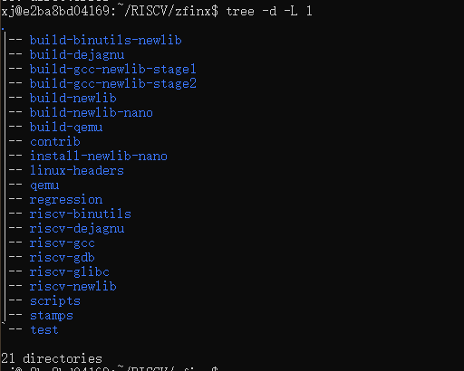

###  riscv-gun-toolchain-zfinx分支构建和回归测试

0、make sure you had installed git and build-essential tools. If tips any error with miss, just use ``apt-get install`` to install it

```
apt-get install git build-essential tcl expect flex texinfo bison libpixman-1-dev libglib2.0-dev pkg-config zlib1g-dev ninja-build nghttp2 libnghttp2-dev libssl-dev
```


1、download riscv-gnu-toolchain form github

```
$ git clone https://github.com/riscv/riscv-gnu-toolchain
$ cd riscv-gnu-toolchain
$ git submodule update --init --recursive
$ cd ..
$ cp riscv-gnu-toolchain zfinx -r && cd zfinx  #将riscv-gnu-toolchain拷贝一份，并重命名为zfinx
```

在执行cp命令之前，我的目录是这样的：

```
/home/xj/RISCV/
|-- llvm
|-- llvm-project
|-- newlib
|-- qemu
|-- riscv-gnu-toolchain
|-- riscv-isa-sim
|-- riscv-pk
`-- test-suite
```

cp之后，在

```
xj@e2ba8bd04169:~/RISCV/zfinx$ tree ~/RISCV/ -d -L 1
/home/xj/RISCV/
|-- llvm
|-- llvm-project
|-- newlib
|-- qemu
|-- riscv-gnu-toolchain
|-- riscv-isa-sim
|-- riscv-pk
|-- test-suite
`-- zfinx
```


2、switch gcc、binutils、qemu form github

不太懂这是在做什么？为什么要做这些？？

```
$ cd riscv-gcc
$ git remote add zfinx https://github.com/pz9115/riscv-gcc.git  #添加远程版本库
$ git fetch zfinx
$ git checkout zfinx/riscv-gcc-10.2.0-zfinx
$ cd ../riscv-binutils
$ git remote add zfinx https://github.com/pz9115/riscv-binutils-gdb.git
$ git fetch zfinx
$ git checkout zfinx/riscv-binutils-2.35-zfinx
$ cd ../qemu
$ git remote add plct-qemu https://github.com/isrc-cas/plct-qemu.git
$ git fetch plct-qemu
$ git checkout plct-qemu/plct-zfinx-dev
$ git reset --hard d73c46e4a84e47ffc61b8bf7c378b1383e7316b5
$ cd ..
```

```
xj@e2ba8bd04169:~/RISCV/zfinx/riscv-gcc$ git fetch zfinx
remote: Enumerating objects: 1000, done.
remote: Counting objects: 100% (988/988), done.
remote: Compressing objects: 100% (302/302), done.
remote: Total 1000 (delta 850), reused 770 (delta 671), pack-reused 12
Receiving objects: 100% (1000/1000), 409.94 KiB | 20.50 MiB/s, done.
Resolving deltas: 100% (850/850), completed with 39 local objects.
From https://github.com/pz9115/riscv-gcc
 * [new branch]              BK                         -> zfinx/BK
 * [new branch]              k-dev                      -> zfinx/k-dev
 * [new branch]              p-ext-andes                -> zfinx/p-ext-andes
 * [new branch]              q-ext                      -> zfinx/q-ext
 * [new branch]              riscv-gcc-10.1.0-rvv       -> zfinx/riscv-gcc-10.1.0-rvv
 * [new branch]              riscv-gcc-10.1.0-rvv-zfh   -> zfinx/riscv-gcc-10.1.0-rvv-zfh
 * [new branch]              riscv-gcc-10.2.0-rvb       -> zfinx/riscv-gcc-10.2.0-rvb
 * [new branch]              riscv-gcc-10.2.0-zfinx     -> zfinx/riscv-gcc-10.2.0-zfinx
 * [new branch]              riscv-gcc-experiment-p-ext -> zfinx/riscv-gcc-experiment-p-ext
xj@e2ba8bd04169:~/RISCV/zfinx/riscv-gcc$ git checkout zfinx/riscv-gcc-10.2.0-zfinx
Previous HEAD position was 03cb20e5433 Update 2 C++ coroutine testcases from upstream.
HEAD is now at 66ae94a003c Fix redefination error of zi_subset

xj@e2ba8bd04169:~/RISCV/zfinx/riscv-gcc$ git checkout zfinx/riscv-gcc-10.2.0-zfinx
HEAD is now at 66ae94a003c Fix redefination error of zi_subset
xj@e2ba8bd04169:~/RISCV/zfinx/riscv-gcc$ cd ../riscv-binutils/
xj@e2ba8bd04169:~/RISCV/zfinx/riscv-binutils$ git remote add zfinx https://github.com/pz9115/riscv-binutils-gdb.git
xj@e2ba8bd04169:~/RISCV/zfinx/riscv-binutils$ git fetch zfinx
remote: Enumerating objects: 322, done.
remote: Counting objects: 100% (307/307), done.
remote: Compressing objects: 100% (87/87), done.
remote: Total 322 (delta 245), reused 253 (delta 220), pack-reused 15
Receiving objects: 100% (322/322), 399.92 KiB | 6.45 MiB/s, done.
Resolving deltas: 100% (245/245), completed with 24 local objects.
From https://github.com/pz9115/riscv-binutils-gdb
 * [new branch]            BK                              -> zfinx/BK
 * [new branch]            b-dev                           -> zfinx/b-dev
 * [new branch]            riscv-binutils-2.35-zfinx       -> zfinx/riscv-binutils-2.35-zfinx
 * [new branch]            riscv-binutils-2.36-k-ext       -> zfinx/riscv-binutils-2.36-k-ext
 * [new branch]            riscv-binutils-experiment       -> zfinx/riscv-binutils-experiment
 * [new branch]            riscv-binutils-experiment-p-ext -> zfinx/riscv-binutils-experiment-p-ext
xj@e2ba8bd04169:~/RISCV/zfinx/riscv-binutils$ git checkout zfinx/riscv-binutils-2.35-zfinx
Updating files: 100% (11611/11611), done.
Previous HEAD position was f35674005e This is 2.36.1 release
HEAD is now at 0dbcf09a9e update disassble info with Z*inx

xj@e2ba8bd04169:~/RISCV/zfinx/riscv-binutils$ cd ../qemu
xj@e2ba8bd04169:~/RISCV/zfinx/qemu$ git remote add plct-qemu https://github.com/isrc-cas/plct-qemu.git
xj@e2ba8bd04169:~/RISCV/zfinx/qemu$ git fetch plct-qemu
remote: Enumerating objects: 3941, done.
remote: Counting objects: 100% (2541/2541), done.
remote: Compressing objects: 100% (30/30), done.
remote: Total 3941 (delta 2512), reused 2536 (delta 2511), pack-reused 1400
Receiving objects: 100% (3941/3941), 1.17 MiB | 14.64 MiB/s, done.
Resolving deltas: 100% (3490/3490), completed with 300 local objects.
From https://github.com/isrc-cas/plct-qemu
 * [new branch]            master                  -> plct-qemu/master
 * [new branch]            new-machine-dev         -> plct-qemu/new-machine-dev
 * [new branch]            plct-courses-dev        -> plct-qemu/plct-courses-dev
 * [new branch]            plct-k-dev              -> plct-qemu/plct-k-dev
 * [new branch]            plct-nuclei             -> plct-qemu/plct-nuclei
 * [new branch]            plct-nuclei-rebase      -> plct-qemu/plct-nuclei-rebase
 * [new branch]            plct-riscv-zfinx        -> plct-qemu/plct-riscv-zfinx
 * [new branch]            plct-rtthread           -> plct-qemu/plct-rtthread
 * [new branch]            plct-rvv                -> plct-qemu/plct-rvv
 * [new branch]            plct-zce-dev            -> plct-qemu/plct-zce-dev
 * [new branch]            plct-zfinx-dev          -> plct-qemu/plct-zfinx-dev
 * [new branch]            rvv-1.0-v6-insn-counter -> plct-qemu/rvv-1.0-v6-insn-counter
 * [new branch]            rvv-sifive-rfc-rc1      -> plct-qemu/rvv-sifive-rfc-rc1
 * [new branch]            rvv-sifive-rfc-rc2      -> plct-qemu/rvv-sifive-rfc-rc2
 * [new branch]            rvv-sifive-rfc-rc3      -> plct-qemu/rvv-sifive-rfc-rc3
 * [new branch]            stable-0.10             -> plct-qemu/stable-0.10
 * [new branch]            stable-0.11             -> plct-qemu/stable-0.11
 * [new branch]            stable-0.12             -> plct-qemu/stable-0.12
 * [new branch]            stable-0.13             -> plct-qemu/stable-0.13
 * [new branch]            stable-0.14             -> plct-qemu/stable-0.14
 * [new branch]            stable-0.15             -> plct-qemu/stable-0.15
 * [new branch]            stable-1.0              -> plct-qemu/stable-1.0
 * [new branch]            stable-1.1              -> plct-qemu/stable-1.1
 * [new branch]            stable-1.2              -> plct-qemu/stable-1.2
 * [new branch]            stable-1.3              -> plct-qemu/stable-1.3
 * [new branch]            stable-1.4              -> plct-qemu/stable-1.4
 * [new branch]            stable-1.5              -> plct-qemu/stable-1.5
 * [new branch]            stable-1.6              -> plct-qemu/stable-1.6
 * [new branch]            stable-1.7              -> plct-qemu/stable-1.7
 * [new branch]            stable-2.0              -> plct-qemu/stable-2.0
 * [new branch]            stable-2.1              -> plct-qemu/stable-2.1
 * [new branch]            stable-2.10             -> plct-qemu/stable-2.10
 * [new branch]            stable-2.11             -> plct-qemu/stable-2.11
 * [new branch]            stable-2.12             -> plct-qemu/stable-2.12
 * [new branch]            stable-2.2              -> plct-qemu/stable-2.2
 * [new branch]            stable-2.3              -> plct-qemu/stable-2.3
 * [new branch]            stable-2.4              -> plct-qemu/stable-2.4
 * [new branch]            stable-2.5              -> plct-qemu/stable-2.5
 * [new branch]            stable-2.6              -> plct-qemu/stable-2.6
 * [new branch]            stable-2.7              -> plct-qemu/stable-2.7
 * [new branch]            stable-2.8              -> plct-qemu/stable-2.8
 * [new branch]            stable-2.9              -> plct-qemu/stable-2.9
 * [new branch]            stable-3.0              -> plct-qemu/stable-3.0
 * [new branch]            stable-3.1              -> plct-qemu/stable-3.1
 * [new branch]            stable-4.0              -> plct-qemu/stable-4.0
 * [new branch]            stable-4.1              -> plct-qemu/stable-4.1
 * [new branch]            staging                 -> plct-qemu/staging
xj@e2ba8bd04169:~/RISCV/zfinx/qemu$ git checkout plct-qemu/plct-zfinx-dev
Previous HEAD position was 553032db17 Update version for v5.2.0 release
HEAD is now at 1a1135edc2 Merge branch 'plct-zfinx-dev' into 'plct-zfinx-dev'
xj@e2ba8bd04169:~/RISCV/zfinx/qemu$ git reset --hard d73c46e4a84e47ffc61b8bf7c378b1383e7316b5
HEAD is now at d73c46e4a8 Update version for v5.2.0-rc4 release
```


3、set configure in riscv-gnu-toolchain for compile

> 以下3个configure分别执行，这三种情况可以分别新建build目录，在各build目录里configure，make。
>
> 一次完整的测试包含：configure+make+make report这3步；
>
> 对于普通用户--prefix=/opt/rv64/ 会权限不足，可以自己将目录设置到/home/xj/.....路径下，这样不会有权限的问题

```
# for rv64:
$ ./configure --prefix=/opt/rv64/ --with-arch=rv64gc --with-abi=lp64 --with-multilib-generator="rv64gc-lp64--"

# for rv32:
$ ./configure --prefix=/opt/rv32/ --with-arch=rv32gc --with-abi=ilp32 --with-multilib-generator="rv32gc-ilp32--"

# for rv32e:
$ ./configure --prefix=/opt/rv32e/ --with-arch=rv32ec --with-abi=ilp32e --with-multilib-generator="rv32ec-ilp32e--"
```

rv32g: rv32imfad （ 整型，乘除，单精度浮点，原子，双精度浮点

rv32e: 一个只有16个寄存器的嵌入式版本的RISC-V，只使用寄存器x0-x15.

rv32c: 压缩指令，只对汇编器和链接器可见，编译器编写者和汇编语言程序员可以幸福地忽略RV32C指令及其格式，他们能感知到的则是最后的程序大小小于大多数其他ISA的程序。

RV32的ABI分别名为ilp32,ilp32f,ilp32d。ilp32表示C语言的整型(int),长整形(long)和指针（pointer）都是32位，可选后缀表示如何传递浮点参数。在ilp32中，浮点参数在整数寄存器中传递；在ilp32f中，单精度浮点参数在浮点寄存器中传递；在ilp32d中，双精度浮点参数**也**在浮点寄存器中传递。

--with-multilib-generator参考riscv-gnu-toolchain readme:

[有必要好好读一读：riscv-gnu-toolchain readme](https://github.com/riscv/riscv-gnu-toolchain)

```
xj@e2ba8bd04169:~/RISCV/zfinx$ ./configure --prefix=/opt/rv64/ --with-arch=rv64gc --with-abi=lp64 --with-multilib-generator="rv64gc-lp64--"
checking for gcc... gcc
checking whether the C compiler works... yes
checking for C compiler default output file name... a.out
checking for suffix of executables...
checking whether we are cross compiling... no
checking for suffix of object files... o
checking whether we are using the GNU C compiler... yes
checking whether gcc accepts -g... yes
checking for gcc option to accept ISO C89... none needed
checking for grep that handles long lines and -e... /usr/bin/grep
checking for fgrep... /usr/bin/grep -F
checking for grep that handles long lines and -e... (cached) /usr/bin/grep
checking for bash... /bin/bash
checking for __gmpz_init in -lgmp... yes
checking for mpfr_init in -lmpfr... yes
checking for mpc_init2 in -lmpc... yes
checking for curl... /usr/bin/curl
checking for wget... /usr/bin/wget
checking for ftp... /usr/bin/ftp
configure: creating ./config.status
config.status: creating Makefile
config.status: creating scripts/wrapper/awk/awk
config.status: creating scripts/wrapper/sed/sed
xj@e2ba8bd04169:~/RISCV/zfinx$ ./configure --prefix=/opt/rv32/ --with-arch=rv32gc --with-abi=ilp32 --with-multilib-generator="rv32gc-ilp32--"
checking for gcc... gcc
checking whether the C compiler works... yes
checking for C compiler default output file name... a.out
checking for suffix of executables...
checking whether we are cross compiling... no
checking for suffix of object files... o
checking whether we are using the GNU C compiler... yes
checking whether gcc accepts -g... yes
checking for gcc option to accept ISO C89... none needed
checking for grep that handles long lines and -e... /usr/bin/grep
checking for fgrep... /usr/bin/grep -F
checking for grep that handles long lines and -e... (cached) /usr/bin/grep
checking for bash... /bin/bash
checking for __gmpz_init in -lgmp... yes
checking for mpfr_init in -lmpfr... yes
checking for mpc_init2 in -lmpc... yes
checking for curl... /usr/bin/curl
checking for wget... /usr/bin/wget
checking for ftp... /usr/bin/ftp
configure: creating ./config.status
config.status: creating Makefile
config.status: creating scripts/wrapper/awk/awk
config.status: creating scripts/wrapper/sed/sed
xj@e2ba8bd04169:~/RISCV/zfinx$ ./configure --prefix=/opt/rv32e/ --with-arch=rv32ec --with-abi=ilp32e --with-multilib-generator="rv32ec-ilp32e--"
checking for gcc... gcc
checking whether the C compiler works... yes
checking for C compiler default output file name... a.out
checking for suffix of executables...
checking whether we are cross compiling... no
checking for suffix of object files... o
checking whether we are using the GNU C compiler... yes
checking whether gcc accepts -g... yes
checking for gcc option to accept ISO C89... none needed
checking for grep that handles long lines and -e... /usr/bin/grep
checking for fgrep... /usr/bin/grep -F
checking for grep that handles long lines and -e... (cached) /usr/bin/grep
checking for bash... /bin/bash
checking for __gmpz_init in -lgmp... yes
checking for mpfr_init in -lmpfr... yes
checking for mpc_init2 in -lmpc... yes
checking for curl... /usr/bin/curl
checking for wget... /usr/bin/wget
checking for ftp... /usr/bin/ftp
configure: creating ./config.status
config.status: creating Makefile
config.status: creating scripts/wrapper/awk/awk
config.status: creating scripts/wrapper/sed/sed
```


4、regression test

```
# you can use make -j* to make speed up
# see the report
$ make report-gcc-newlib 2>&1|tee gcclog.md
$ make report-binutils-newlib 2>&1|tee binutilslog.md
# Use `make clean` to re-check different abi, reset configure and remake for other abi again (lp64\ilp32\ilp32e)
```

- make check和make report的区别

make check只能跑一次，report多次有效

- make report-gcc-linux

也可使用glibc库测试，源码编译时使用`make linux`

[ make 2>&1 | tee log.txt命令解析](https://blog.csdn.net/Dr_Unknown/article/details/76837708)


```
xj@e2ba8bd04169:~/RISCV/zfinx$ make report-gcc-newlib 2>&1|tee gcclog.md
mkdir -p /opt/rv32e/.test || \
        (echo "Sorry, you don't have permission to write to" \
         "'/opt/rv32e', use --prefix to specify" \
         "another path, or use 'sudo make' if you *REALLY* want to" \
         "install into '/opt/rv32e'" && exit 1)
mkdir: cannot create directory '/opt/rv32e': Permission denied
Sorry, you don't have permission to write to '/opt/rv32e', use --prefix to specify another path, or use 'sudo make' if you *REALLY* want to install into '/opt/rv32e'
make: *** [Makefile:195: stamps/check-write-permission] Error 1


```

按照提示修改为以下命令再次执行：

```
./configure --prefix=$RISCV/zfinx-build1
make report-gcc-newlib 2>&1|tee gcclog.md 
```

```
执行结果（部分）详见下图：
Running /home/xj/RISCV/zfinx/riscv-gcc/gcc/testsuite/g++.dg/dg.exp ...
FAIL: g++.dg/cpp2a/decomp2.C  -std=gnu++14 execution test
FAIL: g++.dg/cpp2a/decomp2.C  -std=gnu++17 execution test
FAIL: g++.dg/cpp2a/decomp2.C  -std=gnu++2a execution test
FAIL: c-c++-common/patchable_function_entry-decl.c  -std=gnu++98  scan-assembler-times nop|NOP 2
FAIL: c-c++-common/patchable_function_entry-decl.c  -std=gnu++14  scan-assembler-times nop|NOP 2
FAIL: c-c++-common/patchable_function_entry-decl.c  -std=gnu++17  scan-assembler-times nop|NOP 2
FAIL: c-c++-common/patchable_function_entry-decl.c  -std=gnu++2a  scan-assembler-times nop|NOP 2
FAIL: c-c++-common/patchable_function_entry-default.c  -std=gnu++98  scan-assembler-times nop|NOP 3
FAIL: c-c++-common/patchable_function_entry-default.c  -std=gnu++14  scan-assembler-times nop|NOP 3
FAIL: c-c++-common/patchable_function_entry-default.c  -std=gnu++17  scan-assembler-times nop|NOP 3
FAIL: c-c++-common/patchable_function_entry-default.c  -std=gnu++2a  scan-assembler-times nop|NOP 3
FAIL: c-c++-common/patchable_function_entry-definition.c  -std=gnu++98  scan-assembler-times nop|NOP 1
FAIL: c-c++-common/patchable_function_entry-definition.c  -std=gnu++14  scan-assembler-times nop|NOP 1
FAIL: c-c++-common/patchable_function_entry-definition.c  -std=gnu++17  scan-assembler-times nop|NOP 1
FAIL: c-c++-common/patchable_function_entry-definition.c  -std=gnu++2a  scan-assembler-times nop|NOP 1
FAIL: c-c++-common/spec-barrier-1.c  -std=gnu++98 (test for excess errors)
FAIL: c-c++-common/spec-barrier-1.c  -std=gnu++14 (test for excess errors)
FAIL: c-c++-common/spec-barrier-1.c  -std=gnu++17 (test for excess errors)
FAIL: c-c++-common/spec-barrier-1.c  -std=gnu++2a (test for excess errors)
Running /home/xj/RISCV/zfinx/riscv-gcc/gcc/testsuite/g++.dg/gcov/gcov.exp ...
```


> 测试结果：这个报告最下面的summary给开发就可以
>
> 测试目的：一个是构建是否成功，另外看回归测试运行的结果（有新的commit了需要做回测，commit提交前后各做一次，对比两次的结果，就知道commit有没有引入bug。


疑问：【等待解答】

那make过程中的：出现了诸如此类的
FAIL: g++.dg/cpp2a/decomp2.C  -std=gnu++14 execution test
FAIL: g++.dg/cpp2a/decomp2.C  -std=gnu++17 execution test
FAIL: g++.dg/cpp2a/decomp2.C  -std=gnu++2a execution test
FAIL: c-c++-common/patchable_function_entry-decl.c  -std=gnu++98  scan-assembler-times nop|NOP 2
FAIL: c-c++-common/patchable_function_entry-decl.c  -std=gnu++14  scan-assembler-times nop|NOP 2
FAIL: c-c++-common/patchable_function_entry-decl.c  -std=gnu++17  scan-assembler-times nop|NOP 2
FAIL: c-c++-common/patchable_function_entry-decl.c  -std=gnu++2a  scan-assembler-times nop|NOP 2
FAIL: c-c++-common/patchable_function_entry-default.c  -std=gnu++98  scan-assembler-times nop|NOP 3
FAIL: c-c++-common/patchable_function_entry-default.c  -std=gnu++14  scan-assembler-times nop|NOP 3
FAIL: c-c++-common/patchable_function_entry-default.c  -std=gnu++17  scan-assembler-times nop|NOP 3
FAIL: c-c++-common/patchable_function_entry-default.c  -std=gnu++2a  scan-assembler-times nop|NOP 3
FAIL: c-c++-common/patchable_function_entry-definition.c  -std=gnu++98  scan-assembler-times nop|NOP 1
FAIL: c-c++-common/patchable_function_entry-definition.c  -std=gnu++14  scan-assembler-times nop|NOP 1
FAIL: c-c++-common/patchable_function_entry-definition.c  -std=gnu++17  scan-assembler-times nop|NOP 1
FAIL: c-c++-common/patchable_function_entry-definition.c  -std=gnu++2a  scan-assembler-times nop|NOP 1
FAIL: c-c++-common/spec-barrier-1.c  -std=gnu++98 (test for excess errors)
FAIL: c-c++-common/spec-barrier-1.c  -std=gnu++14 (test for excess errors)
FAIL: c-c++-common/spec-barrier-1.c  -std=gnu++17 (test for excess errors)
FAIL: c-c++-common/spec-barrier-1.c  -std=gnu++2a (test for excess errors)

这种信息，我就不用管；当make显示了红色的Error的时候，构建不能完成的时候，才需要解决问题，再次编译。可以这么理解么


```

./configure --prefix=$RISCV/zfinx-build2
make report-binutils-newlib 2>&1|tee binutilslog.md
```


跟小欧沟通之后，明确了上面的就是测试结果了，从流程上没啥问题，但是从测试内容上来说，还需要继续执行不同configure和make；

下面依次执行一下：


```
# for rv64:
$ ./configure --prefix=$RISCV/zfinx-bld-rv64 --with-arch=rv64gc --with-abi=lp64 --with-multilib-generator="rv64gc-lp64--"
$ make report-gcc-newlib 2>&1|tee gcclog.md
$ make report-binutils-newlib 2>&1|tee binutilslog.md


# for rv32:
$ ./configure --prefix=$RISCV/zfinx-bld-rv32 --with-arch=rv32gc --with-abi=ilp32 --with-multilib-generator="rv32gc-ilp32--"

# for rv32e:
$ ./configure --prefix=$RISCV/zfinx-bld-rv32e --with-arch=rv32ec --with-abi=ilp32e --with-multilib-generator="rv32ec-ilp32e--"
```

```
xj@e2ba8bd04169:~/RISCV/zfinx$ make report-gcc-newlib 2>&1|tee gcclog.md
/home/xj/RISCV/zfinx/scripts/testsuite-filter gcc newlib /home/xj/RISCV/zfinx/test/allowlist `find build-gcc-newlib-stage2/gcc/testsuite/ -name *.sum |paste -sd "," -`

               ========= Summary of gcc testsuite =========
                            | # of unexpected case / # of unique unexpected case
                            |          gcc |          g++ |     gfortran |
 rv64imafdc/  lp64d/ medlow |    0 /     0 |    0 /     0 |      - |
 
 #这次很快
 
 xj@e2ba8bd04169:~/RISCV/zfinx$ make report-binutils-newlib 2>&1|tee binutilslog.md
/home/xj/RISCV/zfinx/scripts/testsuite-filter binutils newlib \
    /home/xj/RISCV/zfinx/test/allowlist \
    `find build-binutils-newlib/ -name *.sum |paste -sd "," -`
/home/xj/RISCV/zfinx/scripts/testsuite-filter <toolname> <libc> <white-list-base-dir> <testsuite.sum>
```


```
xj@e2ba8bd04169:~/RISCV/zfinx$ ./configure --prefix=$RISCV/zfinx-bld-rv32 --with-arch=rv32gc --with-abi=ilp32 --with-multilib-generator="rv32gc-ilp32--"
checking for gcc... gcc
checking whether the C compiler works... yes
checking for C compiler default output file name... a.out
checking for suffix of executables...
checking whether we are cross compiling... no
checking for suffix of object files... o
checking whether we are using the GNU C compiler... yes
checking whether gcc accepts -g... yes
checking for gcc option to accept ISO C89... none needed
checking for grep that handles long lines and -e... /usr/bin/grep
checking for fgrep... /usr/bin/grep -F
checking for grep that handles long lines and -e... (cached) /usr/bin/grep
checking for bash... /bin/bash
checking for __gmpz_init in -lgmp... yes
checking for mpfr_init in -lmpfr... yes
checking for mpc_init2 in -lmpc... yes
checking for curl... /usr/bin/curl
checking for wget... /usr/bin/wget
checking for ftp... /usr/bin/ftp
configure: creating ./config.status
config.status: creating Makefile
config.status: creating scripts/wrapper/awk/awk
config.status: creating scripts/wrapper/sed/sed
xj@e2ba8bd04169:~/RISCV/zfinx$ make report-gcc-newlib 2>&1|tee gcclog-rv32.md
/home/xj/RISCV/zfinx/scripts/testsuite-filter gcc newlib /home/xj/RISCV/zfinx/test/allowlist `find build-gcc-newlib-stage2/gcc/testsuite/ -name *.sum |paste -sd "," -`

               ========= Summary of gcc testsuite =========
                            | # of unexpected case / # of unique unexpected case
                            |          gcc |          g++ |     gfortran |
 rv64imafdc/  lp64d/ medlow |    0 /     0 |    0 /     0 |      - |
```


```
xj@e2ba8bd04169:~/RISCV/zfinx$ ./configure --prefix=$RISCV/zfinx-bld-rv32e --with-arch=rv32ec --with-abi=ilp32e --with-multilib-generator="rv32ec-ilp32e--"
checking for gcc... gcc
checking whether the C compiler works... yes
checking for C compiler default output file name... a.out
checking for suffix of executables...
checking whether we are cross compiling... no
checking for suffix of object files... o
checking whether we are using the GNU C compiler... yes
checking whether gcc accepts -g... yes
checking for gcc option to accept ISO C89... none needed
checking for grep that handles long lines and -e... /usr/bin/grep
checking for fgrep... /usr/bin/grep -F
checking for grep that handles long lines and -e... (cached) /usr/bin/grep
checking for bash... /bin/bash
checking for __gmpz_init in -lgmp... yes
checking for mpfr_init in -lmpfr... yes
checking for mpc_init2 in -lmpc... yes
checking for curl... /usr/bin/curl
checking for wget... /usr/bin/wget
checking for ftp... /usr/bin/ftp
configure: creating ./config.status
config.status: creating Makefile
config.status: creating scripts/wrapper/awk/awk
config.status: creating scripts/wrapper/sed/sed
xj@e2ba8bd04169:~/RISCV/zfinx$ make report-gcc-newlib 2>&1|tee gcclog-rv32e.md
/home/xj/RISCV/zfinx/scripts/testsuite-filter gcc newlib /home/xj/RISCV/zfinx/test/allowlist `find build-gcc-newlib-stage2/gcc/testsuite/ -name *.sum |paste -sd "," -`

               ========= Summary of gcc testsuite =========
                            | # of unexpected case / # of unique unexpected case
                            |          gcc |          g++ |     gfortran |
 rv64imafdc/  lp64d/ medlow |    0 /     0 |    0 /     0 |      - |
 
 xj@e2ba8bd04169:~/RISCV/zfinx$ make report-binutils-newlib 2>&1|tee binutilslog-rv32e.md
/home/xj/RISCV/zfinx/scripts/testsuite-filter binutils newlib \
    /home/xj/RISCV/zfinx/test/allowlist \
    `find build-binutils-newlib/ -name *.sum |paste -sd "," -`
/home/xj/RISCV/zfinx/scripts/testsuite-filter <toolname> <libc> <white-list-base-dir> <testsuite.sum>
```

疑问：

1. 为啥执行不同的configure，最后的的summary都一样呢？

2. 为啥 make report-binutils-newlib 2>&1|tee binutilslog.md执行不成功？怎么解决问题？

3. 后续执行make report.....的时候，速度非常快，不到2秒就完成，与第一次执行的好几个小时相比，差距明显，为什么？难道不需要重新make么？

4. 参考https://github.com/riscv/riscv-gnu-toolchain 这里的命令有3步骤：configure_>make_>make report  ，为什么测试指导手册中只有2个命令？

   ```
   ./configure --prefix=$RISCV --disable-linux --with-arch=rv64ima # or --with-arch=rv32ima
   make newlib
   make report-newlib SIM=gdb # Run with gdb simulator
   
   ./configure --prefix=$RISCV
   make linux
   make report-linux SIM=qemu # Run with qemu
   ```

   


执行完之后的目录结构：

xj@e2ba8bd04169:~/RISCV/zfinx$ tree -d -L 1
.
|-- build-binutils-newlib
|-- build-dejagnu
|-- build-gcc-newlib-stage1
|-- build-gcc-newlib-stage2
|-- build-newlib
|-- build-newlib-nano
|-- build-qemu
|-- contrib
|-- install-newlib-nano
|-- linux-headers
|-- qemu
|-- regression
|-- riscv-binutils
|-- riscv-dejagnu
|-- riscv-gcc
|-- riscv-gdb
|-- riscv-glibc
|-- riscv-newlib
|-- scripts
|-- stamps
`-- test




执行了BKV分支的测试回过头来，发现这里还是有很多问题的，后面重新测试一下》