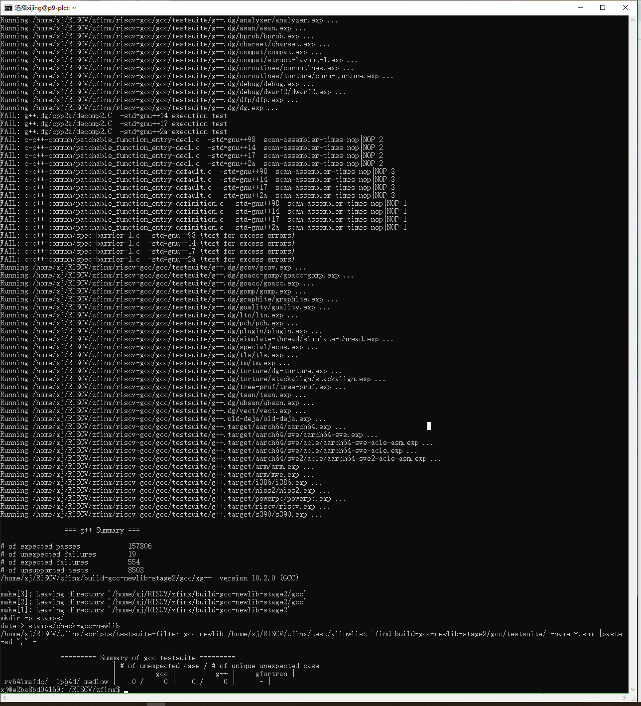

## 问题

1. 我要测试什么？测试的目的是什么？测试内容是什么？测试的结果怎么看，怎么分析？我们主要关注测试结果的哪些信息？哪些测试结论是需要关注并改进的？

2. 整个测试体系包含了多个项目和目录，这些项目分别是干什么的？文件目录父子关系（如果没有必须的关系，给出一个建议的目录关系）

   【todo】等我做完一遍测试之后，再梳理

1. 如何方便的找到很多人的测试日志？
2. 如何提交问题？问题issue在哪里创建？


## 参考资料

感谢小欧、章翔的指导，本文档大部分的内容是拷贝大家写的操作手册，在执行的过程中，根据我个人遇到的问题，进行了补充和说明。

本文以测试日志的方式记录，可以供基础比较差的朋友参考。

本文参考链接：

【测试合集】https://github.com/mollybuild/RISCV-Measurement/blob/master/beginner-guidance.md

PLCT-mirror：https://mirror.iscas.ac.cn/plct/


基础环境搭建：

docker 命令：https://github.com/mollybuild/RISCV-Measurement/blob/master/Tools-Guide.md

RISC-V编译环境：https://github.com/sunshaoce/learning-riscv/blob/main/2/2.md


测试日志参考：
RISCV的B、K、V扩展简介以及运行他们的回归测试：https://zhuanlan.zhihu.com/p/368516136
ci_script_build_B_ext_toolchain_v1.sh——》b扩展脚本，可以改一下编快点

萌新的交叉编译OpenJDK11 for RV32G的踩坑之路：https://zhuanlan.zhihu.com/p/372067562

菜鸟的Qemu系统模式下运行Embench的心酸之路：https://zhuanlan.zhihu.com/p/373077383

构建RISCV LLVM并运行test-suite的新手指引：https://zhuanlan.zhihu.com/p/373431891

openjdk是我做的比较细的，因为我最近还在做，相对来说，好跑一点
embench那个的话主要是避免docker跟root
我跑embench是用自己的阿里云的，你可以尝试按照小欧的那个环境部署
因为他就是不能用root
docker好像也有问题，你可以尝试一下


就openjdk，bkv扩展好跑，llvm的test主要是时间太长，而且当时我用错了源代码
https://github.com/llvm/llvm-project


## 准备工作

说明：不建议在个人PC上跑测试，如果需要，请先解决好以下问题：

1. 能够稳定、快捷的从github上clone代码；

   比如，单个仓库4G以上；

2. 编译需要很长时间，且文件多，对设备性能要求高。

   不要问我到底要什么配置，我现在还不知道，可以去问资深大神，新手小白匿了。

---


1. 创建ssh pubkey作为登录服务器的秘钥

   `ssh-keygen -t rsa -C "xijing@droid.ac.cn"`  其中双引号中的信息随意填写

   将生成的id_rsa.pub打开，复制文件中的内容粘贴到github网页ssh配置处；（人工规定的管理流程：默认将gitlab的秘钥作为服务器的秘钥）

2. 申请服务器P9（外网服务器）的权限。

   需要说明的是，我们的代码主要都在github上，而且很大。在进行git clone操作时，由于网络不稳定是非常容易出问题的。在P9上操作可以大大提高成功率。服务器的使用需要@ww申请权限。

   当不具备服务器的时候，就有点麻烦了，必须先搭梯子，解决上网问题。

   （1）搭梯子

   即使搭梯子，也存在git clone失败的问题；试了3-4遍都没有成功，网络稳定性不太好。

   （2）通过gitee作为代码仓库管理代码

   目前riscv-gcc因为仓库太大，导致必须企业版才能支持导入。【这是值得探讨的一条路】

3. 学会在服务器上使用tmux终端工具

   ```
   # 新建会话
   tmux new -s <session-name>
   # 分离回话
   tmux detach
   # ls 所有回话
   tmux ls
   # 进入session
   tmux a -t <session-name>
   # 切换会话
   $ tmux switch -t <session-name> || 编号
   # 使用会话名称
   $ tmux kill-session -t <session-name> || 编号
   ```
   

   
4. 学会通过docker运行测试环境

当服务器完成授权，并且能够成功访问的时候：

```
#检验是否能够连接成功
ssh p9
#检验docker是否有权限
docker ps
```


5. 
6. 

## 创建docker容器

操作参考：https://github.com/mollybuild/RISCV-Measurement/blob/master/Tools-Guide.md

### 背景说明

我们的工作大部分在服务器上进行，老板当然是不会给我们Root权限的，那么怎么自由的安装我所需要的软件呢？那么就需要用到docker了。

目前的服务器上，都已经安装好了docker，甚至已经有很多image可用了。所以在服务器上操作的时候，就省去了安装docker的过程了；甚至image也有可用的了，我们可以通过查询来确定。

```
#ssh连接服务器
ssh p9
#创建一个会话
tmux new -s <session-name>
#将窗口和会话分离
tmux detach
#查询会话
tmux ls
#连接已有的会话
tmux a -t <session-name>
```


1. 创建docker, 并挂载/usr/Downloads到host

```shell
$ docker run -P --expose 80 -v $HOME/dock/Downloads:/usr/Downloads --privileged=true -it --name YOUR-DOCKER-NAME ubuntu:20.04 /bin/bash
#ubuntu:20.04就是docker images中已有的镜像


docker run -P --expose 80 -v $HOME/dock/Downloads:/usr/Downloads --privileged=true -it --name testxx ubuntu:20.04 /bin/bash
```

之后连接

```shell
# docker已经启动以后，运行时这样去连接
docker attach YOUR-DOCKER-NAME

# Access a shell and run custom commands inside a container. Everytime you use this command will create a new bash shell.
docker exec -it YOUR-DOCKER-NAME /bin/bash
```

如果docker容器没有running，那么还需要重启docker容器，在执行上面的连接

```shell
docker restart YOUR-DOCKER-NAME
```

2. 添加docker容器内的用户

docker容器内的root和宿主机的root属于同一个用户，两者的UID均为0。因此虽然在docker容器中，我们还是需要新建普通用户，并使用普通用户来运行程序。
（YOUR-USER-NAME代表你自己的用户名）

```
$ adduser YOUR-USER-NAME
$ su YOUR-USER-NAME
$ cd ~   
```

`exit`切换回root用户，安装sudo命令，给用户添加sudo权限

```
# apt update
# apt install sudo
apt install vim  #接下来编辑文件需要
```

在/etc/sudoers中添加一行`YOUR-USER-NAME     ALL=(ALL:ALL) ALL`

```
# User privilege specification
root    ALL=(ALL:ALL) ALL
YOUR-USER-NAME     ALL=(ALL:ALL) ALL
```

或者可以执行：

```
# 为用户username添加sudo权限
usermod -a -G sudo YOUR-USER-NAME
```


## 安装RISC-V编译环境

【TODO】编译环境不需要一次性准备完成，建议在测试过程中按需安装。——》


操作参考：https://github.com/sunshaoce/learning-riscv/blob/main/2/2.md

本节所有操作都是在YOUR-USER-NAME下操作的，非root用户，请注意。

```
su xj
```

### 环境要求

我们使用Ubuntu系统，来进行环境配置，其他的Linux版本，可以仿照此来进行。

然后下载一些基础的库（如果还缺少库，请自行进行添加）。

`sudo apt install autoconf automake autotools-dev curl python3 libmpc-dev libmpfr-dev libgmp-dev gawk build-essential bison flex texinfo gperf libtool patchutils bc zlib1g-dev libexpat-dev cmake ninja-build pkg-config libglib2.0-dev libpixman-1-dev python git libfdt-dev libncurses5-dev libncursesw5-dev device-tree-compiler`


再选择一个目录，作为RISC-V编译程序的存放位置。然后设置环境变量，此处的`~/RISCV`可以替换。注意，此处的变量需要在每次登陆时重新设置（或设置环境变量）。【参考：[Ubuntu系统的配置](/F2/F2.md)】

```shell
cd  #xj@e2ba8bd04169:~$   确保后续的命令都在这个开头下完成
~$ mkdir RISCV
###~$ RISCV=~/RISCV  环境变量设置项
~$ cd RISCV
```

我们生成的是64位的版本，32位的请参考源代码相应的手册。


#### 设置环境变量

设置环境变量：非root用户下

【重要】https://blog.csdn.net/qq_19734597/article/details/103905155

修改/etc/profile 会出现失效的问题，就是刚设置并echo输出正确的环境变量，过会就无效了。

https://blog.csdn.net/u010798968/article/details/74065238

```
# 配置环境变量
xj@e2ba8bd04169:~$ vim ~/.bashrc
----在文件开头加入以下两行-------------
export RISCV=~/RISCV
export PATH=$RISCV/newlib/bin/:$PATH


# 使得环境变量生效
xj@e2ba8bd04169:~$ source ~/.bashrc

# 检查是否生效
xj@e2ba8bd04169:~$ exho $PATH
bash: exho: command not found
xj@e2ba8bd04169:~$ echo $PATH
/home/xijing/RISCV/newlib/bin/:/usr/local/sbin:/usr/local/bin:/usr/sbin:/usr/bin:/sbin:/bin:/usr/games:/usr/local/games:/snap/bin
xj@e2ba8bd04169:~$ echo $RISCV
/home/xijing/RISCV
```

ps：修改~/.bashrc；而不是/etc/profile（环境变量会丢失）;


### 注意事项

如果源代码下载很慢，请自行学习科学上网。

如果源代码编译失败（或很慢），请考虑增加你的物理内存（或者学习如何增加虚拟内存）。

同时，本教程提供下述源代码的打包文件（总带宽500KB/s）的下载地址，供没有科学上网的同学使用。https://dl.miimuu.com/riscv.tar.gz（链接失效）

### riscv-gnu-toolchain

这是一个交叉编译的工具链，能让我们在x86架构的CPU下，生成RISC-V的程序。

首先便是下载源代码（需要非常久）：

```shell
RISCV$ git clone --recursive https://github.com/riscv/riscv-gnu-toolchain.git
# git clone --recursive 用于循环克隆git子项目 
```

*git clone 很慢，需要在外网服务器上执行，才可能有较高的成功率；当没有条件的时候，可以到https://mirror.iscas.ac.cn/plct/  下载 riscv-gnu-toolchain.tbz最新版本文件*

```
###如果从mirror上下载riscv-gnu-toolchain，需要fetch和merge：
$wget https://mirror.iscas.ac.cn/plct/riscv-gnu-toolchain.20210207.tbz
$tar xjvf riscv-gnu-toolchain.20210207.tbz
$cd riscv-gnu-toolchain
$git fetch origin master
$git merge origin/master
$git submodule update --init --recursive  # 当使用git clone下来的工程中带有submodule时，初始的时候，submodule的内容并不会自动下载下来的，此时，只需执行该指令即可将子模块内容下载下来后工程才不会缺少相应的文件。
```


然后对源代码进行编译，创建一个目录build，用以存放生成的编译程序（newlib和linux是两个不同的函数库，可以选择一个）：

```shell
RISCV$ cd riscv-gnu-toolchain
riscv-gnu-toolchain$ mkdir build
riscv-gnu-toolchain$ cd build
```

#### 构建newlib函数库版本

```shell
build$ mkdir newlib
build$ cd newlib
newlib$ ../../configure --prefix=$RISCV/newlib   --host=riscv64-unknown-elf#执行出错时，检查文件权限 sudo chmod -R 755 riscv-gnu-toolchain
newlib$ make # 内存较大可用 -j $(nproc)
```

```
源码的安装一般由3个步骤组成：配置(configure)、编译(make)、安装(make install)。
Configure是一个可执行脚本，它有很多选项，在待安装的源码路径下使用命令./configure –help输出详细的选项列表。
其中--prefix选项是配置安装的路径，如果不配置该选项，安装后可执行文件默认放在/usr /local/bin，库文件默认放在/usr/local/lib，配置文件默认放在/usr/local/etc，其它的资源文件放在/usr /local/share，比较凌乱。
如果配置--prefix，如：
./configure --prefix=/usr/local/test
可以把所有资源文件放在/usr/local/test的路径中，不会杂乱。
用了—prefix选项的另一个好处是卸载软件或移植软件。当某个安装的软件不再需要时，只须简单的删除该安装目录，就可以把软件卸载得干干净净；移植软件只需拷贝整个目录到另外一个机器即可（相同的操作系统）。
当然要卸载程序，也可以在原来的make目录下用一次make uninstall，但前提是make文件指定过uninstall。

make时，会在build目录下创建bin；
make install 之后，会把bin目录下的可执行文件拷贝一份到上述configure --prefix=$RISCV/newlib指定的prefix目录下；prefix指定的目录会被自动创建；
不过现在的gnu-toolchain都不用make install，make的时候就执行了上述的拷贝动作；
```

```
xj@e2ba8bd04169:~/RISCV/riscv-gnu-toolchain/build/newlib$ ../../configure --prefix=$RISCV/newlib
checking for gcc... gcc
checking whether the C compiler works... yes
checking for C compiler default output file name... a.out
checking for suffix of executables...
checking whether we are cross compiling... no
checking for suffix of object files... o
checking whether we are using the GNU C compiler... yes
checking whether gcc accepts -g... yes
checking for gcc option to accept ISO C89... none needed
checking for grep that handles long lines and -e... /usr/bin/grep
checking for fgrep... /usr/bin/grep -F
checking for grep that handles long lines and -e... (cached) /usr/bin/grep
checking for bash... /bin/bash
checking for __gmpz_init in -lgmp... yes
checking for mpfr_init in -lmpfr... yes
checking for mpc_init2 in -lmpc... yes
checking for curl... /usr/bin/curl
checking for wget... no
checking for ftp... no
configure: creating ./config.status
config.status: creating Makefile
config.status: creating scripts/wrapper/awk/awk
config.status: creating scripts/wrapper/sed/sed
xj@e2ba8bd04169:~/RISCV/riscv-gnu-toolchain/build/newlib$ apt install wget ftp
E: Could not open lock file /var/lib/dpkg/lock-frontend - open (13: Permission denied)
E: Unable to acquire the dpkg frontend lock (/var/lib/dpkg/lock-frontend), are you root?
xj@e2ba8bd04169:~/RISCV/riscv-gnu-toolchain/build/newlib$ sudo apt install wget ftp

xj@e2ba8bd04169:~/RISCV/riscv-gnu-toolchain/build/newlib$ ../../configure --prefix=$RISCV/newlib
checking for gcc... gcc
checking whether the C compiler works... yes
checking for C compiler default output file name... a.out
checking for suffix of executables...
checking whether we are cross compiling... no
checking for suffix of object files... o
checking whether we are using the GNU C compiler... yes
checking whether gcc accepts -g... yes
checking for gcc option to accept ISO C89... none needed
checking for grep that handles long lines and -e... /usr/bin/grep
checking for fgrep... /usr/bin/grep -F
checking for grep that handles long lines and -e... (cached) /usr/bin/grep
checking for bash... /bin/bash
checking for __gmpz_init in -lgmp... yes
checking for mpfr_init in -lmpfr... yes
checking for mpc_init2 in -lmpc... yes
checking for curl... /usr/bin/curl
checking for wget... /usr/bin/wget
checking for ftp... /usr/bin/ftp
configure: creating ./config.status
config.status: creating Makefile
config.status: creating scripts/wrapper/awk/awk
config.status: creating scripts/wrapper/sed/sed
xj@e2ba8bd04169:~/RISCV/riscv-gnu-toolchain/build/newlib$  make

后续执行顺利
```


#### 构建linux函数库（可选）

```shell
build$ mkdir linux
build$ cd linux
linux$ ../../configure --prefix=$RISCV/linux
linux$ make # 内存较大可用 -j $(nproc)
```

至此，我们已经可以编译C/C++程序了。

在`$RISCV/newlib`下的`bin`里面，我们可以看到`riscv64-unknown-elf-gcc`（或`$RISCV/linux/bin/riscv64-unknown-elf-g++`）的编译器，其用法和`gcc`与`g++`无异。生成的是RISC-V版的可执行文件，故在X86架构下，需要使用模拟器。

### qemu

这是一个模拟器，代码已经被包含在`riscv-gnu-toolchain`里面。

开始构建。

```shell
RISCV$ cd riscv-gnu-toolchain/qemu
qemu$ mkdir build
qemu$ cd build
build$ ../configure --target-list=riscv64-softmmu,riscv64-linux-user --prefix=$RISCV/qemu
build$ ninja
build$ ninja install

### 不知道是否我之前给用户授予sudo权限没有成功还是怎样，这些命令都需要加上sudo才能执行。_>每一次运行失败就是因为RISCV创建在了/目录，而不是~下面，/只有root有权限
```

在`$RISCV/qemu/bin`里面，可以看到`qemu-riscv64`，可以运行上述交叉编译器生成的程序。


### spike（可选）

这是另外一个模拟器spike，依旧是先下载源代码：

```shell
git clone https://github.com/riscv/riscv-isa-sim.git
```

然后编译newlib版：

```shell
RISCV$ cd riscv-isa-sim
riscv-isa-sim$ mkdir build
riscv-isa-sim$ cd build
build$ ../configure --prefix=$RISCV/newlib  #linux版为$RISCV/linux
build$ make # 内存较大可用 -j $(nproc)
build$ make install
```

可以在`$RISCV/newlib`（或`$RISCV/linux`）下的`bin`里面，看到我们的`spike`程序。


### pk（可选）

spike需要pk，才能运行RISC-V程序。

下载源代码：

```shell
git clone https://github.com/riscv/riscv-pk.git
```

编译（注意，此处需要`$RISCV/newlib/bin`在`$PATH`中，且须在`gcc`的路径前面）：

```shell
RISCV$ cd riscv-pk
riscv-pk$ mkdir -p build/newlib
riscv-pk$ cd build/newlib
newlib$ ../../configure --prefix=$RISCV/newlib --host=riscv64-unknown-elf #linux版为$RISCV/linux/bin/riscv64-unknown-linux
newlib$ make # 内存较大可用 -j $(nproc)
newlib$ make install
```


### llvm（可选）

这是另外一个编译器，clang便是llvm中的子项目。

首先下载源代码：

```shell
git clone https://github.com/llvm/llvm-project.git
```

然后编译源代码：

```shell
RISCV$ cd llvm-project
llvm-project$ mkdir build
llvm-project$ cd build
build$ cmake -DLLVM_TARGETS_TO_BUILD="X86;RISCV" -DLLVM_ENABLE_PROJECTS="clang;llvm" -DCMAKE_INSTALL_PREFIX=$RISCV/llvm -G "Ninja" ../llvm
build$ ninja
build$ ninja install
```

我们可以在`$RISCV/llvm/bin`中找到`clang`，这个便是我们的编译器了。


## 测试任务说明

测试任务与内容参考：https://github.com/mollybuild/RISCV-Measurement/blob/master/beginner-guidance.md

测试的目标：主要是做一下 GNU toolchain的构建和回归测试，LLVM的构建和回归测试，Openjdk的构建

测试的内容：


## 执行测试

###  riscv-gun-toolchain-zfinx分支构建和回归测试

参考资料：https://github.com/mollybuild/RISCV-Measurement/blob/master/run-riscv-gnu-toolchain-testsuite.md


每次mkdir的时候，我好想看到tree ，就是目录关系图啊。。。。。。。。。。。。。。。。。

zfinx分支是什么东西？对应的是解决编译过程中哪个阶段的什么问题？

B、K、V扩展又是什么东西？解决编译过程中哪个阶段的问题？什么情况下应该用哪个分支？


0、make sure you had installed git and build-essential tools. If tips any error with miss, just use ``apt-get install`` to install it

```
apt-get install git build-essential tcl expect flex texinfo bison libpixman-1-dev libglib2.0-dev pkg-config zlib1g-dev ninja-build nghttp2 libnghttp2-dev libssl-dev
```


1、download riscv-gnu-toolchain form github

```
$ git clone https://github.com/riscv/riscv-gnu-toolchain
$ cd riscv-gnu-toolchain
$ git submodule update --init --recursive
$ cd ..
$ cp riscv-gnu-toolchain zfinx -r && cd zfinx  #将riscv-gnu-toolchain拷贝一份，并重命名为zfinx
```

在执行cp命令之前，我的目录是这样的：

```
/home/xj/RISCV/
|-- llvm
|-- llvm-project
|-- newlib
|-- qemu
|-- riscv-gnu-toolchain
|-- riscv-isa-sim
|-- riscv-pk
`-- test-suite
```

cp之后，在

```
xj@e2ba8bd04169:~/RISCV/zfinx$ tree ~/RISCV/ -d -L 1
/home/xj/RISCV/
|-- llvm
|-- llvm-project
|-- newlib
|-- qemu
|-- riscv-gnu-toolchain
|-- riscv-isa-sim
|-- riscv-pk
|-- test-suite
`-- zfinx
```


2、switch gcc、binutils、qemu form github

不太懂这是在做什么？为什么要做这些？？

```
$ cd riscv-gcc
$ git remote add zfinx https://github.com/pz9115/riscv-gcc.git  #添加远程版本库
$ git fetch zfinx
$ git checkout zfinx/riscv-gcc-10.2.0-zfinx
$ cd ../riscv-binutils
$ git remote add zfinx https://github.com/pz9115/riscv-binutils-gdb.git
$ git fetch zfinx
$ git checkout zfinx/riscv-binutils-2.35-zfinx
$ cd ../qemu
$ git remote add plct-qemu https://github.com/isrc-cas/plct-qemu.git
$ git fetch plct-qemu
$ git checkout plct-qemu/plct-zfinx-dev
$ git reset --hard d73c46e4a84e47ffc61b8bf7c378b1383e7316b5
$ cd ..
```

```
xj@e2ba8bd04169:~/RISCV/zfinx/riscv-gcc$ git fetch zfinx
remote: Enumerating objects: 1000, done.
remote: Counting objects: 100% (988/988), done.
remote: Compressing objects: 100% (302/302), done.
remote: Total 1000 (delta 850), reused 770 (delta 671), pack-reused 12
Receiving objects: 100% (1000/1000), 409.94 KiB | 20.50 MiB/s, done.
Resolving deltas: 100% (850/850), completed with 39 local objects.
From https://github.com/pz9115/riscv-gcc
 * [new branch]              BK                         -> zfinx/BK
 * [new branch]              k-dev                      -> zfinx/k-dev
 * [new branch]              p-ext-andes                -> zfinx/p-ext-andes
 * [new branch]              q-ext                      -> zfinx/q-ext
 * [new branch]              riscv-gcc-10.1.0-rvv       -> zfinx/riscv-gcc-10.1.0-rvv
 * [new branch]              riscv-gcc-10.1.0-rvv-zfh   -> zfinx/riscv-gcc-10.1.0-rvv-zfh
 * [new branch]              riscv-gcc-10.2.0-rvb       -> zfinx/riscv-gcc-10.2.0-rvb
 * [new branch]              riscv-gcc-10.2.0-zfinx     -> zfinx/riscv-gcc-10.2.0-zfinx
 * [new branch]              riscv-gcc-experiment-p-ext -> zfinx/riscv-gcc-experiment-p-ext
xj@e2ba8bd04169:~/RISCV/zfinx/riscv-gcc$ git checkout zfinx/riscv-gcc-10.2.0-zfinx
Previous HEAD position was 03cb20e5433 Update 2 C++ coroutine testcases from upstream.
HEAD is now at 66ae94a003c Fix redefination error of zi_subset

xj@e2ba8bd04169:~/RISCV/zfinx/riscv-gcc$ git checkout zfinx/riscv-gcc-10.2.0-zfinx
HEAD is now at 66ae94a003c Fix redefination error of zi_subset
xj@e2ba8bd04169:~/RISCV/zfinx/riscv-gcc$ cd ../riscv-binutils/
xj@e2ba8bd04169:~/RISCV/zfinx/riscv-binutils$ git remote add zfinx https://github.com/pz9115/riscv-binutils-gdb.git
xj@e2ba8bd04169:~/RISCV/zfinx/riscv-binutils$ git fetch zfinx
remote: Enumerating objects: 322, done.
remote: Counting objects: 100% (307/307), done.
remote: Compressing objects: 100% (87/87), done.
remote: Total 322 (delta 245), reused 253 (delta 220), pack-reused 15
Receiving objects: 100% (322/322), 399.92 KiB | 6.45 MiB/s, done.
Resolving deltas: 100% (245/245), completed with 24 local objects.
From https://github.com/pz9115/riscv-binutils-gdb
 * [new branch]            BK                              -> zfinx/BK
 * [new branch]            b-dev                           -> zfinx/b-dev
 * [new branch]            riscv-binutils-2.35-zfinx       -> zfinx/riscv-binutils-2.35-zfinx
 * [new branch]            riscv-binutils-2.36-k-ext       -> zfinx/riscv-binutils-2.36-k-ext
 * [new branch]            riscv-binutils-experiment       -> zfinx/riscv-binutils-experiment
 * [new branch]            riscv-binutils-experiment-p-ext -> zfinx/riscv-binutils-experiment-p-ext
xj@e2ba8bd04169:~/RISCV/zfinx/riscv-binutils$ git checkout zfinx/riscv-binutils-2.35-zfinx
Updating files: 100% (11611/11611), done.
Previous HEAD position was f35674005e This is 2.36.1 release
HEAD is now at 0dbcf09a9e update disassble info with Z*inx

xj@e2ba8bd04169:~/RISCV/zfinx/riscv-binutils$ cd ../qemu
xj@e2ba8bd04169:~/RISCV/zfinx/qemu$ git remote add plct-qemu https://github.com/isrc-cas/plct-qemu.git
xj@e2ba8bd04169:~/RISCV/zfinx/qemu$ git fetch plct-qemu
remote: Enumerating objects: 3941, done.
remote: Counting objects: 100% (2541/2541), done.
remote: Compressing objects: 100% (30/30), done.
remote: Total 3941 (delta 2512), reused 2536 (delta 2511), pack-reused 1400
Receiving objects: 100% (3941/3941), 1.17 MiB | 14.64 MiB/s, done.
Resolving deltas: 100% (3490/3490), completed with 300 local objects.
From https://github.com/isrc-cas/plct-qemu
 * [new branch]            master                  -> plct-qemu/master
 * [new branch]            new-machine-dev         -> plct-qemu/new-machine-dev
 * [new branch]            plct-courses-dev        -> plct-qemu/plct-courses-dev
 * [new branch]            plct-k-dev              -> plct-qemu/plct-k-dev
 * [new branch]            plct-nuclei             -> plct-qemu/plct-nuclei
 * [new branch]            plct-nuclei-rebase      -> plct-qemu/plct-nuclei-rebase
 * [new branch]            plct-riscv-zfinx        -> plct-qemu/plct-riscv-zfinx
 * [new branch]            plct-rtthread           -> plct-qemu/plct-rtthread
 * [new branch]            plct-rvv                -> plct-qemu/plct-rvv
 * [new branch]            plct-zce-dev            -> plct-qemu/plct-zce-dev
 * [new branch]            plct-zfinx-dev          -> plct-qemu/plct-zfinx-dev
 * [new branch]            rvv-1.0-v6-insn-counter -> plct-qemu/rvv-1.0-v6-insn-counter
 * [new branch]            rvv-sifive-rfc-rc1      -> plct-qemu/rvv-sifive-rfc-rc1
 * [new branch]            rvv-sifive-rfc-rc2      -> plct-qemu/rvv-sifive-rfc-rc2
 * [new branch]            rvv-sifive-rfc-rc3      -> plct-qemu/rvv-sifive-rfc-rc3
 * [new branch]            stable-0.10             -> plct-qemu/stable-0.10
 * [new branch]            stable-0.11             -> plct-qemu/stable-0.11
 * [new branch]            stable-0.12             -> plct-qemu/stable-0.12
 * [new branch]            stable-0.13             -> plct-qemu/stable-0.13
 * [new branch]            stable-0.14             -> plct-qemu/stable-0.14
 * [new branch]            stable-0.15             -> plct-qemu/stable-0.15
 * [new branch]            stable-1.0              -> plct-qemu/stable-1.0
 * [new branch]            stable-1.1              -> plct-qemu/stable-1.1
 * [new branch]            stable-1.2              -> plct-qemu/stable-1.2
 * [new branch]            stable-1.3              -> plct-qemu/stable-1.3
 * [new branch]            stable-1.4              -> plct-qemu/stable-1.4
 * [new branch]            stable-1.5              -> plct-qemu/stable-1.5
 * [new branch]            stable-1.6              -> plct-qemu/stable-1.6
 * [new branch]            stable-1.7              -> plct-qemu/stable-1.7
 * [new branch]            stable-2.0              -> plct-qemu/stable-2.0
 * [new branch]            stable-2.1              -> plct-qemu/stable-2.1
 * [new branch]            stable-2.10             -> plct-qemu/stable-2.10
 * [new branch]            stable-2.11             -> plct-qemu/stable-2.11
 * [new branch]            stable-2.12             -> plct-qemu/stable-2.12
 * [new branch]            stable-2.2              -> plct-qemu/stable-2.2
 * [new branch]            stable-2.3              -> plct-qemu/stable-2.3
 * [new branch]            stable-2.4              -> plct-qemu/stable-2.4
 * [new branch]            stable-2.5              -> plct-qemu/stable-2.5
 * [new branch]            stable-2.6              -> plct-qemu/stable-2.6
 * [new branch]            stable-2.7              -> plct-qemu/stable-2.7
 * [new branch]            stable-2.8              -> plct-qemu/stable-2.8
 * [new branch]            stable-2.9              -> plct-qemu/stable-2.9
 * [new branch]            stable-3.0              -> plct-qemu/stable-3.0
 * [new branch]            stable-3.1              -> plct-qemu/stable-3.1
 * [new branch]            stable-4.0              -> plct-qemu/stable-4.0
 * [new branch]            stable-4.1              -> plct-qemu/stable-4.1
 * [new branch]            staging                 -> plct-qemu/staging
xj@e2ba8bd04169:~/RISCV/zfinx/qemu$ git checkout plct-qemu/plct-zfinx-dev
Previous HEAD position was 553032db17 Update version for v5.2.0 release
HEAD is now at 1a1135edc2 Merge branch 'plct-zfinx-dev' into 'plct-zfinx-dev'
xj@e2ba8bd04169:~/RISCV/zfinx/qemu$ git reset --hard d73c46e4a84e47ffc61b8bf7c378b1383e7316b5
HEAD is now at d73c46e4a8 Update version for v5.2.0-rc4 release
```


3、set configure in riscv-gnu-toolchain for compile

```
# for rv64:
$ ./configure --prefix=/opt/rv64/ --with-arch=rv64gc --with-abi=lp64 --with-multilib-generator="rv64gc-lp64--"

# for rv32:
$ ./configure --prefix=/opt/rv32/ --with-arch=rv32gc --with-abi=ilp32 --with-multilib-generator="rv32gc-ilp32--"

# for rv32e:
$ ./configure --prefix=/opt/rv32e/ --with-arch=rv32ec --with-abi=ilp32e --with-multilib-generator="rv32ec-ilp32e--"
```

rv32g: rv32imfad （ 整型，乘除，单精度浮点，原子，双精度浮点

rv32e: 一个只有16个寄存器的嵌入式版本的RISC-V，只使用寄存器x0-x15.

rv32c: 压缩指令，只对汇编器和链接器可见，编译器编写者和汇编语言程序员可以幸福地忽略RV32C指令及其格式，他们能感知到的则是最后的程序大小小于大多数其他ISA的程序。

RV32的ABI分别名为ilp32,ilp32f,ilp32d。ilp32表示C语言的整型(int),长整形(long)和指针（pointer）都是32位，可选后缀表示如何传递浮点参数。在ilp32中，浮点参数在整数寄存器中传递；在ilp32f中，单精度浮点参数在浮点寄存器中传递；在ilp32d中，双精度浮点参数**也**在浮点寄存器中传递。

--with-multilib-generator参考riscv-gnu-toolchain readme:

https://github.com/riscv/riscv-gnu-toolchain

```
xj@e2ba8bd04169:~/RISCV/zfinx$ ./configure --prefix=/opt/rv64/ --with-arch=rv64gc --with-abi=lp64 --with-multilib-generator="rv64gc-lp64--"
checking for gcc... gcc
checking whether the C compiler works... yes
checking for C compiler default output file name... a.out
checking for suffix of executables...
checking whether we are cross compiling... no
checking for suffix of object files... o
checking whether we are using the GNU C compiler... yes
checking whether gcc accepts -g... yes
checking for gcc option to accept ISO C89... none needed
checking for grep that handles long lines and -e... /usr/bin/grep
checking for fgrep... /usr/bin/grep -F
checking for grep that handles long lines and -e... (cached) /usr/bin/grep
checking for bash... /bin/bash
checking for __gmpz_init in -lgmp... yes
checking for mpfr_init in -lmpfr... yes
checking for mpc_init2 in -lmpc... yes
checking for curl... /usr/bin/curl
checking for wget... /usr/bin/wget
checking for ftp... /usr/bin/ftp
configure: creating ./config.status
config.status: creating Makefile
config.status: creating scripts/wrapper/awk/awk
config.status: creating scripts/wrapper/sed/sed
xj@e2ba8bd04169:~/RISCV/zfinx$ ./configure --prefix=/opt/rv32/ --with-arch=rv32gc --with-abi=ilp32 --with-multilib-generator="rv32gc-ilp32--"
checking for gcc... gcc
checking whether the C compiler works... yes
checking for C compiler default output file name... a.out
checking for suffix of executables...
checking whether we are cross compiling... no
checking for suffix of object files... o
checking whether we are using the GNU C compiler... yes
checking whether gcc accepts -g... yes
checking for gcc option to accept ISO C89... none needed
checking for grep that handles long lines and -e... /usr/bin/grep
checking for fgrep... /usr/bin/grep -F
checking for grep that handles long lines and -e... (cached) /usr/bin/grep
checking for bash... /bin/bash
checking for __gmpz_init in -lgmp... yes
checking for mpfr_init in -lmpfr... yes
checking for mpc_init2 in -lmpc... yes
checking for curl... /usr/bin/curl
checking for wget... /usr/bin/wget
checking for ftp... /usr/bin/ftp
configure: creating ./config.status
config.status: creating Makefile
config.status: creating scripts/wrapper/awk/awk
config.status: creating scripts/wrapper/sed/sed
xj@e2ba8bd04169:~/RISCV/zfinx$ ./configure --prefix=/opt/rv32e/ --with-arch=rv32ec --with-abi=ilp32e --with-multilib-generator="rv32ec-ilp32e--"
checking for gcc... gcc
checking whether the C compiler works... yes
checking for C compiler default output file name... a.out
checking for suffix of executables...
checking whether we are cross compiling... no
checking for suffix of object files... o
checking whether we are using the GNU C compiler... yes
checking whether gcc accepts -g... yes
checking for gcc option to accept ISO C89... none needed
checking for grep that handles long lines and -e... /usr/bin/grep
checking for fgrep... /usr/bin/grep -F
checking for grep that handles long lines and -e... (cached) /usr/bin/grep
checking for bash... /bin/bash
checking for __gmpz_init in -lgmp... yes
checking for mpfr_init in -lmpfr... yes
checking for mpc_init2 in -lmpc... yes
checking for curl... /usr/bin/curl
checking for wget... /usr/bin/wget
checking for ftp... /usr/bin/ftp
configure: creating ./config.status
config.status: creating Makefile
config.status: creating scripts/wrapper/awk/awk
config.status: creating scripts/wrapper/sed/sed
```


4、regression test

```
# you can use make -j* to make speed up
# see the report
$ make report-gcc-newlib 2>&1|tee gcclog.md
$ make report-binutils-newlib 2>&1|tee binutilslog.md
# Use `make clean` to re-check different abi, reset configure and remake for other abi again (lp64\ilp32\ilp32e)
```

- make check和make report的区别

make check只能跑一次，report多次有效

- make report-gcc-linux

也可使用glibc库测试，源码编译时使用`make linux`

```
xj@e2ba8bd04169:~/RISCV/zfinx$ make report-gcc-newlib 2>&1|tee gcclog.md
mkdir -p /opt/rv32e/.test || \
        (echo "Sorry, you don't have permission to write to" \
         "'/opt/rv32e', use --prefix to specify" \
         "another path, or use 'sudo make' if you *REALLY* want to" \
         "install into '/opt/rv32e'" && exit 1)
mkdir: cannot create directory '/opt/rv32e': Permission denied
Sorry, you don't have permission to write to '/opt/rv32e', use --prefix to specify another path, or use 'sudo make' if you *REALLY* want to install into '/opt/rv32e'
make: *** [Makefile:195: stamps/check-write-permission] Error 1

./configure --prefix=$RISCV/zfinx-build1
make report-gcc-newlib 2>&1|tee gcclog.md 

Running /home/xj/RISCV/zfinx/riscv-gcc/gcc/testsuite/g++.dg/dg.exp ...
FAIL: g++.dg/cpp2a/decomp2.C  -std=gnu++14 execution test
FAIL: g++.dg/cpp2a/decomp2.C  -std=gnu++17 execution test
FAIL: g++.dg/cpp2a/decomp2.C  -std=gnu++2a execution test
FAIL: c-c++-common/patchable_function_entry-decl.c  -std=gnu++98  scan-assembler-times nop|NOP 2
FAIL: c-c++-common/patchable_function_entry-decl.c  -std=gnu++14  scan-assembler-times nop|NOP 2
FAIL: c-c++-common/patchable_function_entry-decl.c  -std=gnu++17  scan-assembler-times nop|NOP 2
FAIL: c-c++-common/patchable_function_entry-decl.c  -std=gnu++2a  scan-assembler-times nop|NOP 2
FAIL: c-c++-common/patchable_function_entry-default.c  -std=gnu++98  scan-assembler-times nop|NOP 3
FAIL: c-c++-common/patchable_function_entry-default.c  -std=gnu++14  scan-assembler-times nop|NOP 3
FAIL: c-c++-common/patchable_function_entry-default.c  -std=gnu++17  scan-assembler-times nop|NOP 3
FAIL: c-c++-common/patchable_function_entry-default.c  -std=gnu++2a  scan-assembler-times nop|NOP 3
FAIL: c-c++-common/patchable_function_entry-definition.c  -std=gnu++98  scan-assembler-times nop|NOP 1
FAIL: c-c++-common/patchable_function_entry-definition.c  -std=gnu++14  scan-assembler-times nop|NOP 1
FAIL: c-c++-common/patchable_function_entry-definition.c  -std=gnu++17  scan-assembler-times nop|NOP 1
FAIL: c-c++-common/patchable_function_entry-definition.c  -std=gnu++2a  scan-assembler-times nop|NOP 1
FAIL: c-c++-common/spec-barrier-1.c  -std=gnu++98 (test for excess errors)
FAIL: c-c++-common/spec-barrier-1.c  -std=gnu++14 (test for excess errors)
FAIL: c-c++-common/spec-barrier-1.c  -std=gnu++17 (test for excess errors)
FAIL: c-c++-common/spec-barrier-1.c  -std=gnu++2a (test for excess errors)
Running /home/xj/RISCV/zfinx/riscv-gcc/gcc/testsuite/g++.dg/gcov/gcov.exp ...

```




```

./configure --prefix=$RISCV/zfinx-build2
make report-binutils-newlib 2>&1|tee binutilslog.md
```


### 构建RISCV LLVM并运行test-suite

操作参考：

[①构建RISCV LLVM并运行test-suite的新手指引](https://zhuanlan.zhihu.com/p/373431891)

[②LLVM-TestSuitGuide](https://llvm.org/docs/TestSuiteGuide.html)


1、检测llvm是否构建成功(构建路径是之前llvm路径下的build/bin下)

```
xj@e2ba8bd04169:~/RISCV/llvm-project/build$ /home/xj/RISCV/llvm-project/build/bin/llvm-lit --version
lit 13.0.0dev
```


2、下载test-suite

这里的源文件路径我放在了~/RISCV下了；

```text
git clone https://github.com/llvm/llvm-test-suite.git test-suite

```


3、创建一个构建目录并使用 CMake 配置套件。使用该 `CMAKE_C_COMPILER`选项指定要测试的编译器。使用缓存文件选择典型的构建配置：

官网：

```
% mkdir test-suite-build
% cd test-suite-build
% cmake -DCMAKE_C_COMPILER=<path to llvm build>/bin/clang \
        -C../test-suite/cmake/caches/O3.cmake \
        ../test-suite
```

我的执行命令：

```
xj@e2ba8bd04169:~/RISCV/test-suite$ mkdir build
xj@e2ba8bd04169:~/RISCV/test-suite$ cd build
xj@e2ba8bd04169:~/RISCV/test-suite/build$ 
cmake -DCMAKE_C_COMPILER=~/RISCV/llvm-project/build/bin/clang -C../cmake/caches/O3.cmake ../
loading initial cache file ../cmake/caches/O3.cmake
-- The C compiler identification is unknown
-- The CXX compiler identification is Clang 13.0.0
CMake Error at CMakeLists.txt:7 (project):
  The CMAKE_C_COMPILER:

    ~/RISCV/llvm-project/build/bin/clang

  is not a full path to an existing compiler tool.

  Tell CMake where to find the compiler by setting either the environment
  variable "CC" or the CMake cache entry CMAKE_C_COMPILER to the full path to
  the compiler, or to the compiler name if it is in the PATH.


-- Check for working CXX compiler: /home/xj/RISCV/llvm-project/build/bin/clang++
-- Check for working CXX compiler: /home/xj/RISCV/llvm-project/build/bin/clang++ -- works
-- Detecting CXX compiler ABI info
-- Detecting CXX compiler ABI info - done
-- Detecting CXX compile features
-- Detecting CXX compile features - done
-- Configuring incomplete, errors occurred!
See also "/home/xj/RISCV/test-suite/build/CMakeFiles/CMakeOutput.log".
See also "/home/xj/RISCV/test-suite/build/CMakeFiles/CMakeError.log".

cmake -DCMAKE_C_COMPILER=/home/xj/RISCV/llvm-project/build/bin/clang -C../cmake/caches/O3.cmake ../

-- Check size of unsigned short - done
-- Using unsigned short
-- Check if the system is big endian - little endian
-- Adding directory Bitcode
-- Looking for pthread.h
-- Looking for pthread.h - found
-- Performing Test CMAKE_HAVE_LIBC_PTHREAD
-- Performing Test CMAKE_HAVE_LIBC_PTHREAD - Failed
-- Looking for pthread_create in pthreads
-- Looking for pthread_create in pthreads - not found
-- Looking for pthread_create in pthread
-- Looking for pthread_create in pthread - found
-- Found Threads: TRUE
-- No reference output found for test halide_local_laplacian
-- No reference output found for test halide_bilateral_grid
-- No reference output found for test halide_blur
-- Adding directory External
-- Adding directory MicroBenchmarks
-- Failed to find LLVM FileCheck
-- Found Git: /usr/bin/git (found version "2.25.1")
-- git Version: v0.0.0
-- Version: 0.0.0
-- Performing Test HAVE_CXX_FLAG_STD_CXX11
-- Performing Test HAVE_CXX_FLAG_STD_CXX11 - Success
-- Performing Test HAVE_CXX_FLAG_WALL
-- Performing Test HAVE_CXX_FLAG_WALL - Success
-- Performing Test HAVE_CXX_FLAG_WEXTRA
-- Performing Test HAVE_CXX_FLAG_WEXTRA - Success
-- Performing Test HAVE_CXX_FLAG_WSHADOW
-- Performing Test HAVE_CXX_FLAG_WSHADOW - Success
-- Performing Test HAVE_CXX_FLAG_WERROR
-- Performing Test HAVE_CXX_FLAG_WERROR - Success
-- Performing Test HAVE_CXX_FLAG_WSUGGEST_OVERRIDE
-- Performing Test HAVE_CXX_FLAG_WSUGGEST_OVERRIDE - Success
-- Performing Test HAVE_CXX_FLAG_WSHORTEN_64_TO_32
-- Performing Test HAVE_CXX_FLAG_WSHORTEN_64_TO_32 - Success
-- Performing Test HAVE_CXX_FLAG_FSTRICT_ALIASING
-- Performing Test HAVE_CXX_FLAG_FSTRICT_ALIASING - Success
-- Performing Test HAVE_CXX_FLAG_WNO_DEPRECATED_DECLARATIONS
-- Performing Test HAVE_CXX_FLAG_WNO_DEPRECATED_DECLARATIONS - Success
-- Performing Test HAVE_CXX_FLAG_WNO_DEPRECATED
-- Performing Test HAVE_CXX_FLAG_WNO_DEPRECATED - Success
-- Performing Test HAVE_CXX_FLAG_WSTRICT_ALIASING
-- Performing Test HAVE_CXX_FLAG_WSTRICT_ALIASING - Success
-- Performing Test HAVE_CXX_FLAG_WD654
-- Performing Test HAVE_CXX_FLAG_WD654 - Failed
-- Performing Test HAVE_CXX_FLAG_WTHREAD_SAFETY
-- Performing Test HAVE_CXX_FLAG_WTHREAD_SAFETY - Success
-- Performing Test HAVE_THREAD_SAFETY_ATTRIBUTES
-- Performing Test HAVE_THREAD_SAFETY_ATTRIBUTES
-- Performing Test HAVE_THREAD_SAFETY_ATTRIBUTES -- failed to compile
-- Performing Test HAVE_CXX_FLAG_COVERAGE
-- Performing Test HAVE_CXX_FLAG_COVERAGE - Failed
-- Performing Test HAVE_GNU_POSIX_REGEX
-- Performing Test HAVE_GNU_POSIX_REGEX
-- Performing Test HAVE_GNU_POSIX_REGEX -- failed to compile
-- Performing Test HAVE_POSIX_REGEX
-- Performing Test HAVE_POSIX_REGEX
-- Performing Test HAVE_POSIX_REGEX -- success
-- Performing Test HAVE_STEADY_CLOCK
-- Performing Test HAVE_STEADY_CLOCK
-- Performing Test HAVE_STEADY_CLOCK -- success
-- Check if compiler accepts -pthread
-- Check if compiler accepts -pthread - yes
-- Performing Test COMPILER_HAS_FXRAY_INSTRUMENT
-- Performing Test COMPILER_HAS_FXRAY_INSTRUMENT - Success
-- Adding directory MultiSource
-- Found Intl: /usr/include
-- Could NOT find Tclsh (missing: TCL_TCLSH)
-- Could NOT find TCL (missing: TCL_LIBRARY TCL_INCLUDE_PATH)
-- Could NOT find TCLTK (missing: TCL_LIBRARY TCL_INCLUDE_PATH TK_LIBRARY TK_INCLUDE_PATH)
-- Could NOT find TK (missing: TK_LIBRARY TK_INCLUDE_PATH)
-- Looking for re_comp
-- Looking for re_comp - found
-- Adding directory SingleSource
-- Looking for __ARM_NEON
-- Looking for __ARM_NEON - not found
-- Performing Test COMPILER_HAS_MATRIX_FLAG
-- Performing Test COMPILER_HAS_MATRIX_FLAG - Success
-- Looking for mmap
-- Looking for mmap - found
-- Configuring done
-- Generating done
-- Build files have been written to: /home/xj/RISCV/test-suite/build


xj@e2ba8bd04169:~/RISCV/test-suite/build$ cmake -DCMAKE_C_COMPILER=/home/xj/RISCV/llvm-project/build/bin/clang -C../cmake/caches/O3.cmake ../
loading initial cache file ../cmake/caches/O3.cmake
-- Could NOT find OpenMP_C (missing: OpenMP_C_FLAGS OpenMP_C_LIB_NAMES)
-- Could NOT find OpenMP_CXX (missing: OpenMP_CXX_FLAGS OpenMP_CXX_LIB_NAMES)
-- Could NOT find OpenMP (missing: OpenMP_C_FOUND OpenMP_CXX_FOUND)
-- Check target operating system - Linux
-- Check target system architecture: x86
-- Check target system architecture: skylake-avx512
-- Adding directory Bitcode
-- No reference output found for test halide_local_laplacian
-- No reference output found for test halide_bilateral_grid
-- No reference output found for test halide_blur
-- Adding directory External
-- Adding directory MicroBenchmarks
-- Failed to find LLVM FileCheck
-- git Version: v0.0.0
-- Version: 0.0.0
-- Performing Test HAVE_THREAD_SAFETY_ATTRIBUTES -- failed to compile
-- Performing Test HAVE_GNU_POSIX_REGEX -- failed to compile
-- Performing Test HAVE_POSIX_REGEX -- success
-- Performing Test HAVE_STEADY_CLOCK -- success
-- Adding directory MultiSource
-- Could NOT find Tclsh (missing: TCL_TCLSH)
-- Could NOT find TCL (missing: TCL_LIBRARY TCL_INCLUDE_PATH)
-- Could NOT find TCLTK (missing: TCL_LIBRARY TCL_INCLUDE_PATH TK_LIBRARY TK_INCLUDE_PATH)
-- Could NOT find TK (missing: TK_LIBRARY TK_INCLUDE_PATH)
-- Adding directory SingleSource
-- Configuring done
-- Generating done
-- Build files have been written to: /home/xj/RISCV/test-suite/build
```


```
xj@e2ba8bd04169:~/RISCV/test-suite/build$ cmake -DCMAKE_C_COMPILER=/home/xj/RISCV/llvm/bin/clang -C../cmake/caches/O3.cmake ../
依然有 not found  
failed to compile

-- Performing Test HAVE_CXX_FLAG_COVERAGE - Failed
-- Performing Test HAVE_GNU_POSIX_REGEX
-- Performing Test HAVE_GNU_POSIX_REGEX
-- Performing Test HAVE_GNU_POSIX_REGEX -- failed to compile

猜测这些问题可能并不影响后续执行，先尝试继续执行看看；
```

make 出错。。。。。。。。。。。。。。。。。。。。。。

============================================todo=========================


4、建立基准：

```
% make
Scanning dependencies of target timeit-target
[  0%] Building C object tools/CMakeFiles/timeit-target.dir/timeit.c.o
[  0%] Linking C executable timeit-target
...
```


5、使用 lit 运行测试：

```
% llvm-lit -v -j 1 -o results.json .
-- Testing: 474 tests, 1 threads --
PASS: test-suite :: MultiSource/Applications/ALAC/decode/alacconvert-decode.test (1 of 474)
********** TEST 'test-suite :: MultiSource/Applications/ALAC/decode/alacconvert-decode.test' RESULTS **********
compile_time: 0.2192
exec_time: 0.0462
hash: "59620e187c6ac38b36382685ccd2b63b"
size: 83348
**********
PASS: test-suite :: MultiSource/Applications/ALAC/encode/alacconvert-encode.test (2 of 474)
...
```


6、显示和比较结果文件（可选）：

```
# Make sure pandas and scipy are installed. Prepend `sudo` if necessary.
% pip install pandas scipy
# Show a single result file:
% test-suite/utils/compare.py results.json
# Compare two result files:
% test-suite/utils/compare.py results_a.json results_b.json
```

