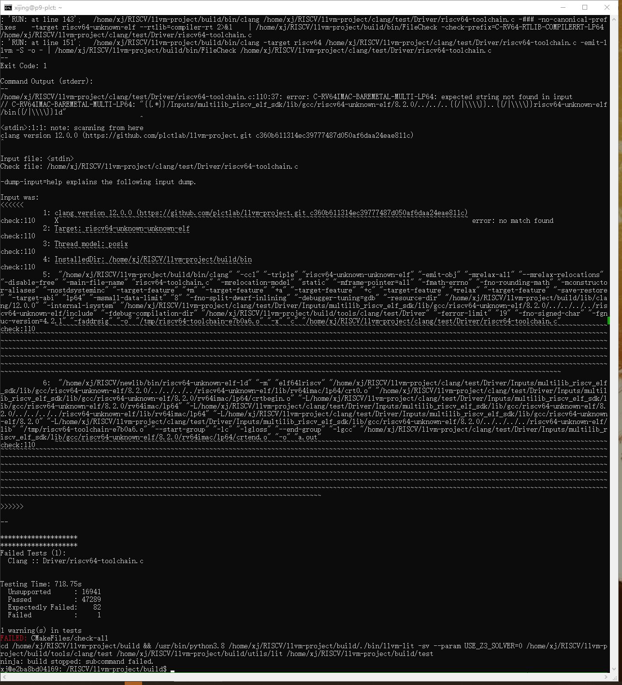
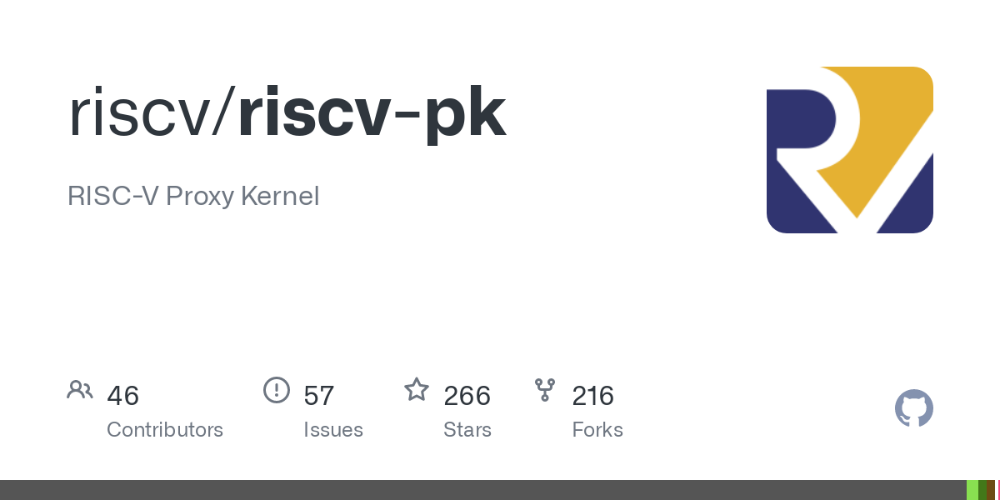
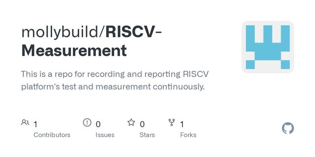

# 构建RISCV LLVM，并运行test-suite

## 构建 RISCV LLVM

**源码地址：**

https://github.com/isrc-cas/rvv-llvm——》不存在的地址

https://github.com/plctlab/llvm-project——》test-suite build的时候，会报错

https://github.com/llvm/llvm-project——》能够执行成功的源


上面的链接，我测试使用的是：https://github.com/llvm/llvm-project


测试之前，了解下llvm的test-suite：

官方网站：https://llvm.org/docs/Reference.html#id7

https://blog.csdn.net/mamamama811/article/details/110134131


https://llvm.org/docs/TestSuiteGuide.html

官网中新建的test-suite-build有什么用？

命令执行的路径也比较混乱。仅参考大致步骤即可。


**Prerequiriste:**

```shell
$ sudo apt update

$ sudo apt install cmake ninja-build
```

**构建的命令如下：**

[Cmake命令行-G 和 -D](https://www.cnblogs.com/hwx0000/p/12733599.html)

```shell
$ git clone https://github.com/plct/llvm-project.git

$ cd llvm-project

$ mkdir build && cd build

$ cmake -DLLVM_PARALLEL_LINK_JOBS=3 -DLLVM_TARGETS_TO_BUILD="X86;RISCV" -DLLVM_ENABLE_PROJECTS="clang" -G Ninja ../llvm

$ ninja

$ ninja check   #报错了，暂时不知道怎么解决，跳过
```

这个构建没有指定安装目录，可执行程序在build/bin中。


```
xj@e2ba8bd04169:~/RISCV$ git clone https://github.com/plctlab/llvm-project.git
Cloning into 'llvm-project'...
remote: Enumerating objects: 4645479, done.
remote: Counting objects: 100% (46688/46688), done.
remote: Compressing objects: 100% (14146/14146), done.
remote: Total 4645479 (delta 32442), reused 45512 (delta 32180), pack-reused 4598791
Receiving objects: 100% (4645479/4645479), 1.10 GiB | 11.57 MiB/s, done.
Resolving deltas: 100% (3679904/3679904), done.
Updating files: 100% (95796/95796), done.
xj@e2ba8bd04169:~/RISCV$ du -sh llvm-project
2.3G    llvm-project

xj@e2ba8bd04169:~/RISCV/llvm-project/build$ cmake -DLLVM_PARALLEL_LINK_JOBS=3 -DLLVM_TARGETS_TO_BUILD="X86;RISCV" -DLLVM_ENABLE_PROJECTS="clang" -G Ninja ../llvm
xj@e2ba8bd04169:~/RISCV/llvm-project/build$ ninja
ninja: no work to do.
```


```
ninja check：

--
Exit Code: 1

Command Output (stderr):
--
/home/xj/RISCV/llvm-project/clang/test/Driver/riscv64-toolchain.c:110:37: error: C-RV64IMAC-BAREMETAL-MULTI-LP64: expected string not found in input
// C-RV64IMAC-BAREMETAL-MULTI-LP64: "{{.*}}/Inputs/multilib_riscv_elf_sdk/lib/gcc/riscv64-unknown-elf/8.2.0/../../..{{/|\\\\}}..{{/|\\\\}}riscv64-unknown-elf/bin{{/|\\\\}}ld"
                                    ^
<stdin>:1:1: note: scanning from here
clang version 12.0.0 (https://github.com/plctlab/llvm-project.git c360b611314ec39777487d050af6daa24eae811c)
^

Input file: <stdin>
Check file: /home/xj/RISCV/llvm-project/clang/test/Driver/riscv64-toolchain.c

-dump-input=help explains the following input dump.

Input was:
<<<<<<
           1: clang version 12.0.0 (https://github.com/plctlab/llvm-project.git c360b611314ec39777487d050af6daa24eae811c)
check:110     X~~~~~~~~~~~~~~~~~~~~~~~~~~~~~~~~~~~~~~~~~~~~~~~~~~~~~~~~~~~~~~~~~~~~~~~~~~~~~~~~~~~~~~~~~~~~~~~~~~~~~~~~~~ error: no match found
           2: Target: riscv64-unknown-unknown-elf
check:110     ~~~~~~~~~~~~~~~~~~~~~~~~~~~~~~~~~~~
           3: Thread model: posix
check:110     ~~~~~~~~~~~~~~~~~~~
           4: InstalledDir: /home/xj/RISCV/llvm-project/build/bin
check:110     ~~~~~~~~~~~~~~~~~~~~~~~~~~~~~~~~~~~~~~~~~~~~~~~~~~~
           5:  "/home/xj/RISCV/llvm-project/build/bin/clang" "-cc1" "-triple" "riscv64-unknown-unknown-elf" "-emit-obj" "-mrelax-all" "--mrelax-relocations" "-disable-free" "-main-file-name" "riscv64-toolchain.c" "-mrelocation-model" "static" "-mframe-pointer=all" "-fmath-errno" "-fno-rounding-math" "-mconstructor-aliases" "-nostdsysteminc" "-target-feature" "+m" "-target-feature" "+a" "-target-feature" "+c" "-target-feature" "+relax" "-target-feature" "-save-restore" "-target-abi" "lp64" "-msmall-data-limit" "8" "-fno-split-dwarf-inlining" "-debugger-tuning=gdb" "-resource-dir" "/home/xj/RISCV/llvm-project/build/lib/clang/12.0.0" "-internal-isystem" "/home/xj/RISCV/llvm-project/clang/test/Driver/Inputs/multilib_riscv_elf_sdk/lib/gcc/riscv64-unknown-elf/8.2.0/../../../../riscv64-unknown-elf/include" "-fdebug-compilation-dir" "/home/xj/RISCV/llvm-project/build/tools/clang/test/Driver" "-ferror-limit" "19" "-fno-signed-char" "-fgnuc-version=4.2.1" "-faddrsig" "-o" "/tmp/riscv64-toolchain-f8d30b.o" "-x" "c" "/home/xj/RISCV/llvm-project/clang/test/Driver/riscv64-toolchain.c"
check:110     ~~~~~~~~~~~~~~~~~~~~~~~~~~~~~~~~~~~~~~~~~~~~~~~~~~~~~~~~~~~~~~~~~~~~~~~~~~~~~~~~~~~~~~~~~~~~~~~~~~~~~~~~~~~~~~~~~~~~~~~~~~~~~~~~~~~~~~~~~~~~~~~~~~~~~~~~~~~~~~~~~~~~~~~~~~~~~~~~~~~~~~~~~~~~~~~~~~~~~~~~~~~~~~~~~~~~~~~~~~~~~~~~~~~~~~~~~~~~~~~~~~~~~~~~~~~~~~~~~~~~~~~~~~~~~~~~~~~~~~~~~~~~~~~~~~~~~~~~~~~~~~~~~~~~~~~~~~~~~~~~~~~~~~~~~~~~~~~~~~~~~~~~~~~~~~~~~~~~~~~~~~~~~~~~~~~~~~~~~~~~~~~~~~~~~~~~~~~~~~~~~~~~~~~~~~~~~~~~~~~~~~~~~~~~~~~~~~~~~~~~~~~~~~~~~~~~~~~~~~~~~~~~~~~~~~~~~~~~~~~~~~~~~~~~~~~~~~~~~~~~~~~~~~~~~~~~~~~~~~~~~~~~~~~~~~~~~~~~~~~~~~~~~~~~~~~~~~~~~~~~~~~~~~~~~~~~~~~~~~~~~~~~~~~~~~~~~~~~~~~~~~~~~~~~~~~~~~~~~~~~~~~~~~~~~~~~~~~~~~~~~~~~~~~~~~~~~~~~~~~~~~~~~~~~~~~~~~~~~~~~~~~~~~~~~~~~~~~~~~~~~~~~~~~~~~~~~~~~~~~~~~~~~~~~~~~~~~~~~~~~~~~~~~~~~~~~~~~~~~~~~~~~~~~~~~~~~~~~~~~~~~~~~~~~~~~~~~~~~~~~~~~~~~~~~~~~~~~~~~~~~~~~~~~~~~~~~~~~~~~~~~~~~~~~~~~~~~~~~~~~~~~~~~~~~~~~~~~~~~~~~~~~~~~~~~~~~~~~~~~~~~~~~~~~~~~~~~~~~~~~~~~~~~~~~~~~~~~~~~~~~~~~~~~~~~~~~~~~~~~~~~~~~~~~~~~~~~~~~~~~~~~~~~~~~~~~~~~~~~~~~~~~~~~~~~~~~~~~~~~~~~~~~~~~~~~~~~~~~~~~~~~~~~~~~~~~~~~~~~~~~~~~~~~~~~~~~
           6:  "/home/xj/RISCV/newlib/bin/riscv64-unknown-elf-ld" "-m" "elf64lriscv" "/home/xj/RISCV/llvm-project/clang/test/Driver/Inputs/multilib_riscv_elf_sdk/lib/gcc/riscv64-unknown-elf/8.2.0/../../../../riscv64-unknown-elf/lib/rv64imac/lp64/crt0.o" "/home/xj/RISCV/llvm-project/clang/test/Driver/Inputs/multilib_riscv_elf_sdk/lib/gcc/riscv64-unknown-elf/8.2.0/rv64imac/lp64/crtbegin.o" "-L/home/xj/RISCV/llvm-project/clang/test/Driver/Inputs/multilib_riscv_elf_sdk/lib/gcc/riscv64-unknown-elf/8.2.0/rv64imac/lp64" "-L/home/xj/RISCV/llvm-project/clang/test/Driver/Inputs/multilib_riscv_elf_sdk/lib/gcc/riscv64-unknown-elf/8.2.0/../../../../riscv64-unknown-elf/lib/rv64imac/lp64" "-L/home/xj/RISCV/llvm-project/clang/test/Driver/Inputs/multilib_riscv_elf_sdk/lib/gcc/riscv64-unknown-elf/8.2.0" "-L/home/xj/RISCV/llvm-project/clang/test/Driver/Inputs/multilib_riscv_elf_sdk/lib/gcc/riscv64-unknown-elf/8.2.0/../../../../riscv64-unknown-elf/lib" "/tmp/riscv64-toolchain-f8d30b.o" "--start-group" "-lc" "-lgloss" "--end-group" "-lgcc" "/home/xj/RISCV/llvm-project/clang/test/Driver/Inputs/multilib_riscv_elf_sdk/lib/gcc/riscv64-unknown-elf/8.2.0/rv64imac/lp64/crtend.o" "-o" "a.out"
check:110     ~~~~~~~~~~~~~~~~~~~~~~~~~~~~~~~~~~~~~~~~~~~~~~~~~~~~~~~~~~~~~~~~~~~~~~~~~~~~~~~~~~~~~~~~~~~~~~~~~~~~~~~~~~~~~~~~~~~~~~~~~~~~~~~~~~~~~~~~~~~~~~~~~~~~~~~~~~~~~~~~~~~~~~~~~~~~~~~~~~~~~~~~~~~~~~~~~~~~~~~~~~~~~~~~~~~~~~~~~~~~~~~~~~~~~~~~~~~~~~~~~~~~~~~~~~~~~~~~~~~~~~~~~~~~~~~~~~~~~~~~~~~~~~~~~~~~~~~~~~~~~~~~~~~~~~~~~~~~~~~~~~~~~~~~~~~~~~~~~~~~~~~~~~~~~~~~~~~~~~~~~~~~~~~~~~~~~~~~~~~~~~~~~~~~~~~~~~~~~~~~~~~~~~~~~~~~~~~~~~~~~~~~~~~~~~~~~~~~~~~~~~~~~~~~~~~~~~~~~~~~~~~~~~~~~~~~~~~~~~~~~~~~~~~~~~~~~~~~~~~~~~~~~~~~~~~~~~~~~~~~~~~~~~~~~~~~~~~~~~~~~~~~~~~~~~~~~~~~~~~~~~~~~~~~~~~~~~~~~~~~~~~~~~~~~~~~~~~~~~~~~~~~~~~~~~~~~~~~~~~~~~~~~~~~~~~~~~~~~~~~~~~~~~~~~~~~~~~~~~~~~~~~~~~~~~~~~~~~~~~~~~~~~~~~~~~~~~~~~~~~~~~~~~~~~~~~~~~~~~~~~~~~~~~~~~~~~~~~~~~~~~~~~~~~~~~~~~~~~~~~~~~~~~~~~~~~~~~~~~~~~~~~~~~~~~~~~~~~~~~~~~~~~~~~~~~~~~~~~~~~~~~~~~~~~~~~~~~~~~~~~~~~~~~~~~~~~~~~~~~~~~~~~~~~~~~~~~~~~~~~~~~~~~~~~~~~~~~~~~~~~~~~~~~~~~~~~~~~~~~~~~~~~~~~~~~~~~~~~~~~~~~~~~~~~~~~~~~~~~~~~~~~~~~~~~~~~~~~~~~~~~~~~~~~~~~~~~~~~~~~~~~~~~~~~~~~~~~~~~~~~~~~~~~~~~~~~~~~~~~~~~~~~~~~~~~~~~~~~~~~~~~~~~~~~~~~~~~~~~~~~~~~~~~~~~~~~~~~~~~~~~~~~~~~~~~~~~~~~~~~~~~~~~~~~~~~~~~~~~~~~~~~~~~~~~~~~~~~~~~~~~~~~~~~
>>>>>>

--

********************
                                                                                                                                            -- Testing: 64313 tests, 52 workers --                                                                                                                                           ********************
Failed Tests (1):
  Clang :: Driver/riscv64-toolchain.c


Testing Time: 479.70s
  Unsupported      : 16941
  Passed           : 47289
  Expectedly Failed:    82
  Failed           :     1

1 warning(s) in tests
FAILED: CMakeFiles/check-all
cd /home/xj/RISCV/llvm-project/build && /usr/bin/python3.8 /home/xj/RISCV/llvm-project/build/./bin/llvm-lit -sv --param USE_Z3_SOLVER=0 /home/xj/RISCV/llvm-project/build/tools/clang/test /home/xj/RISCV/llvm-project/build/utils/lit /home/xj/RISCV/llvm-project/build/test
ninja: build stopped: subcommand failed.
xj@e2ba8bd04169:~/RISCV/llvm-project/build$
```




## 安装test-suit并测试

1、检测llvm是否构建成功

```text
<path to llvm build>/bin/llvm-lit --version  ###路径可以直接写全路径
```

>
>
>xj@e2ba8bd04169:~/RISCV/llvm-project/build$ ./bin/llvm-lit  --version
>lit 0.12.0dev


2、下载test-suite

```text
git clone https://github.com/llvm/llvm-test-suite.git test-suite
```

> 要先build llvm，再把test-suite拷到llvm/projects下面，再重新configure和build，不然会报错说找不到llvm-size工具
>
> xj@e2ba8bd04169:~/RISCV/llvm-project/build$ cd ..
>
> xj@e2ba8bd04169:~/RISCV/llvm-project$ git clone https://github.com/llvm/llvm-test-suite.git test-suite
>
> xj@e2ba8bd04169:~/RISCV/llvm-project$ cmake -DCMAKE_C_COMPILER=/home/xj/RISCV/llvm-project/build/bin/clang -C../test-suite/cmake/caches/O3.cmake ../test-suite
>
> xj@e2ba8bd04169:~/RISCV/llvm-project$ sudo apt install tcl tk tcl-dev tk-dev
>
> xj@e2ba8bd04169:~/RISCV/llvm-project/test-suite/build$ cd ..
> xj@e2ba8bd04169:~/RISCV/llvm-project/test-suite$ vim CMakeCache.txt
> xj@e2ba8bd04169:~/RISCV/llvm-project/test-suite$ vim CMakeCache.txt
>
> 在文件中修改内容：
>
> CMAKE_C_FLAGS:STRING = -fPIE
>
> CMAKE_CXX_FLAGS:STRING = fPIE
>
> xj@e2ba8bd04169:~/RISCV/llvm-project/test-suite$ find . -name speedtest.tcl
> ./MultiSource/Applications/sqlite3/speedtest.tcl
> xj@e2ba8bd04169:~/RISCV/llvm-project/test-suite$ sudo  chmod +x ./MultiSource/Applications/sqlite3/speedtest.tcl
> [sudo] password for xj:
> xj@e2ba8bd04169:~/RISCV/llvm-project/test-suite$ ll ./MultiSource/Applications/sqlite3/speedtest.tcl
> -rwxrwxr-x 1 xj xj 4151 Jun  1 03:39 ./MultiSource/Applications/sqlite3/speedtest.tcl*
>
> xj@e2ba8bd04169:~/RISCV/llvm-project/test-suite$ vim  ./MicroBenchmarks/CMakeLists.txt
>
> MicroBenchmarks/CMakeLists.txt 中注释掉add_subdirectory(XRay)
>
> xj@e2ba8bd04169:~/RISCV/llvm-project/test-suite$


xj@e2ba8bd04169:~/RISCV/llvm-project$ cmake -DCMAKE_C_COMPILER=/home/xj/RISCV/llvm-project/build/bin/clang -C../test-suite/cmake/caches/O3.cmake ../test-suite

-- Could NOT find OpenMP_C (missing: OpenMP_C_FLAGS OpenMP_C_LIB_NAMES)
-- Could NOT find OpenMP_CXX (missing: OpenMP_CXX_FLAGS OpenMP_CXX_LIB_NAMES)
-- Could NOT find OpenMP (missing: OpenMP_C_FOUND OpenMP_CXX_FOUND)
-- Check target operating system - Linux
-- Check target system architecture: x86
-- Check target system architecture: skylake-avx512
-- Adding directory Bitcode
-- No reference output found for test halide_local_laplacian
-- No reference output found for test halide_bilateral_grid
-- No reference output found for test halide_blur
-- Adding directory External
-- Adding directory MicroBenchmarks
-- Failed to find LLVM FileCheck
-- git Version: v0.0.0
-- Version: 0.0.0
-- Performing Test HAVE_THREAD_SAFETY_ATTRIBUTES -- failed to compile
-- Performing Test HAVE_GNU_POSIX_REGEX -- failed to compile
-- Performing Test HAVE_POSIX_REGEX -- success
-- Performing Test HAVE_STEADY_CLOCK -- success
-- Adding directory MultiSource
-- Adding directory SingleSource
-- Configuring done
-- Generating done
-- Build files have been written to: /home/xj/RISCV/llvm-project
xj@e2ba8bd04169:~/RISCV/llvm-project$ make


```
xj@e2ba8bd04169:~/RISCV/llvm-project/test-suite-build$ cmake -DCMAKE_C_COMPILER=/home/xj/RISCV/llvm-project/build/bin/clang -C../test-suite/cmake/caches/O3.cmake ../test-suite
loading initial cache file ../test-suite/cmake/caches/O3.cmake
CMake Error at CMakeLists.txt:71 (message):
  In-source builds are not allowed.

  CMake would overwrite the makefiles distributed with LLVM.

  Please create a directory and run cmake from there, passing the path

  to this source directory as the last argument.

  This process created the file `CMakeCache.txt' and the directory
  `CMakeFiles'.

  Please delete them.


-- Configuring incomplete, errors occurred!
See also "/home/xj/RISCV/llvm-project/test-suite/CMakeFiles/CMakeOutput.log".


xj@e2ba8bd04169:~/RISCV/llvm-project$ cmake -DCMAKE_C_COMPILER=/home/xj/RISCV/llvm-project/build/bin/clang -C../test-suite/cmake/caches/O3.cmake ../test-suite
loading initial
```


3、构建suite，注意路径

```text
cmake -DCMAKE_C_COMPILER=/llvm/rvv-llvm/build/bin/clang  -C../test-suite/cmake/caches/O3.cmake  ../test-suite
```

4、make

由于此过程耗时过长（第一次的话至少半天起步），首先要将几个报错提前修改

报错1：

```text
/usr/bin/ld: CMakeFiles/Dither.dir/orderedDitherKernel.c.o: relocation R_X86_64_32S against `.rodata' can not be used when making a PIE object; recompile with -fPIE
/usr/bin/ld: CMakeFiles/Dither.dir/__/utils/glibc_compat_rand.c.o: relocation R_X86_64_32S against `.bss' can not be used when making a PIE object; recompile with -fPIE
collect2: error: ld returned 1 exit status
make[2]: *** [MicroBenchmarks/ImageProcessing/Dither/CMakeFiles/Dither.dir/build.make:146: MicroBenchmarks/ImageProcessing/Dither/Dither] Error 1
make[1]: *** [CMakeFiles/Makefile2:14633: MicroBenchmarks/ImageProcessing/Dither/CMakeFiles/Dither.dir/all] Error 2
make: *** [Makefile:130: all] Error 2
```

解决办法，在test-suite下修改文件中的

```text
CMAKE_C_FLAGS:STRING = -fPIE

CMAKE_CXX_FLAGS:STRING = -fPIE
```

tips：由于文件过多，建议使用命令：grep -nir "xxxx"去找这两句，然后修改

报错2：

~~~text
[ 37%] Building CXX object MicroBenchmarks/XRay/ReturnReference/CMakeFiles/retref-bench.dir/retref-bench.cc.o
/home/removed/release/test-suite/MicroBenchmarks/XRay/ReturnReference/retref-bench.cc:18:10: fatal error:
      'xray/xray_interface.h' file not found
#include "xray/xray_interface.h"
         ^~~~~~~~~~~~~~~~~~~~~~~
1 error generated.
make[2]: *** [MicroBenchmarks/XRay/ReturnReference/CMakeFiles/retref-bench.dir/build.make:63: MicroBenchmarks/XRay/ReturnReference/CMakeFiles/retref-bench.dir/retref-bench.cc.o] Error 1
make[1]: *** [CMakeFiles/Makefile2:19890: MicroBenchmarks/XRay/ReturnReference/CMakeFiles/retref-bench.dir/all] Error 2
make: *** [Makefile:130: all] Error 2
```
~~~

解决办法：

MicroBenchmarks/CMakeLists.txt 中注释掉add_subdirectory(XRay)

tip：如果一时半会没找到文件，同样建议使用上面的字符串搜索命令。

应该是在build下的test-suite或者test-suite-build下

三、运行llvm test-suite

注意加上全路径执行

```text
$ llvm-lit -v -j 1 -o results.json .
/home/xj/RISCV/llvm-project/build/bin/llvm-lit -v -j 1 -o results.json .

# Make sure pandas and scipy are installed. Prepend `sudo` if necessary.
$ pip install pandas scipy

# Show a single result file:
$ test-suite/utils/compare.py results.json
```

```
xj@e2ba8bd04169:~/RISCV/llvm-project$ ./build/bin/llvm-lit -v -j 1 -o results.json .
llvm-lit: /home/xj/RISCV/llvm-project/build/bin/../../llvm/utils/lit/lit/TestingConfig.py:99: fatal: unable to parse config file '/home/xj/RISCV/llvm-project/compiler-rt/test/msan/lit.cfg.py', traceback: Traceback (most recent call last):
  File "/home/xj/RISCV/llvm-project/build/bin/../../llvm/utils/lit/lit/TestingConfig.py", line 88, in load_from_path
    exec(compile(data, path, 'exec'), cfg_globals, None)
  File "/home/xj/RISCV/llvm-project/compiler-rt/test/msan/lit.cfg.py", line 16, in <module>
    [config.target_cflags] +
AttributeError: 'TestingConfig' object has no attribute 'target_cflags'

xj@e2ba8bd04169:~/RISCV/llvm-project$ find . -name llvm-lit
./llvm/test/tools/llvm-lit
./llvm/utils/gn/secondary/llvm/utils/llvm-lit
./llvm/utils/llvm-lit
./build/bin/llvm-lit
./build/test/tools/llvm-lit
./build/utils/llvm-lit
xj@e2ba8bd04169:~/RISCV/llvm-project$
```


**交叉编译RISCV的llvm test-suite**

***\*1. 在clang_riscv_linux.cmake中配置工具链信息。\****

在test-suite-build下新建riscv-build目录

```text
mkdir riscv-build && cd riscv-build
```

新建配置文件clang_riscv_linux.cmake

内容如下：

```text
set(CMAKE_SYSTEM_NAME Linux )
set(triple riscv64-unknown-linux-gnu )
set(CMAKE_C_COMPILER /llvm/llvm-project/build/bin/clang CACHE STRING "" FORCE)
set(CMAKE_C_COMPILER_TARGET ${triple} CACHE STRING "" FORCE)
set(CMAKE_CXX_COMPILER /llvm/llvm-project/build/bin/clang++ CACHE STRING "" FORCE)
set(CMAKE_CXX_COMPILER_TARGET ${triple} CACHE STRING "" FORCE)
set(CMAKE_SYSROOT /root/riscv/linux/sysroot )
set(CMAKE_C_COMPILER_EXTERNAL_TOOLCHAIN  /root/riscv/linux/)
set(CMAKE_CXX_COMPILER_EXTERNAL_TOOLCHAIN  /root/riscv/linux/)
###操作时请注意每一个路径的修改
```

**2. cmake和make**

```text
cmake -DCMAKE_TOOLCHAIN_FILE=/llvm/llvm-projects/build/test-suite-build/riscv-build/clang_riscv_linux.cmake  -DCMAKE_C_COMPILER="/llvm/llvm-project/build/bin/clang"  ../
```

可能会报错：

```text
OMPILER="/llvm/llvm-projects/build/bin/clang"  ../
-- The C compiler identification is unknown
CMake Error at CMakeLists.txt:7 (project):
  The CMAKE_C_COMPILER:

    /llvm/llvm-projects/build/bin/clang

  is not a full path to an existing compiler tool.
```

解决办法：

根据前面的参考，做好工具链的安装配置，修改好对应的路径。

**3. 在模拟器上运行交叉编译的test-suite\****

```text
-需要安装dtc

apt-get install device-tree-compiler

- ld加上选项-static

在CMakeCache.txt中修改下面的配置项


//Flags used by the linker during all build types.
CMAKE_EXE_LINKER_FLAGS:STRING= -static

apt-get install device-tree-compiler
```

**首先做好spike跟pk的安装，关于这两个模拟器的安装还是参考前面的链接**

**spike的安装**：这里的RISCV$对应我们一开始设置的环境变量

这是另外一个模拟器spike，依旧是先下载源代码：

```text
git clone https://github.com/riscv/riscv-isa-sim.git
```

然后编译newlib版：

```text
RISCV$ cd riscv-isa-sim
riscv-isa-sim$ mkdir build
riscv-isa-sim$ cd build
build$ ../configure --prefix=$RISCV/newlib  #linux版为$RISCV/linux
build$ make # 内存较大可用 -j $(nproc)
build$ make install
```

**PK的安装：**

[riscv/riscv-pkgithub.com](https://link.zhihu.com/?target=https%3A//github.com/riscv/riscv-pk)

tip：这里要注意

~~~text
Alternatively, the GNU/Linux toolchain may be used to build this package, by setting--host=riscv64-unknown-linux-gnu.
所以在进行构建时，注意后面参数的修改
```shell
root@e7299bcbf9e1:~/llvm/projects/llvm-test-suite-main/riscv-build/SingleSource/Benchmarks/Linpack# spike --isa=RV64gc /root/bin/riscv64-unknown-linux-gnu/bin/pk functionobjects
```
注意pk需要是linux/gnu版本的。

有一些可以成功的运行，有一些测试程序需要用到动态链接库的，就会出错。

我试了一下这个程序是可以正确执行的：
SingleSource/Benchmarks/BenchmarkGame/fannkuch

仿真的命令是：

```shell
spike --isa=RV64gc /root/bin/riscv64-unknown-linux-gnu/bin/pk fannkuch > fannkuch.result 2>&1
~~~

参考链接：

[mollybuild/RISCV-Measurementgithub.com](https://link.zhihu.com/?target=https%3A//github.com/mollybuild/RISCV-Measurement/blob/master/Build-RISCV-LLVM-and-run-testsuite.md)[mollybuild/RISCV-Measurementgithub.com](https://link.zhihu.com/?target=https%3A//github.com/mollybuild/RISCV-Measurement/blob/master/run-riscv-gnu-toolchain-testsuite.md)


## 运行LLVM test-suite

**1. 编译test-suite，参考官方文档：**

https://llvm.org/docs/TestSuiteGuide.html


```
xj@e2ba8bd04169:~/RISCV/llvm-project/build$ ./bin/llvm-lit  --version
lit 0.12.0dev
xj@e2ba8bd04169:~/RISCV/llvm-project/build$ cd ..
xj@e2ba8bd04169:~/RISCV/llvm-project$ ll
total 132
drwxrwxr-x 23 xj xj 4096 Jun  1 01:26 ./
drwxrwxr-x 20 xj xj 4096 Jun  1 01:17 ../
-rw-rw-r--  1 xj xj  155 Jun  1 01:21 .arcconfig
-rw-rw-r--  1 xj xj  437 Jun  1 01:21 .arclint
-rw-rw-r--  1 xj xj   19 Jun  1 01:21 .clang-format
-rw-rw-r--  1 xj xj  913 Jun  1 01:21 .clang-tidy
drwxrwxr-x  8 xj xj 4096 Jun  1 01:21 .git/
-rw-rw-r--  1 xj xj 1256 Jun  1 01:21 .git-blame-ignore-revs
-rw-rw-r--  1 xj xj 1966 Jun  1 01:21 .gitignore
-rw-rw-r--  1 xj xj  253 Jun  1 01:21 .gitlab-ci.yml
-rw-rw-r--  1 xj xj  455 Jun  1 01:21 CONTRIBUTING.md
-rw-rw-r--  1 xj xj 4526 Jun  1 01:21 README.md
drwxrwxr-x 18 xj xj 4096 Jun  1 02:34 build/
drwxrwxr-x 15 xj xj 4096 Jun  1 01:21 clang/
drwxrwxr-x 17 xj xj 4096 Jun  1 01:21 clang-tools-extra/
drwxrwxr-x 11 xj xj 4096 Jun  1 01:21 compiler-rt/
drwxrwxr-x  7 xj xj 4096 Jun  1 01:21 debuginfo-tests/
drwxrwxr-x 12 xj xj 4096 Jun  1 01:21 flang/
drwxrwxr-x 15 xj xj 4096 Jun  1 01:21 libc/
drwxrwxr-x 13 xj xj 4096 Jun  1 01:21 libclc/
drwxrwxr-x 12 xj xj 4096 Jun  1 01:21 libcxx/
drwxrwxr-x  9 xj xj 4096 Jun  1 01:21 libcxxabi/
drwxrwxr-x  7 xj xj 4096 Jun  1 01:21 libunwind/
drwxrwxr-x 16 xj xj 4096 Jun  1 01:21 lld/
drwxrwxr-x 16 xj xj 4096 Jun  1 01:21 lldb/
drwxrwxr-x 16 xj xj 4096 Jun  1 01:21 llvm/
drwxrwxr-x 12 xj xj 4096 Jun  1 01:21 mlir/
drwxrwxr-x  8 xj xj 4096 Jun  1 01:21 openmp/
drwxrwxr-x  3 xj xj 4096 Jun  1 01:21 parallel-libs/
drwxrwxr-x 11 xj xj 4096 Jun  1 01:21 polly/
drwxrwxr-x  6 xj xj 4096 Jun  1 01:21 pstl/
drwxrwxr-x  3 xj xj 4096 Jun  1 01:21 utils/
xj@e2ba8bd04169:~/RISCV/llvm-project$ git clone https://github.com/llvm/llvm-test-suite.git test-suite
```


**注意事项：**

- 要先build llvm，再把test-suite拷到llvm/projects下面，再重新configure和build，不然会报错说找不到llvm-size工具；

- 可能需要安装`tcl, tk, tcl-dev, tk-dev`，缺少这些包在cmake时报如下错误：

```shell
-- Could NOT find TCL (missing: TCL_INCLUDE_PATH)
-- Could NOT find TCLTK (missing: TCL_INCLUDE_PATH TK_INCLUDE_PATH)
-- Could NOT find TK (missing: TK_INCLUDE_PATH)
```

- 链接阶段可能报PIE的错误，报错如下：

```shell
/usr/bin/ld: CMakeFiles/Dither.dir/orderedDitherKernel.c.o: relocation R_X86_64_32S against `.rodata' can not be used when making a PIE object; recompile with -fPIE
/usr/bin/ld: CMakeFiles/Dither.dir/__/utils/glibc_compat_rand.c.o: relocation R_X86_64_32S against `.bss' can not be used when making a PIE object; recompile with -fPIE
collect2: error: ld returned 1 exit status
make[2]: *** [MicroBenchmarks/ImageProcessing/Dither/CMakeFiles/Dither.dir/build.make:146: MicroBenchmarks/ImageProcessing/Dither/Dither] Error 1
make[1]: *** [CMakeFiles/Makefile2:14633: MicroBenchmarks/ImageProcessing/Dither/CMakeFiles/Dither.dir/all] Error 2
make: *** [Makefile:130: all] Error 2
```

解决方法是在文件test-suite-build/CMakeCache.txt中修改：

CMAKE_C_FLAGS:STRING = -fPIE

CMAKE_CXX_FLAGS:STRING = fPIE

- 可能遇到speedtest.tcl权限问题，报错如下：

```shell
[ 26%] Generating sqlite test inputs
/bin/sh: 1: /home/cxo/repo/llvm-project/llvm/projects/llvm-test-suite/MultiSource/Applications/sqlite3/speedtest.tcl: Permission denied
make[2]: *** [MultiSource/Applications/sqlite3/CMakeFiles/sqlite_input.dir/build.make:58：MultiSource/Applications/sqlite3/test15.sql] 错误 126
make[1]: *** [CMakeFiles/Makefile2:29299：MultiSource/Applications/sqlite3/CMakeFiles/sqlite_input.dir/all] 错误 2
make: *** [Makefile:130：all] 错误 2
```

给speedtest.tcl加上可执行权限（chmod +x 就可以了）。

- XRay可能编译不过，就先注释掉吧

报错如下：

```shell
Scanning dependencies of target retref-bench
[ 37%] Building CXX object MicroBenchmarks/XRay/ReturnReference/CMakeFiles/retref-bench.dir/retref-bench.cc.o
/home/removed/release/test-suite/MicroBenchmarks/XRay/ReturnReference/retref-bench.cc:18:10: fatal error:
      'xray/xray_interface.h' file not found
#include "xray/xray_interface.h"
         ^~~~~~~~~~~~~~~~~~~~~~~
1 error generated.
make[2]: *** [MicroBenchmarks/XRay/ReturnReference/CMakeFiles/retref-bench.dir/build.make:63: MicroBenchmarks/XRay/ReturnReference/CMakeFiles/retref-bench.dir/retref-bench.cc.o] Error 1
make[1]: *** [CMakeFiles/Makefile2:19890: MicroBenchmarks/XRay/ReturnReference/CMakeFiles/retref-bench.dir/all] Error 2
make: *** [Makefile:130: all] Error 2
```

MicroBenchmarks/CMakeLists.txt 中注释掉add_subdirectory(XRay)

**2. 运行llvm test-suite**

Command:

```shell
# run test in test-suite-build dir. and llvm-lit need in your PATH or use full path. 
# the last "." represents the test path.
$ llvm-lit -v -j 1 -o results.json .

# Make sure pandas and scipy are installed. Prepend `sudo` if necessary.
$ pip install pandas scipy

# Show a single result file:
$ test-suite/utils/compare.py results.json
```

我这里查看结果如下:

```shell
cxo@be42fa9ca89b:~/repo/llvm-project/llvm/projects/llvm-test-suite/llvm-test-build$ ../utils/compare.py results.json
Warning: 'test-suite :: MicroBenchmarks/XRay/FDRMode/fdrmode-bench.test' has no metrics, skipping!
Warning: 'test-suite :: MicroBenchmarks/XRay/ReturnReference/retref-bench.test' has no metrics, skipping!
Warning: 'test-suite :: SingleSource/UnitTests/Vector/AVX512F/Vector-AVX512F-reduce.test' has no metrics, skipping!
Tests: 2882
Metric: exec_time

Program                                        results
LCALS/Subs...aw.test:BM_MAT_X_MAT_RAW/44217   230781.79
LCALS/Subs...test:BM_MAT_X_MAT_LAMBDA/44217   229731.13
ImageProce...t:BENCHMARK_GAUSSIAN_BLUR/1024    77005.87
harris/har...est:BENCHMARK_HARRIS/2048/2048    38352.47
ImageProce...HMARK_ANISTROPIC_DIFFUSION/256    30532.07
ImageProce...MARK_BICUBIC_INTERPOLATION/256    21323.56
ImageProce...st:BENCHMARK_GAUSSIAN_BLUR/512    18230.56
LCALS/Subs....test:BM_MAT_X_MAT_LAMBDA/5001    10144.18
harris/har...est:BENCHMARK_HARRIS/1024/1024    10035.18
LCALS/Subs...Raw.test:BM_MAT_X_MAT_RAW/5001     8981.66
ImageProce...HMARK_ANISTROPIC_DIFFUSION/128     7359.81
ImageProce...MARK_BICUBIC_INTERPOLATION/128     5186.29
ImageProce...st:BENCHMARK_GAUSSIAN_BLUR/256     4502.60
ImageProce...ARK_BILINEAR_INTERPOLATION/256     4033.49
ImageProce...t:BENCHMARK_boxBlurKernel/1024     3788.60
             results
count  2866.000000
mean   311.559959
std    6350.988758
min    0.000000
25%    0.000400
50%    0.000500
75%    0.004400
max    230781.792333
```

## 交叉编译RISCV的llvm test-suite

**1. 新建build目录**
可以在你的test-suite目录下创建一个riscv-build目录，用于交叉编译.
例如：

```
$ cd ~/chenxiaoou/rvv-llvm/llvm/projects/llvm-test-suite-main/
$ mkdir riscv-build
```

**2. 新建clang_riscv_linux.cmake，配置工具链信息。**

配置文件目录 rvv-llvm/llvm/projects/llvm-test-suite-main/your-build-dir/clang_riscv_linux.cmake

在llvm-test-suite-main/riscv-build/目录下新建clang_riscv_linux.cmake，编辑内容如下：

```shell
root@e7299bcbf9e1:~/chenxiaoou/rvv-llvm/llvm/projects/llvm-test-suite-main/riscv-build# cat clang_riscv_linux.cmake
set(CMAKE_SYSTEM_NAME Linux )
set(triple riscv64-unknown-linux-gnu )
set(CMAKE_C_COMPILER /root/chenxiaoou/rvv-llvm/build/bin/clang CACHE STRING "" FORCE)
set(CMAKE_C_COMPILER_TARGET ${triple} CACHE STRING "" FORCE)
set(CMAKE_CXX_COMPILER /root/chenxiaoou/rvv-llvm/build/bin/clang++ CACHE STRING "" FORCE)
set(CMAKE_CXX_COMPILER_TARGET ${triple} CACHE STRING "" FORCE)
set(CMAKE_SYSROOT /root/riscv/linux/sysroot )
set(CMAKE_C_COMPILER_EXTERNAL_TOOLCHAIN  /root/riscv/linux/)
set(CMAKE_CXX_COMPILER_EXTERNAL_TOOLCHAIN  /root/riscv/linux/)
```

*我尝试用gnu toolchain newlib编译不能通过，用linux lib是可以的*


**3. cmake和make**

```shell
$ cd ~/chenxiaoou/rvv-llvm/llvm/projects/llvm-test-suite-main/riscv-build
$ cmake -DCMAKE_TOOLCHAIN_FILE=/root/chenxiaoou/rvv-llvm/llvm/projects/llvm-test-suite-main/riscv-build/clang_riscv_linux.cmake  -DCMAKE_C_COMPILER="/root/chenxiaoou/rvv-llvm/build/bin/clang"  ../

$ make
```

可能有报错如下：

- 找不到crt1.o

```shell
riscv64-unknown-linux-gnu/bin/ld: cannot find crt1.o: No such file or directory
```

那么注意看一下CMAKE_SYSROOT指定的目录中是否有crt1.o

- matrix-types-spec编译不过

build下面的程序可能有问题，会卡住：
SingleSource/UnitTests/CMakeFiles/matrix-types-spec.dir/matrix-types-spec.cpp.o

解决的办法就是暂时不要它，通过修改SingleSource/UnitTests/CMakeFiles/CMakeLists.txt:

```
# Enable matrix types extension tests for compilers supporting -fenable-matrix.
check_c_compiler_flag(-fenable-matrix COMPILER_HAS_MATRIX_FLAG)
if (COMPILER_HAS_MATRIX_FLAG)
  set_property(SOURCE matrix-types-spec.cpp PROPERTY COMPILE_FLAGS -fenable-matrix)
else()
  list(REMOVE_ITEM Source matrix-types-spec.cpp)
endif()
++ # Hack for testing riscv.
++  list(REMOVE_ITEM Source matrix-types-spec.cpp)
```

**4. 在模拟器上运行交叉编译的test-suite**

- 需要安装dtc

```shell
apt-get install device-tree-compiler
```

- ld加上选项-static

在CMakeCache.txt中修改下面的配置项

```shell
//Flags used by the linker during all build types.
CMAKE_EXE_LINKER_FLAGS:STRING= -static
```


- 手动运动单个测试用例

```shell
root@e7299bcbf9e1:~/chenxiaoou/rvv-llvm/llvm/projects/llvm-test-suite-main/riscv-build/SingleSource/Benchmarks/Linpack# spike --isa=RV64gc /root/bin/riscv64-unknown-linux-gnu/bin/pk functionobjects
```

注意pk需要是linux/gnu版本的。

有一些可以成功的运行，有一些测试程序需要用到动态链接库的，就会出错。

我试了一下这个程序是可以正确执行的：
SingleSource/Benchmarks/BenchmarkGame/fannkuch

仿真的命令是：

```shell
spike --isa=RV64gc /root/bin/riscv64-unknown-linux-gnu/bin/pk fannkuch > fannkuch.result 2>&1
```

对比参考输出，程序的输出正常。


