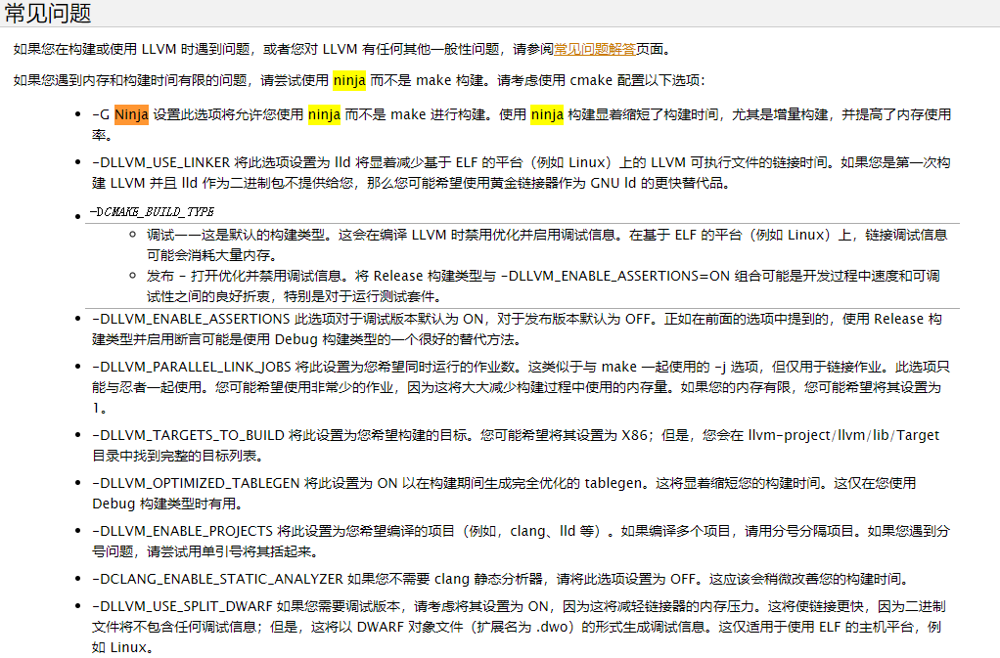
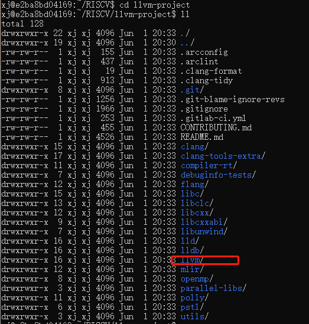
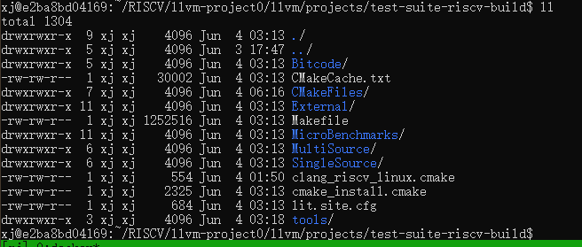

# 构建RISCV LLVM，并运行test-suite

参考文档：

https://zhuanlan.zhihu.com/p/373431891

https://github.com/mollybuild/RISCV-Measurement/blob/master/Build-RISCV-LLVM-and-run-testsuite.md


**源码地址：**

不同的文章给出了不同的连接地址：

https://github.com/isrc-cas/rvv-llvm——》不存在的地址

https://github.com/plctlab/llvm-project——》test-suite build的时候，会报错

https://github.com/llvm/llvm-project——》**能够执行成功的源**


测试使用的是：https://github.com/llvm/llvm-project.git


测试之前，了解下llvm的test-suite：

官方网站：

https://llvm.org/docs/Reference.html#id7

要运行所有 LLVM 回归测试，请使用 check-llvm 目标：

```
% make check-llvm
```

【测试指导】https://llvm.org/docs/TestSuiteGuide.html 

- 官网中新建的test-suite-build有什么用？

- 命令执行的路径也比较混乱。仅参考大致步骤即可。


https://blog.csdn.net/mamamama811/article/details/110134131


ninja:https://blog.csdn.net/tongyi04/article/details/110131799

https://llvm.org/docs/GettingStarted.html




## 构建LLVM

1、环境准备

```shell
$ sudo apt update
$ sudo apt install cmake ninja-build
```

配置环境变量，后面的命令若用到环境变量，都是事先配置好的。


2、下载llvm-project并构建

[Cmake命令行-G 和 -D](https://www.cnblogs.com/hwx0000/p/12733599.html)

```shell
$ git clone https://github.com/plctlab/llvm-project.git

$ cd llvm-project

$ mkdir build && cd build

$ cmake -DLLVM_PARALLEL_LINK_JOBS=3 -DLLVM_TARGETS_TO_BUILD="X86;RISCV" -DLLVM_ENABLE_PROJECTS="clang" -G Ninja ../llvm
# cmake的源文件是llvm-project/llvm——》编译结果：llvm-project/build/bin

$ ninja

$ ninja check   #报错了，跳过继续往下执行
```

执行完成后，相关的目录参考：



![(images/image-20210602134433678.png)


## 构建和运行test-suit

### 构建test-suit

可参考官方文档：https://llvm.org/docs/TestSuiteGuide.html


1、检测llvm是否构建成功

```text
<path to llvm build>/bin/llvm-lit --version  ###路径可以直接写全路径
如：
xj@e2ba8bd04169:~/RISCV/llvm-project/build$ ./bin/llvm-lit --version
lit 13.0.0dev
```


2、下载llvm-test-suite：

各文档都没有说明下载到哪里，我这边也因此纠结好久，建议：

将git的test-suite放到llvm-project/llvm/projects下面；然后同时在llvm-project/llvm/projects下面创建test-suite-build作为其构建路径；

即目录结构为：llvm-project/llvm/projects/test-suite

```
 git clone https://github.com/llvm/llvm-test-suite.git test-suite
```


3、创建test-suite-build目录，作为test-suite的构建目录；

```
 mkdir test-suite-build && cd test-suite-build
```

我这里将test-suite-build创建在了llvm-project/llvm/projects下面，与test-suite平级；

```             
xj@e2ba8bd04169:~/RISCV/llvm-project0/llvm/projects $    mkdir test-suite-build && cd test-suite-build
```


4、CMake

xj@e2ba8bd04169:~/RISCV/llvm-project0/build/test-suite/build$ cmake -DCMAKE_C_COMPILER=/home/xj/RISCV/llvm-project0/build/bin/clang -C../test-suite/cmake/caches/O3.cmake ../test-suite

说明：看到$ 前我的路径了吧，我因为尝试多个git源的代码，因此这里修改了 llvm-project 文件夹名字为 llvm-project0。大家按照自己的目录名对应修改指令即可。这里尤其注意 -DCMAKE_C_COMPILER=的值。


5、make

由于llvm-test-suite每次make的时间都超过5小时，只多不少哈。所以出错重新make会比较费时间，通过自己之前的测试和其它同事总结的经验，这里最好在make之前修改以下内容，以保证make成功。

（1）、【验证过的必改内容】修改test-suite/MicroBenchmarks/CMakeLists.txt文件，注释掉add_subdirectory(XRay)

```
xj@e2ba8bd04169:~/RISCV/llvm-project0/llvm/projects/test-suite-build$ vim ../test-suite/MicroBenchmarks/CMakeLists.txt
```

注释掉add_subdirectory(XRay);

否则会报错：


（2）、【自己未验证】修改llvm/projects/test-suite-build/CMakeCache.txt

```
xj@e2ba8bd04169:~/RISCV/llvm-project0/llvm/projects/test-suite-build$ vim CMakeCache.txt
```

通过vim的查找命令找到以下两行（默认等号后为空），改成如下的值：

```text
CMAKE_C_FLAGS:STRING = -fPIE
CMAKE_CXX_FLAGS:STRING = -fPIE
```


（3）、【自己未验证】增加test-suite/MultiSource/Applications/sqlite3/speedtest.tcl 的可执行权限

```
xj@e2ba8bd04169:~/RISCV/llvm-project0/llvm/projects/test-suite-build$ find ../ -name speedtest.tcl
../test-suite/MultiSource/Applications/sqlite3/speedtest.tcl
xj@e2ba8bd04169:~/RISCV/llvm-project0/llvm/projects/test-suite-build$ sudo chmod +x ../test-suite/MultiSource/Applications/sqlite3/speedtest.tcl
[sudo] password for xj:
xj@e2ba8bd04169:~/RISCV/llvm-project0/llvm/projects/test-suite-build$ ll ../test-suite/MultiSource/Applications/sqlite3/speedtest.tcl
-rwxrwxr-x 1 xj xj 4151 Jun  2 19:12 ../test-suite/MultiSource/Applications/sqlite3/speedtest.tcl*
```


（4）、安装

```
$ sudo apt install tcl  tk tcl-dev tk-dev
```


（5）、执行make

```
xj@e2ba8bd04169:~/RISCV/llvm-project0/llvm/projects/test-suite-build$  make
```

说明：这里make将执行很长的时间。

xj@e2ba8bd04169:~/RISCV/llvm-project0/llvm/projects/test-suite-build$ ll
total 1588
drwxrwxr-x  9 xj xj    4096 Jun  3 02:36 ./
drwxrwxr-x  4 xj xj    4096 Jun  3 02:24 ../
drwxrwxr-x  6 xj xj    4096 Jun  3 02:35 Bitcode/
-rw-rw-r--  1 xj xj   29982 Jun  3 02:32 CMakeCache.txt
drwxrwxr-x  7 xj xj    4096 Jun  3 07:09 CMakeFiles/
drwxrwxr-x 11 xj xj    4096 Jun  3 02:35 External/
-rw-rw-r--  1 xj xj 1545759 Jun  3 02:35 Makefile
drwxrwxr-x 11 xj xj    4096 Jun  3 02:35 MicroBenchmarks/
drwxrwxr-x  6 xj xj    4096 Jun  3 02:35 MultiSource/
drwxrwxr-x  6 xj xj    4096 Jun  3 02:36 SingleSource/
-rw-rw-r--  1 xj xj    2284 Jun  3 02:25 cmake_install.cmake
-rw-rw-r--  1 xj xj     630 Jun  3 02:25 lit.site.cfg
drwxrwxr-x  3 xj xj    4096 Jun  3 02:36 tools/


### 运行llvm test-suite

Command:  [参考文档LLVM Command Guide](https://llvm.org/docs/CommandGuide/lit.html)

```shell
# run test in test-suite-build dir. and llvm-lit need in your PATH or use full path. 
# the last "." represents the test path.
$ llvm-lit -v -j 1 -o results.json .

# Make sure pandas and scipy are installed. Prepend `sudo` if necessary.
$ pip install pandas scipy

# Show a single result file:
$ test-suite/utils/compare.py results.json
```


1、按照上面的命令，我这边按照上述构建的目录结构，我这边执行的命令如下：

```
xj@e2ba8bd04169:~/RISCV/llvm-project0/llvm/projects/test-suite-build$ ~/RISCV/llvm-project0/build/bin/llvm-lit -v -j 1 -o results.json .
```

2、pip安装pandas、scipy

可能需要先安装pip，我这边的具体操作如下:

```
xj@e2ba8bd04169:~/RISCV/llvm-project0/llvm/projects/test-suite-build$ sudo pip install pandas scipy
sudo: pip: command not found
----------------------------------------------------------------
xj@e2ba8bd04169:/usr/local/lib/python2.7/dist-packages$ sudo curl https://bootstrap.pypa.io/pip/2.7/get-pip.py -o get-pip.py
  % Total    % Received % Xferd  Average Speed   Time    Time     Time  Current
                                 Dload  Upload   Total   Spent    Left  Speed
100 1863k  100 1863k    0     0  34.3M      0 --:--:-- --:--:-- --:--:-- 34.3M
xj@e2ba8bd04169:/usr/local/lib/python2.7/dist-packages$ ll
total 1872
drwxrwsr-x 2 root staff    4096 Jun  3 17:12 ./
drwxrwsr-x 4 root staff    4096 May 28 17:04 ../
-rw-r--r-- 1 root staff 1908226 Jun  3 17:12 get-pip.py
xj@e2ba8bd04169:/usr/local/lib/python2.7/dist-packages$ sudo chmod +x *.py
xj@e2ba8bd04169:/usr/local/lib/python2.7/dist-packages$ python get-pip.py

xj@e2ba8bd04169:/usr/local/lib/python2.7/dist-packages$ python get-pip.py
DEPRECATION: Python 2.7 reached the end of its life on January 1st, 2020. Please upgrade your Python as Python 2.7 is no longer maintained. pip 21.0 will drop support for Python 2.7 in January 2021. More details about Python 2 support in pip can be found at https://pip.pypa.io/en/latest/development/release-process/#python-2-support pip 21.0 will remove support for this functionality.
Defaulting to user installation because normal site-packages is not writeable
Collecting pip<21.0
  Downloading pip-20.3.4-py2.py3-none-any.whl (1.5 MB)
     |################################| 1.5 MB 19.0 MB/s
Collecting setuptools<45
  Downloading setuptools-44.1.1-py2.py3-none-any.whl (583 kB)
     |################################| 583 kB 131.3 MB/s
Collecting wheel
  Downloading wheel-0.36.2-py2.py3-none-any.whl (35 kB)
Installing collected packages: pip, setuptools, wheel
  WARNING: The scripts pip, pip2 and pip2.7 are installed in '/home/xj/.local/bin' which is not on PATH.
  Consider adding this directory to PATH or, if you prefer to suppress this warning, use --no-warn-script-location.
  WARNING: The scripts easy_install and easy_install-2.7 are installed in '/home/xj/.local/bin' which is not on PATH.
  Consider adding this directory to PATH or, if you prefer to suppress this warning, use --no-warn-script-location.
  WARNING: The script wheel is installed in '/home/xj/.local/bin' which is not on PATH.
  Consider adding this directory to PATH or, if you prefer to suppress this warning, use --no-warn-script-location.
  
  编辑.bashrc环境变量，把'/home/xj/.local/bin' 添加到PATH.
  
  xj@e2ba8bd04169:~/.local/bin$  ./pip install pandas scipy
```


3、运行test-suite/utils/compare.py results.json

执行结果：

```
xj@e2ba8bd04169:~/RISCV/llvm-project0/llvm/projects/test-suite-build$ ../test-suite/utils/compare.py results.json
Tests: 2939
Metric: exec_time

Program                                         results
 LCALS/Subs...test:BM_MAT_X_MAT_LAMBDA/44217   232937.60
 LCALS/Subs...aw.test:BM_MAT_X_MAT_RAW/44217   230737.60
 ImageProce...t:BENCHMARK_GAUSSIAN_BLUR/1024   76605.66
 harris/har...est:BENCHMARK_HARRIS/2048/2048   37791.02
 ImageProce...HMARK_ANISTROPIC_DIFFUSION/256   30690.55
 ImageProce...MARK_BICUBIC_INTERPOLATION/256   21273.31
 ImageProce...st:BENCHMARK_GAUSSIAN_BLUR/512   18133.11
 LCALS/Subs....test:BM_MAT_X_MAT_LAMBDA/5001   10727.87
 LCALS/Subs...Raw.test:BM_MAT_X_MAT_RAW/5001   10589.28
 harris/har...est:BENCHMARK_HARRIS/1024/1024   9858.62
 ImageProce...HMARK_ANISTROPIC_DIFFUSION/128   7391.75
 ImageProce...MARK_BICUBIC_INTERPOLATION/128   5162.42
 MemFunctio...mCmp<1, GreaterThanZero, None>   4481.69
 ImageProce...st:BENCHMARK_GAUSSIAN_BLUR/256   4384.49
 MemFunctio...emCmp<1, GreaterThanZero, Mid>   4290.40
             results
count  2922.000000
mean   320.374646
std    6330.932416
min    0.000000
25%    0.000500
50%    0.000500
75%    0.007425
max    232937.596667
```


## 交叉编译RISCV的llvm test-suite

### 构建riscv下的test-sutie

1、在llvm-project/llvm/projects下面创建test-suite-riscv-build作为交叉编译的构建路径；

```
xj@e2ba8bd04169:~/RISCV/llvm-project0/llvm/projects$ mkdir test-suite-riscv-build
xj@e2ba8bd04169:~/RISCV/llvm-project0/llvm/projects$ ll
total 24
drwxrwxr-x  5 xj xj 4096 Jun  3 17:47 ./
drwxrwxr-x 16 xj xj 4096 May 28 18:46 ../
-rw-rw-r--  1 xj xj 2124 May 28 18:46 CMakeLists.txt
drwxrwxr-x 21 xj xj 4096 Jun  2 19:58 test-suite/
drwxrwxr-x  9 xj xj 4096 Jun  3 17:47 test-suite-build/
drwxrwxr-x  2 xj xj 4096 Jun  3 17:47 test-suite-riscv-build/                                            
```


2、新建配置文件clang_riscv_linux.cmake，并在clang_riscv_linux.cmake中配置工具链信息.

配置文件路径：test-suite-riscv-build/ clang_riscv_linux.cmake

/home/xj/RISCV/llvm-project0/llvm/projects/test-suite-riscv-build


先不着急创建文件，请对照之前自己安装的具体路径，将以下配置文件中的各路径搞清楚：

clang_riscv_linux.cmake配置文件内容如下：

```text
set(CMAKE_SYSTEM_NAME Linux )
set(triple riscv64-unknown-linux-gnu )
set(CMAKE_C_COMPILER /llvm/llvm-project/build/bin/clang CACHE STRING "" FORCE)
set(CMAKE_C_COMPILER_TARGET ${triple} CACHE STRING "" FORCE)
set(CMAKE_CXX_COMPILER /llvm/llvm-project/build/bin/clang++ CACHE STRING "" FORCE)
set(CMAKE_CXX_COMPILER_TARGET ${triple} CACHE STRING "" FORCE)
set(CMAKE_SYSROOT /root/riscv/linux/sysroot )
set(CMAKE_C_COMPILER_EXTERNAL_TOOLCHAIN  /root/riscv/linux/)
set(CMAKE_CXX_COMPILER_EXTERNAL_TOOLCHAIN  /root/riscv/linux/)
###操作时请注意每一个路径的修改
```

> 参考小欧的笔记，newlib编译未成功，用linux编译成功了。我这边重点体验流程，为了节约时间，先只跑一遍linux编译的。


说明：

- /llvm/llvm-project/build/bin/clang  ——》替换成自己的llvm build路径，我这里是
- /root/riscv/linux/  ——》这里是【安装RISC-V编译环境】---->【riscv-gnu-toolchain】---->【构建linux函数库】---->configure --prefix 配置的路径；

```
set(CMAKE_SYSTEM_NAME Linux )
set(triple riscv64-unknown-linux-gnu )
set(CMAKE_C_COMPILER /home/xj/RISCV/llvm-project0/build/bin/clang CACHE STRING "" FORCE)
set(CMAKE_C_COMPILER_TARGET ${triple} CACHE STRING "" FORCE)
set(CMAKE_CXX_COMPILER /home/xj/RISCV/llvm-project0/build/bin/clang++ CACHE STRING "" FORCE)
set(CMAKE_CXX_COMPILER_TARGET ${triple} CACHE STRING "" FORCE)
set(CMAKE_SYSROOT /home/xj/RISCV/linux/sysroot )
set(CMAKE_C_COMPILER_EXTERNAL_TOOLCHAIN  /home/xj/RISCV/linux/)
set(CMAKE_CXX_COMPILER_EXTERNAL_TOOLCHAIN  /home/xj/RISCV/linux/)
```


3、cmake

```
$ cd /home/xj/RISCV/llvm-project0/llvm/projects/test-suite-riscv-build
$ cmake -DCMAKE_TOOLCHAIN_FILE=/home/xj/RISCV/llvm-project0/llvm/projects/test-suite-riscv-build/clang_riscv_linux.cmake  -DCMAKE_C_COMPILER="/home/xj/RISCV/llvm-project0/build/bin/clang"  ../test-suite
```

报错：

```
xj@e2ba8bd04169:~/RISCV/llvm-project0/llvm/projects/test-suite-riscv-build$ cmake -DCMAKE_TOOLCHAIN_FILE=/home/xj/RISCV/llvm-project0/llvm/projects/test-suite-riscv-build/clang_riscv_linux.cmake  -DCMAKE_C_COMPILER=/home/xj/RISCV/llvm-project0/build/bin/clang  ../test-suite
-- The C compiler identification is Clang 13.0.0
-- The CXX compiler identification is Clang 13.0.0
-- Check for working C compiler: /home/xj/RISCV/llvm-project0/build/bin/clang
-- Check for working C compiler: /home/xj/RISCV/llvm-project0/build/bin/clang -- broken
CMake Error at /usr/share/cmake-3.16/Modules/CMakeTestCCompiler.cmake:60 (message):
  The C compiler

    "/home/xj/RISCV/llvm-project0/build/bin/clang"

  is not able to compile a simple test program.

  It fails with the following output:

    Change Dir: /home/xj/RISCV/llvm-project0/llvm/projects/test-suite-riscv-build/CMakeFiles/CMakeTmp

    Run Build Command(s):/usr/bin/make cmTC_ffd00/fast && /usr/bin/make -f CMakeFiles/cmTC_ffd00.dir/build.make CMakeFiles/cmTC_ffd00.dir/build
    make[1]: Entering directory '/home/xj/RISCV/llvm-project0/llvm/projects/test-suite-riscv-build/CMakeFiles/CMakeTmp'
    Building C object CMakeFiles/cmTC_ffd00.dir/testCCompiler.c.o
    /home/xj/RISCV/llvm-project0/build/bin/clang --target=riscv64-unknown-linux-gnu --gcc-toolchain=/home/xj/RISCV/linux/ --sysroot=/home/xj/RISCV/linux/sysroot    -o CMakeFiles/cmTC_ffd00.dir/testCCompiler.c.o   -c /home/xj/RISCV/llvm-project0/llvm/projects/test-suite-riscv-build/CMakeFiles/CMakeTmp/testCCompiler.c
    Linking C executable cmTC_ffd00
    /usr/bin/cmake -E cmake_link_script CMakeFiles/cmTC_ffd00.dir/link.txt --verbose=1
    /home/xj/RISCV/llvm-project0/build/bin/clang --target=riscv64-unknown-linux-gnu --gcc-toolchain=/home/xj/RISCV/linux/ --sysroot=/home/xj/RISCV/linux/sysroot      CMakeFiles/cmTC_ffd00.dir/testCCompiler.c.o  -o cmTC_ffd00
    /home/xj/RISCV/linux/lib/gcc/riscv64-unknown-elf/10.2.0/../../../../riscv64-unknown-elf/bin/ld: warning: -z relro ignored
    /home/xj/RISCV/linux/lib/gcc/riscv64-unknown-elf/10.2.0/../../../../riscv64-unknown-elf/bin/ld: unrecognized option '--hash-style=gnu'
    /home/xj/RISCV/linux/lib/gcc/riscv64-unknown-elf/10.2.0/../../../../riscv64-unknown-elf/bin/ld: use the --help option for usage information
    clang-13: error: linker command failed with exit code 1 (use -v to see invocation)
    make[1]: *** [CMakeFiles/cmTC_ffd00.dir/build.make:87: cmTC_ffd00] Error 1
    make[1]: Leaving directory '/home/xj/RISCV/llvm-project0/llvm/projects/test-suite-riscv-build/CMakeFiles/CMakeTmp'
    make: *** [Makefile:121: cmTC_ffd00/fast] Error 2


  CMake will not be able to correctly generate this project.
Call Stack (most recent call first):
  CMakeLists.txt:7 (project)


-- Configuring incomplete, errors occurred!
See also "/home/xj/RISCV/llvm-project0/llvm/projects/test-suite-riscv-build/CMakeFiles/CMakeOutput.log".
See also "/home/xj/RISCV/llvm-project0/llvm/projects/test-suite-riscv-build/CMakeFiles/CMakeError.log".
```

这个错误的原因是因为：指定的target是riscv64-unknown-linux-gnu， ld用的是riscv64-unknown-elf，不一致。

经过检查，linux函数库编译的时候，可能出现了错误，删除编译结果重新执行riscv-gnu-toolchain for linux的构建。（跟第一次执行相比，最后的make命令改成make linux  [参考官方readme](https://github.com/riscv/riscv-gnu-toolchain)）

- Linux版本的triple是riscv64-unknow-linux-gnu

  > 我指定的是riscv64-unknow-linux-gnu  ，但是报错提示的【10.2.0/../../../../riscv64-unknown-elf/bin/ld:】对应的是newlib的，因此riscv-gnu-toolchain for linux的构建结果不对，结果是newlib的；

- newlib版本的triple是riscv64-unknown-elf


再次执行cmake命令，依然存在问题：

```
xj@e2ba8bd04169:~/RISCV/llvm-project0/llvm/projects/test-suite-riscv-build$ cmake -DCMAKE_TOOLCHAIN_FILE=/home/xj/RISCV/llvm-project0/llvm/projects/test-suite-riscv-build/clang_riscv_linux.cmake  -DCMAKE_C_COMPILER="/home/xj/RISCV/llvm-project0/build/bin/clang"  ../test-suite
-- The C compiler identification is Clang 13.0.0
-- The CXX compiler identification is Clang 13.0.0
-- Check for working C compiler: /home/xj/RISCV/llvm-project0/build/bin/clang
-- Check for working C compiler: /home/xj/RISCV/llvm-project0/build/bin/clang -- broken
CMake Error at /usr/share/cmake-3.16/Modules/CMakeTestCCompiler.cmake:60 (message):
  The C compiler

    "/home/xj/RISCV/llvm-project0/build/bin/clang"

  is not able to compile a simple test program.

  It fails with the following output:

    Change Dir: /home/xj/RISCV/llvm-project0/llvm/projects/test-suite-riscv-build/CMakeFiles/CMakeTmp

    Run Build Command(s):/usr/bin/make cmTC_b2f45/fast && /usr/bin/make -f CMakeFiles/cmTC_b2f45.dir/build.make CMakeFiles/cmTC_b2f45.dir/build
    make[1]: Entering directory '/home/xj/RISCV/llvm-project0/llvm/projects/test-suite-riscv-build/CMakeFiles/CMakeTmp'
    Building C object CMakeFiles/cmTC_b2f45.dir/testCCompiler.c.o
    /home/xj/RISCV/llvm-project0/build/bin/clang --target=riscv64-unknown-linux-gnu --gcc-toolchain=/home/xj/RISCV/linux/    -o CMakeFiles/cmTC_b2f45.dir/testCCompiler.c.o   -c /home/xj/RISCV/llvm-project0/llvm/projects/test-suite-riscv-build/CMakeFiles/CMakeTmp/testCCompiler.c
    Linking C executable cmTC_b2f45
    /usr/bin/cmake -E cmake_link_script CMakeFiles/cmTC_b2f45.dir/link.txt --verbose=1
    /home/xj/RISCV/llvm-project0/build/bin/clang --target=riscv64-unknown-linux-gnu --gcc-toolchain=/home/xj/RISCV/linux/      CMakeFiles/cmTC_b2f45.dir/testCCompiler.c.o  -o cmTC_b2f45
    /home/xj/RISCV/linux/lib/gcc/riscv64-unknown-linux-gnu/10.2.0/../../../../riscv64-unknown-linux-gnu/bin/ld: cannot find crt1.o: No such file or directory
    clang-13: error: linker command failed with exit code 1 (use -v to see invocation)
    make[1]: *** [CMakeFiles/cmTC_b2f45.dir/build.make:87: cmTC_b2f45] Error 1
    make[1]: Leaving directory '/home/xj/RISCV/llvm-project0/llvm/projects/test-suite-riscv-build/CMakeFiles/CMakeTmp'
    make: *** [Makefile:121: cmTC_b2f45/fast] Error 2


  CMake will not be able to correctly generate this project.
Call Stack (most recent call first):
  CMakeLists.txt:7 (project)


-- Configuring incomplete, errors occurred!
See also "/home/xj/RISCV/llvm-project0/llvm/projects/test-suite-riscv-build/CMakeFiles/CMakeOutput.log".
See also "/home/xj/RISCV/llvm-project0/llvm/projects/test-suite-riscv-build/CMakeFiles/CMakeError.log".
```

搜索了一下，在sysroot/usr/lib下有该文件：

```
xj@e2ba8bd04169:~/RISCV/llvm-project0/llvm/projects/test-suite-riscv-build$ find ~/RISCV/linux -name  crt1.o
/home/xj/RISCV/linux/sysroot/usr/lib/crt1.o
```

不知道问题在哪里，重新按照小欧的配置文件核对一遍，


文件没问题，重新查询环境变量，发现有$RISCV/newlib/bin,没有linux的，尝试添加：

编辑~/.bashrc，将~/RISCV/linux/bin添加到path中；再次cmake通过。


4、make

```
xj@e2ba8bd04169:~/RISCV/llvm-project0/llvm/projects/test-suite-riscv-build$ make 
```

make成功。


### 运行llvm test suit




1、~/RISCV/llvm-project0/build/bin/llvm-lit -v -j 1 -o results.json .

```
xj@e2ba8bd04169:~/RISCV/llvm-project0/llvm/projects/test-suite-riscv-build$ ~/RISCV/llvm-project0/build/bin/llvm-lit -v -j 1 -o results.json .
```


2、运行test-suite/utils/compare.py results.json

```
xj@e2ba8bd04169:~/RISCV/llvm-project0/llvm/projects/test-suite-riscv-build$ ../test-suite/utils/compare.py results.json
```


### 在模拟器上运行交叉编译的test-suite

1、准备工作

(1)安装

```
sudo apt-get install device-tree-compiler
```


(2)在CMakeCache.txt中修改下面的配置项

//Flags used by the linker during all build types.
CMAKE_EXE_LINKER_FLAGS:STRING= -static

```
xj@e2ba8bd04169:~/RISCV/llvm-project0/llvm/projects/test-suite-riscv-build$ vim CMakeCache.txt
```


2、安装spike

**首先做好spike跟pk的安装，关于这两个模拟器的安装还是参考前面的链接**

**spike的安装**：这里的RISCV$对应我们一开始设置的环境变量

这是另外一个模拟器spike，依旧是先下载源代码：

```text
git clone https://github.com/riscv/riscv-isa-sim.git
```

然后编译newlib版：

```text
RISCV$ cd riscv-isa-sim
riscv-isa-sim$ mkdir build
riscv-isa-sim$ cd build
build$ ../configure --prefix=$RISCV/linux
build$ make
build$ make install
```


```
xj@e2ba8bd04169:~/RISCV/riscv-isa-sim/build$ make
Makefile:349: warning: overriding recipe for target 'disasm.o'
Makefile:349: warning: ignoring old recipe for target 'disasm.o'
make: Circular libcustomext.so <- libcustomext.so dependency dropped.
make: Circular libsoftfloat.so <- libsoftfloat.so dependency dropped.
make: Nothing to be done for 'default'.
```


```
xj@e2ba8bd04169:~/RISCV/riscv-isa-sim/build$ make install
Makefile:349: warning: overriding recipe for target 'disasm.o'
Makefile:349: warning: ignoring old recipe for target 'disasm.o'
../scripts/mk-install-dirs.sh /home/xj/RISCV/linux/include
for file in fesvr/byteorder.h fesvr/elf.h fesvr/elfloader.h fesvr/htif.h fesvr/dtm.h fesvr/memif.h fesvr/syscall.h fesvr/context.h fesvr/htif_pthread.h fesvr/htif_hexwriter.h fesvr/option_parser.h fesvr/term.h fesvr/device.h fesvr/rfb.h fesvr/tsi.h riscv/mmio_plugin.h; \
  do \
        ../scripts/mk-install-dirs.sh /home/xj/RISCV/linux/include/`dirname $file`; \
    /usr/bin/install -c -m 644 ../$file /home/xj/RISCV/linux/include/`dirname $file`; \
  done
mkdir /home/xj/RISCV/linux/include/fesvr
mkdir /home/xj/RISCV/linux/include/riscv
../scripts/mk-install-dirs.sh /home/xj/RISCV/linux/include
for dir in fesvr       ; \
  do \
        ../scripts/mk-install-dirs.sh /home/xj/RISCV/linux/include/$dir; \
    /usr/bin/install -c -m 644 config.h /home/xj/RISCV/linux/include/$dir; \
  done
make: Circular libcustomext.so <- libcustomext.so dependency dropped.
make: Circular libsoftfloat.so <- libsoftfloat.so dependency dropped.
../scripts/mk-install-dirs.sh /home/xj/RISCV/linux/lib
for file in libfesvr.a libdisasm.a libcustomext.so libsoftfloat.so; \
  do \
    /usr/bin/install -c -m 644 $file /home/xj/RISCV/linux/lib; \
  done
../scripts/mk-install-dirs.sh /home/xj/RISCV/linux/bin
for file in elf2hex spike spike-log-parser xspike termios-xspike spike-dasm; \
  do \
    /usr/bin/install -c -m 755 $file /home/xj/RISCV/linux/bin; \
  done
../scripts/mk-install-dirs.sh /home/xj/RISCV/linux/lib/pkgconfig/
mkdir /home/xj/RISCV/linux/lib/pkgconfig
for file in riscv-fesvr.pc riscv-disasm.pc; \
  do \
    /usr/bin/install -c -m 644 $file /home/xj/RISCV/linux/lib/pkgconfig/; \
  done
```


3、安装PK


**PK的安装：**

[ddddddddddddd](https://link.zhihu.com/?target=https%3A//github.com/riscv/riscv-pk)

tip：这里要注意

~~~text
Alternatively, the GNU/Linux toolchain may be used to build this package, by setting--host=riscv64-unknown-linux-gnu.
所以在进行构建时，注意后面参数的修改
```shell
root@e7299bcbf9e1:~/llvm/projects/llvm-test-suite-main/riscv-build/SingleSource/Benchmarks/Linpack# spike --isa=RV64gc /root/bin/riscv64-unknown-linux-gnu/bin/pk functionobjects
```
注意pk需要是linux/gnu版本的。

有一些可以成功的运行，有一些测试程序需要用到动态链接库的，就会出错。

我试了一下这个程序是可以正确执行的：
SingleSource/Benchmarks/BenchmarkGame/fannkuch

仿真的命令是：

```shell
spike --isa=RV64gc /root/bin/riscv64-unknown-linux-gnu/bin/pk fannkuch > fannkuch.result 2>&1
~~~

参考链接：

```
../configure --prefix=$RISCV/linux --host=riscv64-unknown-linux-gnu
```


```
xj@e2ba8bd04169:~/RISCV/riscv-pk/build$ ../configure --prefix=$RISCV/linux-pk --host=riscv64-unknown-linux-gnu
checking build system type... x86_64-pc-linux-gnu
checking host system type... riscv64-unknown-linux-gnu
checking for riscv64-unknown-linux-gnu-gcc... riscv64-unknown-linux-gnu-gcc
checking whether the C compiler works... yes
checking for C compiler default output file name... a.out
checking for suffix of executables...
checking whether we are cross compiling... yes
checking for suffix of object files... o
checking whether we are using the GNU C compiler... yes
checking whether riscv64-unknown-linux-gnu-gcc accepts -g... yes
checking for riscv64-unknown-linux-gnu-gcc option to accept ISO C89... none needed
checking for riscv64-unknown-linux-gnu-g++... riscv64-unknown-linux-gnu-g++
checking whether we are using the GNU C++ compiler... yes
checking whether riscv64-unknown-linux-gnu-g++ accepts -g... yes
checking for riscv64-unknown-linux-gnu-ar... riscv64-unknown-linux-gnu-ar
checking for riscv64-unknown-linux-gnu-ranlib... riscv64-unknown-linux-gnu-ranlib
checking for riscv64-unknown-linux-gnu-readelf... riscv64-unknown-linux-gnu-readelf
checking for riscv64-unknown-linux-gnu-objcopy... riscv64-unknown-linux-gnu-objcopy
checking for a BSD-compatible install... /usr/bin/install -c
checking how to run the C preprocessor... riscv64-unknown-linux-gnu-gcc -E
checking for grep that handles long lines and -e... /usr/bin/grep
checking for egrep... /usr/bin/grep -E
checking for ANSI C header files... yes
configure: configuring default subproject : pk
configure: configuring default subproject : bbl
configure: configuring default subproject : softfloat
configure: configuring default subproject : dummy_payload
configure: configuring default subproject : machine
configure: configuring default subproject : util
configure: creating ./config.status
config.status: creating pk.mk
config.status: creating bbl.mk
config.status: creating softfloat.mk
config.status: creating dummy_payload.mk
config.status: creating machine.mk
config.status: creating util.mk
config.status: creating Makefile
config.status: creating config.h
```


```
xj@e2ba8bd04169:~/RISCV/riscv-pk/build$ make install
../scripts/mk-install-dirs.sh //home/xj/RISCV/linux-pk/riscv64-unknown-linux-gnu/include/riscv-pk
mkdir //home/xj/RISCV/linux-pk
mkdir //home/xj/RISCV/linux-pk/riscv64-unknown-linux-gnu
mkdir //home/xj/RISCV/linux-pk/riscv64-unknown-linux-gnu/include
mkdir //home/xj/RISCV/linux-pk/riscv64-unknown-linux-gnu/include/riscv-pk
for file in ../pk/boot.h ../pk/elf.h ../pk/file.h ../pk/frontend.h ../pk/mmap.h ../pk/pk.h ../pk/syscall.h ../pk/usermem.h ../bbl/bbl.h ../softfloat/internals.h ../softfloat/opts-GCC.h ../softfloat/platform.h ../softfloat/primitives.h ../softfloat/primitiveTypes.h ../softfloat/softfloat.h ../softfloat/softfloat_types.h ../softfloat/specialize.h  ../machine/atomic.h ../machine/bits.h ../machine/fdt.h ../machine/emulation.h ../machine/encoding.h ../machine/fp_emulation.h ../machine/htif.h ../machine/mcall.h ../machine/mtrap.h ../machine/uart.h ../machine/uart16550.h ../machine/uart_litex.h ../machine/finisher.h ../machine/unprivileged_memory.h ../machine/vm.h ; \
  do \
    /usr/bin/install -c -m 644 $file //home/xj/RISCV/linux-pk/riscv64-unknown-linux-gnu/include/riscv-pk; \
  done
../scripts/mk-install-dirs.sh //home/xj/RISCV/linux-pk/riscv64-unknown-linux-gnu/lib/riscv-pk
mkdir //home/xj/RISCV/linux-pk/riscv64-unknown-linux-gnu/lib
mkdir //home/xj/RISCV/linux-pk/riscv64-unknown-linux-gnu/lib/riscv-pk
for file in libpk.a libbbl.a libsoftfloat.a libdummy_payload.a libmachine.a libutil.a; \
  do \
    /usr/bin/install -c -m 644 $file //home/xj/RISCV/linux-pk/riscv64-unknown-linux-gnu/lib/riscv-pk; \
  done
../scripts/mk-install-dirs.sh //home/xj/RISCV/linux-pk/riscv64-unknown-linux-gnu/bin
mkdir //home/xj/RISCV/linux-pk/riscv64-unknown-linux-gnu/bin
for file in  pk  bbl   dummy_payload  ; \
  do \
    /usr/bin/install -c -m 755 $file //home/xj/RISCV/linux-pk/riscv64-unknown-linux-gnu/bin; \
  done
```


~~~text
```shell
root@e7299bcbf9e1:~/llvm/projects/llvm-test-suite-main/riscv-build/SingleSource/Benchmarks/Linpack# spike --isa=RV64gc /root/bin/riscv64-unknown-linux-gnu/bin/pk functionobjects
```
注意pk需要是linux/gnu版本的。

有一些可以成功的运行，有一些测试程序需要用到动态链接库的，就会出错。

我试了一下这个程序是可以正确执行的：
SingleSource/Benchmarks/BenchmarkGame/fannkuch

仿真的命令是：

```shell
spike --isa=RV64gc /root/bin/riscv64-unknown-linux-gnu/bin/pk fannkuch > fannkuch.result 2>&1
~~~

参考链接：


/home/xj/RISCV/llvm-project0/llvm/projects/test-suite-riscv-build/SingleSource/Benchmarks/Linpack

pk地址：/home/xj/RISCV/linux-pk/riscv64-unknown-linux-gnu/bin/pk

/home/xj/RISCV/linux/riscv64-unknown-linux-gnu/bin/pk

/home/xj/RISCV/llvm-project0/llvm/projects/test-suite-riscv-build/SingleSource/Benchmarks/BenchmarkGame/fannkuch


spike --isa=RV64gc /home/xj/RISCV/linux-pk/riscv64-unknown-linux-gnu/bin/pk fannkuch > fannkuch.result 2>&1

spike --isa=RV64gc /home/xj/RISCV/linux/riscv64-unknown-linux-gnu/bin/pk fannkuch > fannkuch.result 2>&1


```
xj@e2ba8bd04169:~/RISCV/llvm-project0/llvm/projects/test-suite-riscv-build/SingleSource/Benchmarks/Linpack$ cat fannkuch.result
bbl loader
couldn't open ELF program: fannkuch!

xj@e2ba8bd04169:~/RISCV/llvm-project0/llvm/projects/test-suite-riscv-build/SingleSource/Benchmarks/BenchmarkGame$ spike --isa=RV64gc /home/xj/RISCV/linux/riscv64-unknown-linux-gnu/bin/pk  fannkuch
bbl loader
not a statically linked ELF program

不同路径下执行，报错不一样。但是都未能解决
```

spike --isa=RV64gc /home/xj/RISCV/linux-pk/riscv64-unknown-linux-gnu/bin/pk /home/xj/RISCV/llvm-project0/llvm/projects/test-suite-riscv-build/SingleSource/Benchmarks/BenchmarkGame/fannkuch > fannkuch.result 2>&1

```
 spike --isa=RV64gc /home/xj/RISCV/linux-pk/riscv64-unknown-linux-gnu/bin/pk functionobjects
```


**4. 在模拟器上运行交叉编译的test-suite**

- 需要安装dtc

```shell
apt-get install device-tree-compiler
```

- ld加上选项-static

在CMakeCache.txt中修改下面的配置项

```shell
//Flags used by the linker during all build types.
CMAKE_EXE_LINKER_FLAGS:STRING= -static
```


- 手动运动单个测试用例

```shell
root@e7299bcbf9e1:~/chenxiaoou/rvv-llvm/llvm/projects/llvm-test-suite-main/riscv-build/SingleSource/Benchmarks/Linpack# spike --isa=RV64gc /root/bin/riscv64-unknown-linux-gnu/bin/pk functionobjects
```

注意pk需要是linux/gnu版本的。

有一些可以成功的运行，有一些测试程序需要用到动态链接库的，就会出错。

我试了一下这个程序是可以正确执行的：
SingleSource/Benchmarks/BenchmarkGame/fannkuch

仿真的命令是：

```shell
spike --isa=RV64gc /root/bin/riscv64-unknown-linux-gnu/bin/pk fannkuch > fannkuch.result 2>&1
```

对比参考输出，程序的输出正常。


 spike --isa=RV64gc /home/xj/RISCV/linux-pk/riscv64-unknown-linux-gnu/bin/pk 